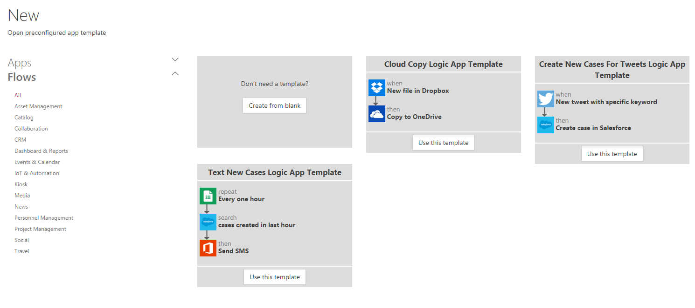
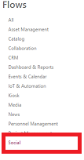

<properties
    pageTitle="KratosApps tutorial: Create PowerApps Logic from a template"
    description="There are a number of built-in templates to create logic from."
    services="kratosapps"
    authors="aftowen"
 />

<tags
   ms.service="kratosapps"
   ms.devlang="na"
   ms.topic="get-started-article"
   ms.tgt_pltfrm="na"
   ms.workload="na"
   ms.date="11/02/2015"
   ms.author="anneta"/>

# Create Logic from a template #
There are a number of built-in templates to create logic from. You can also[create from scratch](get-started-powerflow.md) if you are interested in starting from a blank canvas. This tutorial walks through specifically a template that listens to a keyword you provide on twitter and sends you an email notification when there is a new tweet matching that keyword.

**Prerequisites**

- [KratosApps](https://www.kratosapps.com/)
- An account for Twitter
- An Office 365 account (from which you can send email)

## Choose your template

1. Open KratosApps, and then click **Create Logic** in the landing page.

    

2. You are now presented with the list of all of the templates.

    

3. In the categories on the left-hand-side, click on a category, such as **Social** to narrow your list.

    

4. Select the template you want. For this tutorial we'll use **Send email on new tweets**. 

5. You will now be prompted for credentials to use for Twitter and Office 365.

6. The all of the logic will be visible to you now. You'll need to fill out the required fields that aren't provided. You can see those fields marked with a red `*`. In this template, the only field you need to fill out is the email address you want to send the emails to. 

    

7. You can also change the keyword that is being listened to in the first text box.

8. Enter a name for your logic in the **Logic name** text box near the bottom of the screen. 

9. Save your logic by clicking **Done** near the bottom of the screen.

    

## Next Steps ##

- [Add additional steps](advanced-parameters-powerflow.md) Add more steps, such as different ways to be notified, to your Logic.