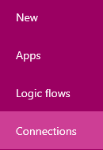
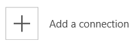
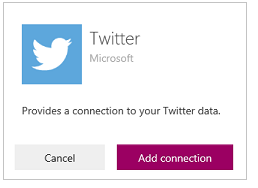
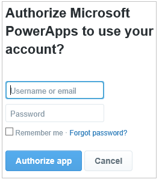
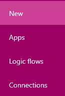

<properties
    pageTitle="Create Logic Flows from a template | Microsoft PowerApps"
    description="Create Logic Flows from any of several built-in templates."
    services=""
    suite="powerapps"
    documentationCenter="na"
    authors="stepsic-microsoft-com"
    manager="dwrede"
    editor=""
    tags=""
 />

<tags
  ms.service="powerapps"
    ms.devlang="na"
    ms.topic="article"
    ms.tgt_pltfrm="na"
    ms.workload="na"
    ms.date="11/14/2015"
   ms.author="stepsic"/>

# Create Logic Flows from a template #
Create Logic Flows from any of several built-in templates that can, for example, send you an email message when anyone sends a tweet that includes a particular keyword.

**Note:** [Create a logic flow from scratch](get-started-logic-flow.md) if you want to start from a blank canvas.

**Prerequisites**

- An account on [powerapps.com](http://go.microsoft.com/fwlink/?LinkId=708209)
- An account on Twitter
- An account on Office 365 (from which you can send email)

## Create connections ##
1. Open [powerapps.com](http://go.microsoft.com/fwlink/?LinkId=708209), and then select **Connections** in the left navigation bar.

	

1. Select **Add a connection** to open a list of connection types.

	

1. Select **Twitter**, and then select **Add connection.**

	

1. Provide your credentials, and then select **Authorize app.**

	

1. Repeat the previous three steps twice, adding a connection to Office 365 Outlook and Office 365 Users.

## Choose your template

1. In the left navigation bar, select **New**.

	

1. Under **Make a logic flow**, select **Get started**.

	

1. In the list of categories, select **Social**, and then select the **Get Email Notification for Tweets** template.

	

1. Confirm your connections by selecting **Open logic flow**.

	

	Your logic flow appears, showing all events and actions.

	

## Finish your logic flow ##

1. Select the title bar for the event to expand it, and then specify a keyword that interests you.

	

1. Expand the **Send Email** action, and then select the subject line of the notification mail.

1. Customize the subject line by typing any text that you want to appear in every message, selecting one or more placeholders to add information that's specific to each tweet, or combine these kinds of information.

 	Select the button with the ellipsis to show more placeholders.

	

1. Near the bottom of the screen, specify a name for your logic flow, and then select **Done**.

	

When a tweet is sent with the keyword that you specified, you'll receive email notification according to the information that you specified.

## Next steps ##

- [Add steps](multi-step-logic-flow.md), such as different ways to be notified, to your logic flow.
