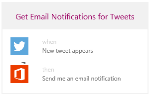
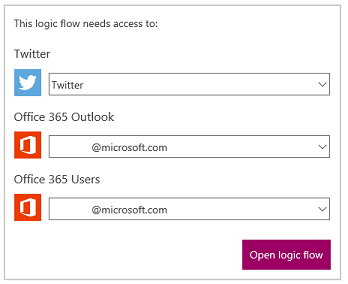
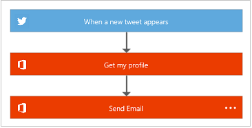
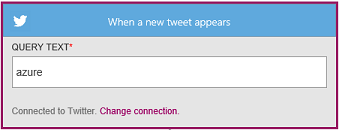
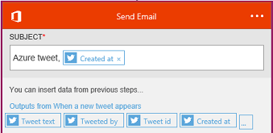

<properties
    pageTitle="Create flows from a template | Microsoft Flow"
    description="Create flows from any of several built-in templates."
    services=""
    suite="flow"
    documentationCenter="na"
    authors="aftowen"
    manager="dwrede"
    editor=""
    tags=""
 />

<tags
  ms.service="flow"
    ms.devlang="na"
    ms.topic="article"
    ms.tgt_pltfrm="na"
    ms.workload="na"
   ms.date="04/08/2016"
   ms.author="aftowen"/>

# Create a flow from a template #
Create a flow from one of many built-in templates that can, for example, send you an email message when anyone sends a tweet that includes a particular keyword.

**Note:** [Create a flow from scratch](get-started-logic-flow.md) if you want to start from a blank canvas.

**Prerequisites**

- An account on [flow.microsoft.com](https://flow.microsoft.com)
- A Twitter account
- Office 365 credentials

## Choose a template

1. In [flow.microsoft.com](https://flow.microsoft.com), select **Browse** in the top navigation bar.

	

1. Select a template, such as **Get Email Notification for Tweets**.

	

1. If prompted, connect to one or more data sources, such as Twitter, by selecting **Add new connection** in the drop-down list and then following the prompts.

	

1. Select **Open flow**.

	Your flow appears, showing each event with a blue title bar and each action with an orange title bar.

	

## Customize your flow ##

1. Select the title bar for an event to expand it, and then customize it (for example, by specifying a keyword that interests you).

	

1. Expand and customize the template's action or actions.

	For example, expand the **Send Email** action, and then customize the subject line, the body, and the recipient fields.

	Customize the subject line and the body by following either or both of these steps:

	- Type any text that you want to appear in every message that this flow sends.
	- Select one or more placeholders to add information that's specific to each tweet. (Select the button with the ellipsis to show more placeholders.)

	

	In the **To** field, leave your address as the default, or specify one or more other addresses in addition to or instead of your own.

1. Near the bottom of the screen, specify a name for your flow, and then select **Done**.

	

When a tweet is sent with the keyword that you specified, you'll receive email notification according to the information that you specified.

## Next steps ##

- [Add steps](multi-step-logic-flow.md), such as different ways to be notified, to your flow.
