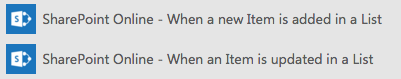
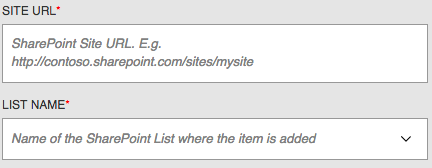
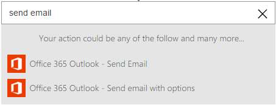
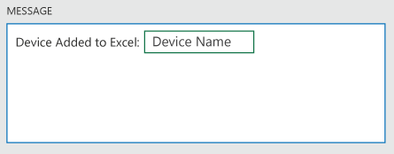
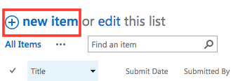

<properties
    pageTitle="PowerApps: Automate tasks by creating Logic Flows"
    description="Create Logic Flows to automatically perform one or more actions, such as sending mail, when one or more conditions are met, such as someone adding a row to a SharePoint list."
    services="powerapps"
    documentationCenter="na"
    authors="AFTOwen"
    manager="dwrede"
    editor=""
    tags=""
 />
<tags
    ms.service="powerapps"
    ms.devlang="na"
    ms.topic="get-started-article"
    ms.tgt_pltfrm="na"
    ms.workload="na"
    ms.date="11/02/2015"
    ms.author="anneta"/>

# Create Logic Flows in PowerApps#
Create a logic flow to perform a task automatically when a condition triggers an action. For example, create a logic flow that notifies you by mail as soon as someone adds a row to a SharePoint list. In this scenario, adding a row is the trigger, and sending mail is the action.

**Prerequisites**

- An account, such as Dropbox, OneDrive, or SharePoint, for storing files in the cloud
- An Office 365 account (from which you can send email)
- Chrome browser

## Create a trigger

1. In Chrome, open [powerapps.com](), and then select **Create a flow**.

    

3. Select **Create from blank**.

    

4. In the box that says **How would you like to start?**, type or paste **SharePoint**.

1. In the list of actions, select **SharePoint Online - When a new item is created**.

    

5. If you haven't already connected your SharePoint Online account to PowerApps, select **Sign in to SharePoint Online**, and then provide your credentials.

6. In the **SITE URL** box, type or paste the URL of the SharePoint site that contains the list you want to use.

  **Important:** Include only the site URL, not the full path of the list.

  

1. Under **LIST NAME**, select the down arrow to show the names of all lists in the site you specified.

	**Note:** If **Could not retrieve values** appears, correct your site URL.

8.  Select the name of a list, name your PowerFlow in the box near the bottom of the screen, and then select **Done**.

	

## Create an action ##
In this procedure, you'll add an action to send email and then you'll test that action. By following these steps, you'll learn the basics of actions and how to configure your logic flow to make it work the way you want.

1. In the list of your logic flows, select the edit icon, which looks like a pencil, next to the logic flow that you created in the previous procedure.

	

1. Under the trigger condition that you created in the previous procedure, select the "+" button.

	

1. Select **Add action**.

    

2. In the box that shows **What would you like to do next?**, type or paste **send email**, and then click **Office365 - Send Email**.

  

1. If prompted, provide your Office 365 credentials.

  

4. In the form that appears, type a subject in the **Subject** box and your email address in the **To** box.

	

5. In the **Body** box, type or paste **Item added to a list:**, and then select a parameter (such as **Title**) to add a placeholder for it to your message.

  **Note:** The available parameters reflect the column headings of whatever list you specify.

    

4. Type the end of your message, including any other parameters you want to include, and then select **Done** at the bottom of the screen.

	

    The list of your logic flow reflects your changes.

## Test your logic flow ##

1. On the main page for the list that you specified, select **new item**.

	

3. Specify data in each field, and then select **Save**.

    Within a minute, an email message notifies you of the new item.

## Next Steps ##

- [Add steps](advanced-parameters-powerflow.md), such as different ways to be notified, to your logic flow.
