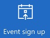
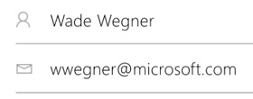

<properties
	pageTitle="Test drive KratosApps"
	description=""
	services="kratosapps"
	authors="AFTOwen"
 />

# Test drive KratosApps
Create an app automatically based on one of several templates for a variety of scenarios. The app will have a default interface and sample data, so that you can explore how the app works out of the box. If you want to build or manage a set of data differently, you can customize the app to better fit the way you work.

[Find out more about KratosApps](), such as how to automatically [create an app based on an existing data set]() or [build your own app from scratch]().

**Prerequisites**

In addition to signing up for and installing KratosApps, you'll also need an account, such as DropBox or OneDrive, for storing sample data in the cloud.

## Open an app template ##
1. Sign in to KratosApps, and then click **New** in the left navigation bar.

	

1. Leave the default option to create a phone app.

	

1. Under **Start from Template**, click **Get started**.

	

2. Click **Event SignUp**, and then specify where you want to store data for your app in the cloud (for example, DropBox or OneDrive).

	The splash screen for the **Event Signup** template appears.

	

## Explore the app's default appearance and behavior ##
App templates open in the default workspace, where you'll spend most of your time customizing a template or creating an app from scratch. Before you make changes, you'll explore how the app works in **Preview**.

**Tip:** Design and develop apps in the default workspace, but test them in **Preview** before you share them with others.

1. In the left navigation bar, click the thumbnail for the **VolunteerDetails** screen.

	

	By default, your information appears in the text boxes for name and address. You can change that information if you want.

	

1. Press F5 (or click the right arrow in the upper-right corner) to open **Preview**.

	

1. Click a t-shirt size, and then click **Next**.

	

	The **Schedule** screen appears with columns for days, timeslots, and names of volunteers.
1. Click a **Sign up** button to schedule yourself (or a fictional volunteer) for a timeslot.

	

	**Note:** If you click a **Sign up** button, the other **Sign up** button for the same timeslot stops being available.

1. (optional) Remove yourself or the volunteer from a timeslot by clicking the "X" icon to the right of the volunteer's name.

1. Return to the default workspace by pressing Esc (or by clicking the "X" icon in the upper-right corner).

1. (optional) Verify that the data in the cloud reflects your changes.

## Configure a control ##
As you customize the interface of an app or develop one from scratch, you'll add and configure elements that show text, images, and other information. To configure how an element appears or what it does, you first click it so that a thick, gray selection box appears around it.

**Important:** If you click another element or a blank area of the screen, that element or screen becomes selected, and you can no longer configure the first element.

When an element is selected, you can configure it in these ways:

- Change it directly (for example, by moving it).
- Click a tab on the ribbon near the top of the screen, and then click an option on that tab.
- Click an option in the properties list, and then type a value in the Function Bar. These elements appear near the top of the screen and are separated by an equals sign and the function button. In this example, the **Items** property appears in the properties list, and the value of that property (**ScheduleItems**) appears in the Function Bar.

	

If you can't find a property on the ribbon, find it in the properties list, which shows all properties alphabetically.

1. Near the top of the screen, click **PowerApps at OneWeek** to select that label.

	

1. Resize the label by dragging the white triangle in the lower-right corner of the selection box.

	

1. Move the label to the right side of the screen by dragging the selection box itself (not a triangle or square in the selection box).

1. With the label still selected, rename it by clicking **Label1_1** on the **Home** tab and then typing **Banner**.

	

	**Note:** You can more easily develop an app if you give each control a descriptive name. For example, you'll want to configure buttons to navigate to different screens, and you'll want names that are easier to remember than **Screen1**, **Screen2**, and so on.

1. With the label still selected, click **Text** in the properties list, and then type **Today()** in the Function Bar.

	The label shows the current date.

1. Change the text in the label by triple-clicking it and then typing in anything you want.

## Save and share your app ##
After you finish developing and testing your app, you share it with other people by saving it to the portal and then sending mail that your app is available. You specify which people can run your app or even customize it to create their own versions.

1. On the **File** menu, click **App Settings**.

	

2. Update any of these settings.

	- the name of your app
	- the color of your app's tile

		

	- the image on your app's tile

		

	- the aspect ratio of your app

		

	If you change the aspect ratio, click **Apply**.

2. On the **File** menu, click **Save As**.
3. Under **Save As**, leave the default value of **PowerApps**, and then click **Save**.

	

6. On the **File** menu, click **Share**.

	An email template appears.

1. In the **To** text box, type the email addresses of the people with whom you want to share your app.

	

1. In the drop-down list, click **Can View** to allow users to run your app, or click **Can edit** to allow users to run your app and create their own versions of it.

	

1. Edit the text in the **Subject** and **Message** text boxes, and then click **Share**.

	The people with whom you shared your app will receive an email message that contains a link they can click to install KratosApps and run your app.
