<properties
	pageTitle="Create an app from a template | Microsoft PowerApps"
	description="Step-by-step instructions for creating an app automatically based on a template, customizing the app, and then publishing it."
	services=""
	suite="powerapps"
	documentationCenter="na"
	authors="linhtranms"
	manager="darshand"
	editor=""
	tags=""/>

<tags
   ms.service="powerapps"
   ms.devlang="na"
   ms.topic="hero-article"
   ms.tgt_pltfrm="na"
   ms.workload="na"
   ms.date="04/11/2016"
   ms.author="litran"/>

# Create an app from a template #

[AZURE.VIDEO nb:cid:UUID:b95d313a-0d00-80c4-8bbc-f1e59201f745]

Create an app automatically based on one of several templates for a variety of scenarios. Explore how the app works by default, customize it to better fit the way you work, and then publish it.

**Prerequisites**

- Install [PowerApps](http://aka.ms/powerappsinstall)

- An account on DropBox, OneDrive, or GoogleDrive for storing sample data in the cloud

## What will you learn in this article? ##

- Create an app from a template
- Save and share the app you just created

## Open a template ##
1. Open PowerApps.

**Note: ** If you haven't installed PowerApps before, please click the link above in Prerequisite to install PowerApps. You can also download PowerApps by clicking the pointing down arrow on PowerApps web portal to download. 
1. If you haven't opened PowerApps before, select the right-pointing arrow near the lower-right corner to advance through the opening screens, and then sign in.

2. If you haven't opened PowerApps before, you will be prompted to sign in. Please enter the account you used to sign up for PowerApps. It should be your school or organization account. 

4. In PowerApps, select **Connections** in the **File** menu (near the left edge of the screen).

	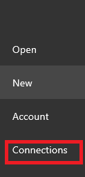

5. This will open PowerApps web portal. Select ** Connection ** tab and select ** Addd a connection **
	
	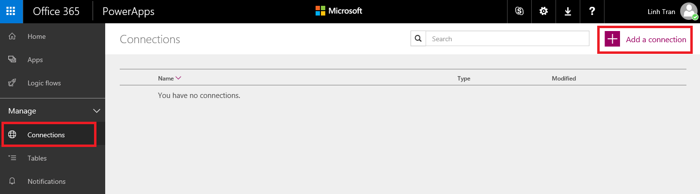

6. In the list of available connections, select ** Dropbox ** (or another cloud-storage account), and then select ** Add connection **.

	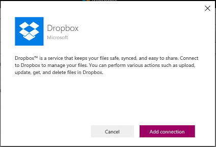

7. Provide your credentials, and then select **Sign in**. Please ** Allow ** Dropbox to access files in your system if prompted. 

	

8. Your Dropbox connection should be successfully created and listed in the PowerApps web portal.

	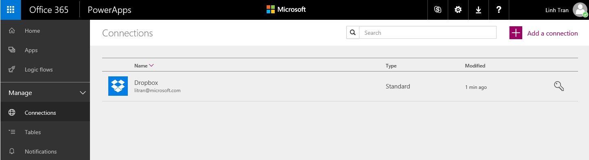

9. Go back to PowerApps on your Desktop

10. Select **New** on the **File** menu (near the left edge of the screen).

	

11. Select ** Create an app ** and ** Start from a template **. Then select a form factor for the app you want to create, phone or tablet. In this example, I'll select ** Phone **.

	

	**Note:** You can create an app for a tablet, but this tutorial focuses on the phone option.

12. You will be shown a list of templates to choose from. 

	**Note:** If you configure the connection like in step 4-6 above, you won't need to set up the connection again. However, if you haven't set up your connection, you'll need to do so before you can use a template to create an app by clicking the ** Add a connection ** at the bottom of the page where all the templates are listed. Follow similar steps 5-6 to set up the connection. 

	

13. In the list of templates, select ** Cost Estimator **, and then select ** Use ** (near the lower-right corner).

	

14. Once you select ** Use ** , the app is created and sample data is being copied over to your Dropbox (or chosen storage account). 

15. Once the app is created, the ** Cost Estimator ** home page will appear.

	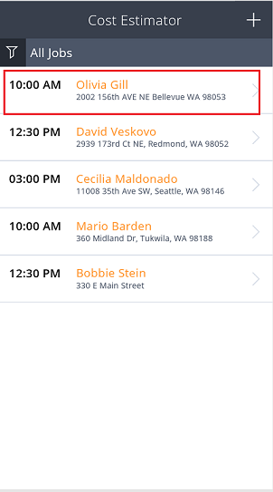

## Explore the app's default behavior ##
Apps from templates open in the default workspace, where you'll spend most of your time customizing an app or creating one from scratch. Before you make changes, you'll explore how the app works in **Preview**.

**Tip:** Design and develop apps in the default workspace, but test them in **Preview** before you share them with others.

1. In the left navigation bar, select the thumbnail for the **OpenJobsPage**.

	

2. Press F5 (or select the right arrow in the upper-right corner) to open **Preview**.

	

3. **Cost Estimate** is pre-populated with sample data to demonstrate the functionality of the app. This is an app that allows user create job entry with client on site and create an estimate for how much it costs to replace flooring for a room with chosen material. 

4. Select a job entry **Olivia Gill** on the home screen to view details.

	

5. Select a **Begin Estimate** button to start an estimate.

	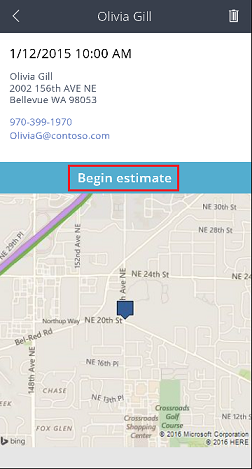

6. (optional) Verify that the data in your cloud account reflects your changes after you finish an estimate.

7. (optional) Add a new job entry by clicking the **'+'** on the home page.

8. Return to the default workspace by selecting the **'X'** icon in the upper-right corner (under the PowerApps title bar).

	

## Configure a control ##
As you customize the interface of an app or develop one from scratch, you'll add and configure elements that show text, images, and other information. To configure how an element appears or what it does, you select it, which adds a thick, gray box around it.

**Important:** If you select another element or a blank area of the screen, you can no longer configure the first element.

When an element is selected, you can configure it in these ways:

- Change it directly (for example, by moving it).
- Select a tab on the ribbon near the top of the screen, and then select an option on that tab.
- Select an option in the properties list, and then type a value in the formula bar. These elements appear near the top of the screen and are separated by an equals sign and the function button. In this example, the **Items** property appears in the properties list, and the value of that property (**Job**) appears in the formula bar.

	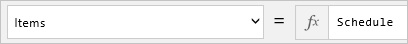

If you can't find a property on the ribbon, find it in the properties list, which shows properties alphabetically.

1. Near the top of the screen, select **Cost Estimator**.

	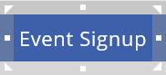

1. Move the text box to the left edge of the screen by dragging the selection box around the text box.

1. Highlight the text inside the text box (for example, by triple-clicking it), and then change the text by typing **Cost Estimator for Flooring**.

1. Resize the text box by dragging a handle in the upper-right or lower-right corner of the selection box until all the text appears in the box.

	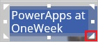

1. With the text box still selected, select **Text** in the properties list, and then type **Now()** in the formula bar.

	The text box shows the current date and time.

1. With the text box still selected, rename it by selecting **TextBox1** on the **Home** tab and then typing **Banner**.

	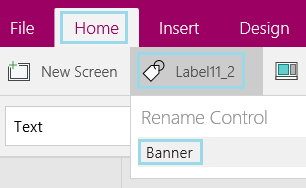

	**Note:** As you develop or customize an app, you'll configure some controls to reference other controls. For example, you'll probably configure a button or other control to open one screen from another. That type of configuration will be much easier if the screens have names that are easier to remember than **Screen1**, **Screen2**, and so on.

## Save and share your app ##
After you finish developing and testing your app, share it with other people by saving it to [powerapps.com](https://web.powerapps.com) and sending mail that your app is available. Specify which people can run your app or even customize it to create their own versions.

1. On the **File** menu, select **App Settings**.

	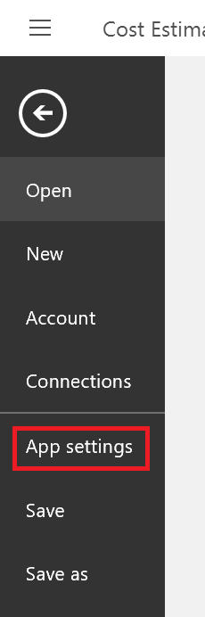

2. Update any of these settings.

	- the name of your app

		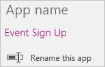

	- the color of your app's tile

		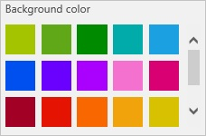

	- the image on your app's tile

		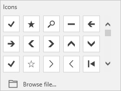

	- the screen size and orientation of your app

		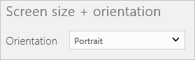

		**Note:** If you change the size and orientation, select **Apply** (near the lower-right corner) to save the changes.

		

2. On the **File** menu, select **Save As**.

	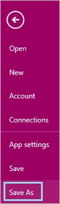

3. Under **Save As**, leave the default value of **PowerApps cloud**, and then select **Save**.

	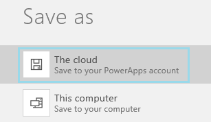

6. On the **File** menu, select **Share**.

	An email template appears.

**Note**: Before you share an app, make sure that the people with whom you're sharing it have access to the data. For example, you must [share an Excel or other file](share-app-data.md) in a cloud-storage account.

1. Type the email addresses of the people with whom you want to share your app, and then select one of these options:

	- **Can view** allows the users you specify to run your app
	- **Can edit** allows the users you specify not only to run your app but also to create their own versions of it.

	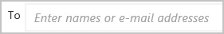

1. Edit the text in the message box, and then select **Share**.

	The people with whom you shared your app will receive an email message that contains a link that they can select to install PowerApps and run your app.
