<properties
	pageTitle="Create a PowerApp from a template | Microsoft PowerApps"
	description="Step-by-step instructions for creating a PowerApp automatically based on a template, customizing the PowerApp, and then publishing it."
	services=""
	suite="powerapps"
	documentationCenter="na"
	authors="AFTOwen"
	manager="dwrede"
	editor=""
	tags=""/>

<tags
   ms.service="powerapps"
   ms.devlang="na"
   ms.topic="hero-article"
   ms.tgt_pltfrm="na"
   ms.workload="na"
   ms.date="11/22/2015"
   ms.author="anneta"/>

# Create a PowerApp from a template #
Create a PowerApp automatically based on one of several templates for a variety of scenarios. Explore how the PowerApp works by default, customize it to better fit the way you work, and then publish it.

[What are PowerApps?](http://www.kratosapps.com/tutorials)

**Prerequisites**

- [Install PowerApps](http://aka.ms/powerappsinstall)
- An account on DropBox, OneDrive, or GoogleDrive for storing sample data in the cloud

## Video demonstration ##

[AZURE.VIDEO nb:cid:uuid:b95d313a-0d00-80c4-8bbc-f1e59201f745]

## Open a PowerApp template ##
1. In PowerApps, select **Connections** in the **File** menu (near the left edge of the screen).

	

1. Select **Available Connections**, select **Dropbox** (or another cloud-storage account), and then select **Connect**.

	

1. Provide your credentials, and then select **Sign in**.

	

1. Select **New** on the **File** menu (near the left edge of the screen).

	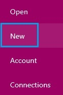

1. Leave the default option to create a PowerApp for a phone.

	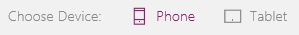

	**Note:** You can create a PowerApp for a tablet, but this tutorial focuses on the phone option.

1. Under **Start from a template**, select **Get started**.

	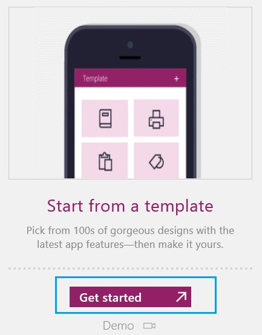

2. Select **Event SignUp**, and then select **Choose**.

	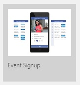

	The **VolunteerDetailsScreen_1** of your PowerApp appears.

	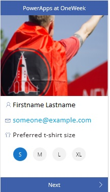

## Explore the PowerApp's default appearance and behavior ##
PowerApps from templates open in the default workspace, where you'll spend most of your time customizing a PowerApp from a template or creating a PowerApp from scratch. Before you make changes, you'll explore how the PowerApp works in **Preview**.

**Tip:** Design and develop PowerApps in the default workspace, but test them in **Preview** before you share them with others.

1. In the left navigation bar, select the thumbnail for the **VolunteerDetailsScreen**.

	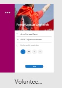

	By default, your information appears in the text boxes for name and address. You can change that information if you want.

1. Press F5 (or select the right arrow in the upper-right corner) to open **Preview**.

	

1. Select a t-shirt size, and then select **Next**.

	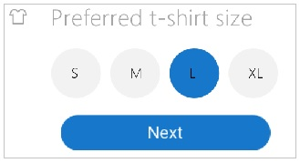

	The **Schedule** screen appears with columns for days, timeslots, and names of volunteers.

1. Select a **Sign up** button to schedule yourself (or a fictional volunteer) for a timeslot.

	

	**Note:** If you select a **Sign up** button for a timeslot for which nobody else has signed up, the other **Sign up** button for the same timeslot stops being available.

1. (optional) Remove yourself or the volunteer from a timeslot by selecting the "X" icon next to the name of the person whom you want to remove.

1. Return to the default workspace by selecting the "X" icon in the upper-right corner (under the PowerApps title bar).

	

1. (optional) Verify that the data in your cloud account reflects your changes.

## Configure a control ##
As you customize the interface of a PowerApp or develop one from scratch, you'll add and configure elements that show text, images, and other information. To configure how an element appears or what it does, you select it, which adds a thick, gray box around it.

**Important:** If you select another element or a blank area of the screen, you can no longer configure the first element.

When an element is selected, you can configure it in these ways:

- Change it directly (for example, by moving it).
- Select a tab on the ribbon near the top of the screen, and then select an option on that tab.
- Select an option in the properties list, and then type a value in the formula bar. These elements appear near the top of the screen and are separated by an equals sign and the function button. In this example, the **Items** property appears in the properties list, and the value of that property (**Schedule**) appears in the formula bar.

	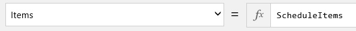

If you can't find a property on the ribbon, find it in the properties list, which shows all properties alphabetically.

1. Near the top of the screen, select **PowerApps at OneWeek**.

	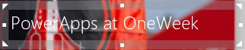

1. Resize the label by dragging the white triangle in the lower-right corner of the selection box.

	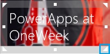

1. Move the label to the right side of the screen by dragging the selection box itself (not a triangle or square in the selection box).

1. With the label still selected, rename it by selecting **Label11_1** on the **Home** tab and then typing **Banner**.

	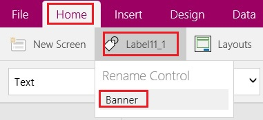

	**Note:** As you develop or customize a PowerApp, you'll configure some controls to reference other controls. For example, you'll probably configure a button or other control to open one screen from another. That configuration will be much easier if the screens have names that are easier to remember than **Screen1**, **Screen2**, and so on.

1. With the label still selected, select **Text** in the properties list, and then type **Today()** in the formula bar.

	The label shows the current date.

1. Triple-click the text in the label, and then type anything you want.

## Save and share your PowerApp ##
After you finish developing and testing your PowerApp, share it with other people by saving it to powerapps.com and sending mail that your app is available. Specify which people can run your app or even customize it to create their own versions.

1. On the **File** menu, select **App Settings**.

	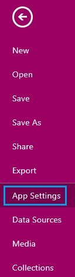

2. Update any of these settings.

	- the name of your PowerApp

		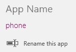

	- the color of your PowerApp's tile

		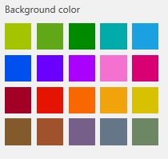

	- the image on your PowerApp's tile

		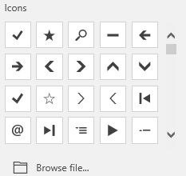

	- the screen size and orientation of your PowerApp

		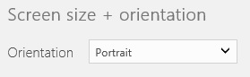

		**Note:** If you change the size and orientation, select **Apply** (near the lower-right corner) to save the changes.

		

2. On the **File** menu, select **Save As**.

	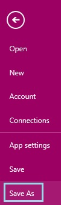

3. Under **Save As**, leave the default value of **PowerApps cloud**, and then select **Save**.

	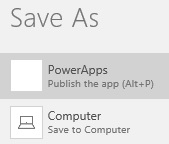

6. On the **File** menu, select **Share**.

	An email template appears.

1. In the **To** text box, type the email addresses of the people with whom you want to share your PowerApp.

	

1. In the list of permissions, select **Can view** to allow users to run your PowerApp, or select **Can edit** to allow users to run your PowerApp and create their own versions of it.

	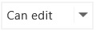

1. Edit the text in the **Subject** and **Message** boxes, and then select **Share**.

	The people with whom you shared your PowerApp will receive an email message that contains a link they can select to install PowerApps and run your PowerApp.
