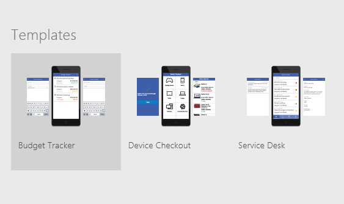
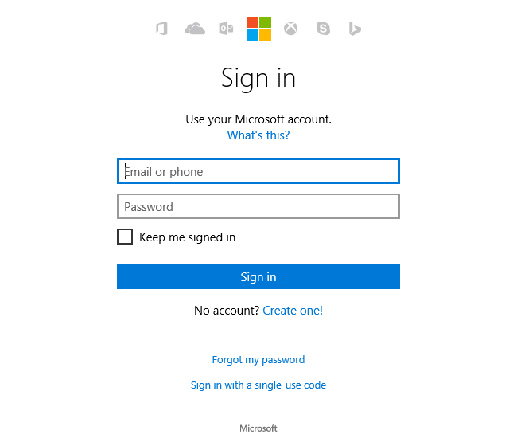
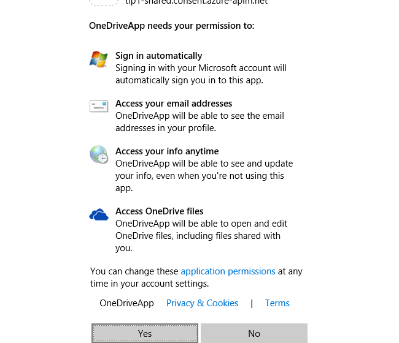
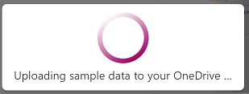

<properties
	pageTitle="Create an app from a template | Microsoft PowerApps"
	description="Step-by-step instructions for creating an app automatically based on a template, and then publishing it."
	services=""
	suite="powerapps"
	documentationCenter="na"
	authors="AFTOwen"
	manager="erikre"
	editor=""
	tags=""/>

<tags
   ms.service="powerapps"
   ms.devlang="na"
   ms.topic="hero-article"
   ms.tgt_pltfrm="na"
   ms.workload="na"
   ms.date="04/15/2016"
   ms.author="litran"/>

# Create an app from a template #
Create an app automatically based on one of several templates for a variety of scenarios. Explore how the app works by default, customize it to better fit the way you work, and then publish it.

**Prerequisites**

- [Sign up](signup-for-powerapps.md) for PowerApps, [install](http://aka.ms/powerappsinstall) PowerApps, and then open PowerApps.

	If you haven't opened PowerApps before, swipe left (or select the right-pointing arrow near the lower-right corner) three times to advance through the opening screens, and then sign in by providing the same credentials that you used to sign up.

- An account on DropBox, OneDrive, or GoogleDrive for storing sample data in the cloud

## Open a template ##
1. In PowerApps, select **New** on the **File** menu (near the left edge of the screen).

	

2. Select **Create an app** and **Start from a template**. Then select a form factor for the app you want to create, **Phone app** or **Tablet app**. In this example, I'll select **Phone**.

	

	**Note:** You can create an app for a tablet, but this tutorial focuses on the phone option.

3. You will be shown a list of templates to choose from.

	

4. If you haven't set up your connection, you'll need to do so before you can use a template to create an app. Select the **Add a connection** at the bottom of the page where all the templates are listed. 

	

5. Select **One Drive** or any other service where you would like to put the sample data file for the template.

	

6. Sign in to **One Drive** using your credentials.

	

7. Select **Yes** to allow **One Drive** to access to your data.

	

8. Now you have established a connection to **One Drive** as shown at bottom of the screen. 

	

9. Select template **Cost Estimator**, and then select **Use** (near the lower-right corner).

	

1. Once you select **Use** , the app is created and sample data is being copied over to your Dropbox (or chosen storage account).

	

1. Once the app is created, the **Cost Estimator** home page will appear.

	

## Explore the app's default behavior ##
Apps from templates open in the default workspace, where you'll spend most of your time customizing. Before you make any changes to the app, let's explore how the app works in **Preview**.

**Tip:** Design and develop apps in the default workspace, but test them in **Preview** before you share them with others.

1. In the left navigation bar, select the thumbnail for the **OpenJobsPage** for this app.

	

2. Press F5 (or select the right arrow in the upper-right corner) to open the app in **Preview** mode.

	

3. **Cost Estimate** is pre-populated with sample data to demonstrate the functionality of the app. This app allows user create job entry on site and create an estimate for how much it costs to replace flooring for a room with chosen material.

4. Select a job entry **Olivia Gill** on the home screen to view details.

	

5. Select a **Begin Estimate** button to start an estimate. 

	

	**Note:** You can follow the details in [Cost Estimator tutorial](cost-estimator.md) for more step by step instructions such as adding a new job entry, etc. 

6. (optional) Verify that the data in your cloud account reflects your changes after you finish an estimate.

7. Return to the default workspace by selecting the **'X'** icon in the upper-right corner (under the PowerApps title bar).

	

## Configure a control ##
As you customize the interface of an app, you'll add and configure elements that show text, images, and other information. To configure how an element appears or what it does, you select it, which adds a thick, gray box around it.

**Important:** If you select another element or a blank area of the screen, you can no longer configure the first element.

When an element is selected, you can configure it in these ways:

- Change it directly (for example, by moving it).
- Select a tab on the ribbon near the top of the screen, and then select an option on that tab.
- Select an option in the properties list, and then type a value in the formula bar. These elements appear near the top of the screen and are separated by an equals sign and the function button. In this example, the **Items** property appears in the properties list, and the value of that property (**Job**) appears in the formula bar.

	

If you can't find a property on the ribbon, find it in the properties list, which shows properties alphabetically.

To learn more, please go to [add and configure a control](add-configure-control).

## Save and share your app ##
After you finish developing and testing your app, save it to [powerapps.com](https://web.powerapps.com) and share it with other people by sending mail that your app is available. Specify which people can run your app or even customize it to create their own versions.

1. On the **File** menu, select **App Settings**.

	
2. Update any of these settings.

	- the name of your app

		

	- the color of your app's tile

		

	- the image on your app's tile

		

	- the screen size and orientation of your app

		

		**Note:** If you change the size and orientation, select **Apply** (near the lower-right corner) to save the changes.

		

3. On the **File** menu, select **Save As**.

	

4. Under **Save As**, leave the default value of **PowerApps cloud**, and then select **Save**.

	

5. On the **File** menu, select **Share**.

	An email template appears.

	**Note**: Before you share an app, make sure that the people with whom you're sharing it have access to the data. For example, you must [share an Excel or other file](share-app-data.md) in a cloud-storage account.

6. Type the email addresses of the people with whom you want to share your app, and then select one of these options:

	- **Can view** allows the users you specify to run your app
	- **Can edit** allows the users you specify not only to run your app but also to create their own versions of it.

	

7. Edit the text in the message box, and then select **Share**.

	The people with whom you shared your app will receive an email message that contains a link that they can select to install PowerApps and run your app.
