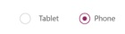
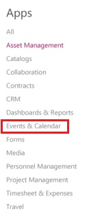

<properties
	pageTitle="Test drive KratosApps"
	description=""
	services="kratosapps"
	authors="AFTOwen"
 />

# Test drive KratosApps

## Sign in and open KratosApps ##
1. Perform either of these steps:
	- If someone shared an app with you or invited you to try the product, click the link in the email message.
	- If you found the product in a search engine or the Windows Store, click the result.
1. Type your email address, and then click **Sign up**.
1. Open the email message from the Microsoft Office 365 Team, and then click the link to finish signing up.
1. Specify your country or region, your full name, and your password.
1. Specify your password again, and then click **Start**.

	KratosApps opens.

1. (optional) If someone shared an app with you, run it, and then click **New** in the left navigation bar when you're ready to explore KratosApps further.

## Open an app template ##
1. Under **Start from Template**, click **Get started**.

	

1. Click the **Tablet** option to specify that you want to create an app that's designed for a larger screen in landscape orientation.

	

1. Under **Apps**, click **Events & Calendar** in the list of template categories.

	

2. Click **Event SignUp**, and then specify where you want to store the data for your app (for example, DropBox).

	The splash screen for the **Event Signup** template appears.

	

## Explore the app's default appearance and behavior ##
App templates open in the default workspace, where you'll spend most of your time customizing a template or creating an app from scratch. Before you make changes, you'll explore how the app works in **Preview**.

**Tip:** Design and develop apps in the default workspace, but test them in **Preview** before you share them with others.

1. Switch to the **VolunteerDetails** screen by clicking its thumbnail in the left navigation bar.

	

1. Press F5 (or click the right arrow in the upper-right corner) to open **Preview**.

	

1. In the text boxes, specify the name, the email address, and the phone number of a fictional volunteer.

	

1. Click a t-shirt size, and then click **Next**.

	

	The **Schedule** screen appears with columns for days, timeslots, and names of volunteers.
1. Click a **Sign up** button to schedule your fictional volunteer for a timeslot.

	

	**Note:** If you sign up someone for a timeslot (for example, as **Volunteer1**), you can't sign that person up for another option in that timeslot (for example, **Volunteer2** and **Backup**).

1. (optional) Remove your volunteer from a timeslot by clicking the "X" icon to the right of the volunteer's name.
1. Return to the default workspace by pressing Esc (or by clicking the "X" icon in the upper-right corner).

## Configure a control ##
As you customize the interface of an app or develop one from scratch, you'll add and configure elements that show text, images, and other information. To configure how an element appears or what it does, you first click it so that a thick, gray selection box appears around it.

**Important:** If you click another element or a blank area of the screen, that element or screen becomes selected, and you can no longer configure the first element.

When an element is selected, you can configure it in these ways:

- Change it directly (for example, by moving it).
- Click a tab on the ribbon near the top of the screen, and then click an option on that tab.
- Click an option in the properties list, and then type a value in the Function Bar. These elements appear near the top of the screen and are separated by an equals sign and the function button. In this example, the **Items** property appears in the properties list, and the value of that property (**ScheduleItems**) appears in the Function Bar.

	

As this procedure demonstrates, you can change many properties by using more than one method. If you can't figure out how to change a property, find it in the properties list, which shows all properties alphabetically.

1. Near the top of the screen, click **PowerApps at OneWeek** to select that label.

	

1. Resize the label by dragging the white triangle in the lower-right corner of the selection box.

	

1. Move the label to the right side of the screen by dragging the selection box itself (not a triangle or square in the selection box).

1. With the label still selected, rename it by clicking **Label1_1** on the **Home** tab and then typing **Banner**.

	

	**Note:** You can more easily develop an app if you give each control a descriptive name. For example, you'll want to configure buttons to navigate to different screens, and you'll want names that are easier to remember than **Screen1**, **Screen2**, and so on.

1. With the label still selected, click **Text** in the properties list, and then type **Today()** in the Function Bar.

	The label shows the current date.

1. Change the text in the label by triple-clicking it and then typing in anything you want.

	For example, you could type your name, followed by an apostrophe and an "s", followed by **Best Event Ever**.

	

## Save and share your app ##
After you finish developing and testing your app, you share it with other people by saving it to the portal and then sending mail that your app is available. You specify which people can run your app or even customize it to create their own versions.

1. On the **File** menu, click **App Settings**.
2. Update any of these settings.

	- the name of your app
	- the color of your app's tile
	- the image on your app's tile
	- the aspect ratio of your app

	If you change the aspect ratio, click **Apply**.

2. On the **File** menu, click **Save As**.

	

3. Under **Save As**, leave the default value of **PowerApps**.

5. Click **Save** to save your app to the portal.
6. On the **File** menu, click **Share**.