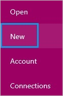
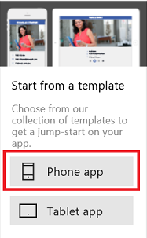
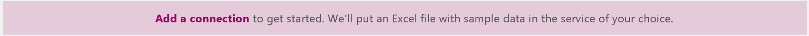
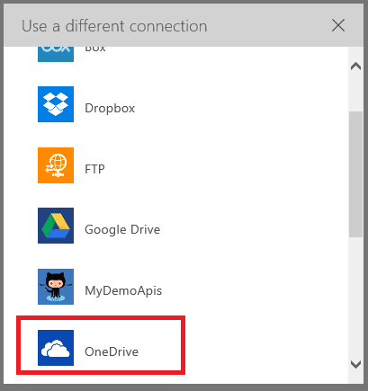
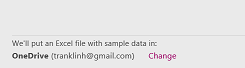
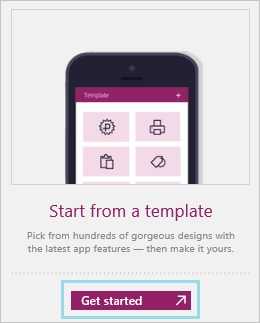
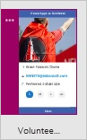
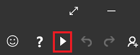
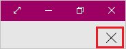
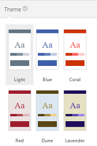

<properties
	pageTitle="Create an app from a template | Microsoft PowerApps"
	description="Step-by-step instructions for creating an app automatically based on a template and then saving it."
	services=""
	suite="powerapps"
	documentationCenter="na"
	authors="linhtranms"
	manager="erikre"
	editor=""
	tags=""/>

<tags
   ms.service="powerapps"
   ms.devlang="na"
   ms.topic="article"
   ms.tgt_pltfrm="na"
   ms.workload="na"
   ms.date="04/15/2016"
   ms.author="litran"/>

# Create and run an app from a template #
Create an app automatically based on a template for specific scenario, and then run it to understand its default behavior. Experiment with how to customize an app, and then save and share it with others.

**Prerequisites**

- [Sign up](signup-for-powerapps.md) for PowerApps, [install](http://aka.ms/powerappsinstall) it, open it, and then sign in by providing the same credentials that you used to sign up.
- A cloud-storage account such as DropBox, OneDrive, or Google Drive.

## Create an app ##
1. In PowerApps, select **New** on the **File** menu (near the left edge of the screen).

	

1. Under **Create an app**, select **Phone layout** on the **Start from a template** tile.

	**Note:** You can create an app for a tablet, but this tutorial focuses on the phone option.

	

	A list of templates appears.

1. If you don't have a connection to a cloud-storage account:

	1. Near the bottom of the screen, select **Add a connection**.

		

	1. Select the account that you want to use, provide your credentials, and then select **Yes** to grant access.

		

		Your connection appears near the bottom of the screen.

		

1. In the list of templates, select a template, and then select **Use** (near the lower-right corner).

	

	The sample data is copied to your cloud-storage account, the app is created, and its home page appears.

## Run the app ##
An app from a template opens in the default workspace, where you'll spend most of your time customizing. Before you make any changes to the app, let's explore how the app works in **Preview** mode.

**Tip:** Design and develop apps in the default workspace, but test them in **Preview** mode before you share them with others.

1. Select the thumbnail at the top of the left navigation bar.

	

1. Press F5 (or select the right arrow in the upper-right corner) to open the app in **Preview** mode.

	

	The app is pre-populated with sample data to demonstrate the functionality of the app. For example, the Cost Estimator app contains data for creating appointments and estimating the cost of installing a specific flooring product in a room of a particular size.

1. Explore the app's default behavior, and verify that the data in your cloud account reflects your changes.

	For example, make an appointment, and create a cost estimate in the Cost Estimator app.

1. Return to the default workspace by selecting the **'X'** icon in the upper-right corner (under the PowerApps title bar).

	

## Customize the app ##
You can customize this or any app in these ways, among others:

- [change the screen size, orientation, or both](set-aspect-ratio-portrait-landscape.md)
- [add another data source](add-data-connection.md)
- [add one or more screens](add-screen-context-variables.md)
- [add and configure more controls](add-configure-controls.md)
- [change how the app behaves](working-with-formulas.md)

You can also, for example, change the colors in an app easily by selecting a different theme.

1. If the **Theme** tab isn't open in the right-hand pane, select that tab, and then select the theme that you want.

	

Even if you select a theme, you can still change the color of one or more specific elements by setting a [Color property](controls/properties-color-border.md) or a [Text property](controls/properties-text.md). You can then select a different theme without losing your individual customizations.

## Next steps ##
1. Press Ctrl-S, give your app a name, and then select **Save** to save your app to the cloud.
1. [Share your app](share-app.md) with other people in your organization.

	**Note**: Before you share an app, make sure that the people with whom you're sharing it have access to the data. For example, you must [share an Excel or other file](share-app-data.md) in a cloud-storage account.
