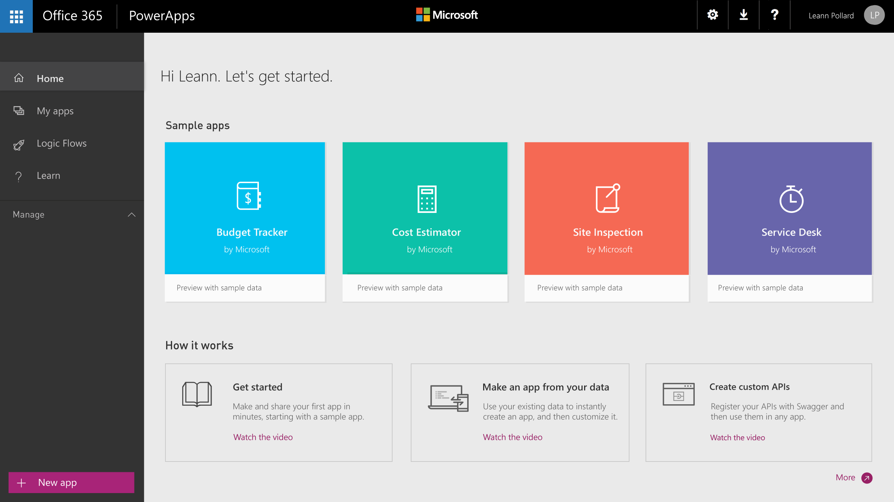

<properties
	pageTitle="Introduction | Microsoft PowerApps"
	description="Quick ways to get started creating and using custom business apps with Microsoft PowerApps"
	services=""
	suite="powerapps"
	documentationCenter="na"
	authors="skjerland"
	manager="anneta"
	editor=""
	tags=""/>

<tags
   ms.service="powerapps"
   ms.devlang="na"
   ms.topic="hero-article"
   ms.tgt_pltfrm="na"
   ms.workload="na"
   ms.date="05/28/2017"
   ms.author="sharik"/>

# Introduction to PowerApps #
Welcome! In PowerApps, you can manage organizational data by running an app that you created or that someone else created and shared with you. Apps run on **[mobile devices such as phones](run-app-client.md)**, or you can run them **[in a browser](run-app-browser.md)** by opening Dynamics 365. You can create an infinite variety of apps &ndash; all without learning a programming language such as C#.

If you're new to app development, you can see how a simple app is built by generating one automatically based on a single data source and then customizing the app to better suit your needs. This video demonstrates how in five minutes:

[AZURE.VIDEO nb:cid:UUID:34ccfd46-7826-49ce-90d8-cf6a144b6968]

After you **[automatically generate an app](app-from-sharepoint.md)** from, for example, a custom SharePoint list, you can change how the app shows **[all items](customize-layout-sharepoint.md)**, **[details about each item](customize-forms-sharepoint.md)**, and **[options for creating or editing an item](customize-forms-sharepoint.md)**. You can also open a **[sample app](open-and-run-a-sample-app.md)** or a **[template](get-started-test-drive.md)** to discover what's possible with PowerApps and to better understand how to build a more complex app.

With some experience and creativity, you can **[develop your own apps from scratch](get-started-create-from-blank.md)**. You can connect to **[data sources](connections-list.md)**, **[add UI elements](reference-properties.md)** (called controls), and specify app behavior by **[building formulas](working-with-formulas.md)**. Starting small and growing your skills at your own pace, you can build and share apps that reinvent how your organization manages data. Ready to take the first step?

## Generate an app automatically ##
To generate an app automatically, you specify a data source such as any of these:

- the **[Common Data Service](data-platform-intro.md)**
- a SQL Server database
- Salesforce
- Dynamics 365
- Excel workbook (in a cloud-storage account)

For step-by-step instructions, see **[Create an app to manage data in SharePoint](app-from-sharepoint.md)**. The topic is designed for SharePoint, but the same principles apply to other types of data sources.

## Customize an app ##
If the generated app doesn't meet your needs by default, you can **[customize it](customize-layout-sharepoint.md)**. You might, for example, want to show different data or the same data in a different control.

For ideas about how to improve your app further, you can **[open a sample app](open-and-run-a-sample-app.md)** to get a sense of what you can invent with some creativity and a bit of experience.

You can also **[build an app from a template](get-started-test-drive.md)**. Each template is based on fictitious data in a cloud account, such as Dropbox. Explore specific screens and controls to understand how they're configured, and experiment with customization to discover techniques that you can apply to your own apps.

## Create an app from scratch
After you've generated an app or two automatically and gained some experience with customization, you can **[create an app from scratch](get-started-create-from-blank.md)**. By working from the ground up, you gain flexibility in app design, flow, and controls, and you can incorporate a larger variety of **[data sources](connections-list.md)**.

For detailed explanations of some concepts you'll need, see these topics:

- formulas (**[tutorial](working-with-formulas.md)** or **[reference](formula-reference.md)**)
- galleries (**[tutorial](add-gallery.md)** or **[reference](reference-properties.md)**)
- forms (**[tutorial](add-form.md)** or **[reference](working-with-forms.md)**)
- **[tables and records](working-with-tables.md)**
- **[controls and their properties](reference-properties.md)**

## Share and run an app ##
When you finish your app, you can **[share it](share-app.md)** with others in your organization, and run either your own apps or shared apps **[in a browser](run-app-browser.md)** or **[on a phone](run-app-client.md)**.

## More information ##
This topic is a high-level overview of the kinds of things you can do with PowerApps, but the possibilities are endless. You can find step-by-step procedures and reference information in the topics listed along the left edge of this page. If you have a detailed question that the topics don't address:

- **[Join our community](https://aka.ms/powerapps-community)** to ask questions and share ideas with other PowerApps users.
- **[Contact support](https://aka.ms/pasupport)**.
