<properties
	pageTitle="KratosApps tutorial: Create an app from a blank screen"
	description="Create an app from scratch by importing a set of sample data, filtering the data, adding items to a custom list, specifying a quantity for each item, and calculating the total cost."
	services="kratosapps"
	authors="AFTOwen"
 />

# Create an app from a blank screen in KratosApps #
Create an app that shows sample data about tablets, laptops, and desktop computers from various manufacturers. Import text and images from an Excel file, show a list from which users can choose one or more devices, and dynamically update the total cost based on a variable quantity for each device.

The first screen of this app shows icons for device categories along the top and manufacturers (OEMs) along the left edge. Users can click these icons to filter the list of devices in the middle of the screen. Users create a list of devices that interest them by selecting the check box for each device. To show the list on the next screen, users click **View Device Mix**.

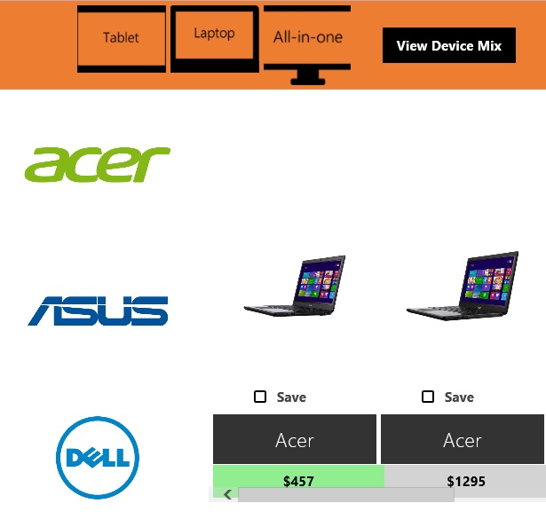

The second screen of this app shows a list of the devices that the user specified on the first screen. Users can specify a quantity for each device, and the app shows the total cost.

*Screen shot*

**Prerequisites**

- Download and install [KratosApps](https://www.kratosapps.com/downloads).

## Install sample data
In this procedure, you'll download an Excel file and three sets of graphics. The Excel file contains these tables:

- **PcCategory**, which contains a name and a link to a graphic for each category
- **OEM**, which contains a name and a link to a graphic for each manufacturer
- **Devices**, which contains a name, a link to a graphic, and other information for each device

After you install the sample data, you'll configure the folder that contains the data so that KratosApps can find it.

1. Download [this file](), and then double-click it to install the sample data in this folder:

	**C:\\Users\\Public\\Public Pictures\\SienaAssets\\PcSelector**
1. In **C:\\Users\\Public\\Pictures**, right-click **SienaAssets**, point to **Include in library**, and then click **Pictures**.

	

1. (optional) Open the Excel file to understand how the tables are structured.

	For example, the **OEM** table has a column for the name of each manufacturer and a column for links to each logo:

	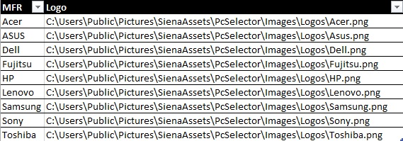

##Import sample data##

2. Open KratosApps, and then press Alt-D (or open the **File** menu, and then click **Data Sources**).

	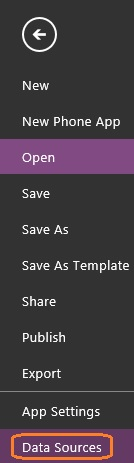

4. In the list of data sources, click **Excel**.

	

5. Browse to the Excel file that you installed at the start of this procedure, and then click that file.

	

6. Click **Open**, confirm that all three checkboxes are selected, and then click **Import Data**.

	

	The three tables in the Excel file appear under **Existing sources**.

	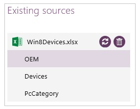

1. (optional) Click each table to display a preview of the data that it contains.

	For example, the **OEM** table shows the name and a logo for each manufacturer. The logos will appear along the left edge of the first screen of the app.

	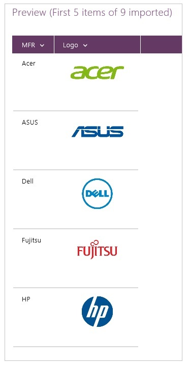

7. Return to the default workspace by pressing Esc (or by clicking the Back arrow in the upper-left corner of the screen).

	

## Create a banner ##
In this procedure, you'll add a rectangle to the first screen of your app, and then you'll configure the **Fill** color, location, and size of the rectangle.

2. On the ribbon, click the **Insert** tab.

	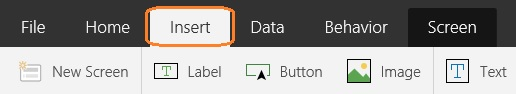

3. On the **Insert** tab, click **Shapes**, and then click the rectangle to add it to the first screen of your app.

	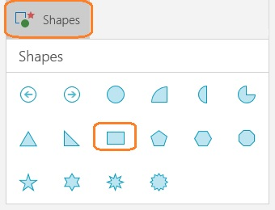

	The rectangle appears near the upper-left corner of the screen.

	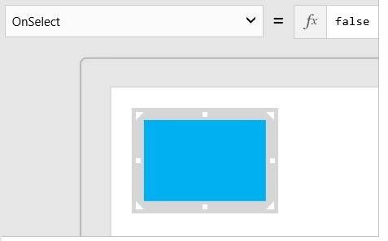

	By default, a thick, gray box surrounds the rectangle to indicate that it's selected by default.

	**Important:** If you click away from the rectangle, it's no longer selected, and you can't configure it. To modify the rectangle (or any other control or screen), click it to select it, and then you can change any of its properties, such as its **Fill** color.

4. On the **Home** tab of the ribbon, click **Fill**, and then click a color in the list that appears.

	To follow this tutorial exactly, click the orange option in the middle of the leftmost column.

	

5. Move the rectangle to the upper-left corner of the screen by dragging the selection box around it up and to the left.

6. In the right side of the same selection box, drag the white square to the right edge of the screen, so that the rectangle becomes a banner.

	The thumbnail view of your screen, near its left edge, reflects your changes.

	
## Show the device categories ##
In this procedure, you'll add a gallery that shows an icon for each device category. A gallery is a UI element that contains other UI elements. By adding and configuring a gallery, you can show a set of related data more easily than by adding and configuring individual elements.

1. On the **Insert** tab, click **Gallery**, and then click the horizontal **Image Only** gallery to add it to your screen.

	

1. Confirm that **Items** appears in the properties list, which is near the upper-left corner of the screen.

	**Tip:** You can configure some properties of a control, such as its size and location, by clicking, dragging, or typing in the control itself. You can change other properties, such as **Fill**, by clicking options in the ribbon. But all properties appear alphabetically in the properties list, so you can always find a property by looking for its name in that list.

3. Set the **Items** property of the gallery by typing **PcCategory** in the Function Bar, which is to the right of the function button.

	**PcCategory** is the name of a table in the Excel file that you imported. That table contains links to icons that the gallery should show.

	

2. Move the gallery to the center of the orange banner, and resize the gallery to fit inside the banner.

	

## Rename a screen and a gallery
In this procedure, you'll rename the default screen and the gallery that you added. You can more easily develop an app if you rename, for example, screens from the default names of **Screen1**, **Screen2**, and so forth.

4. Select the gallery by clicking the icon for the **Laptop** or the **All-in-one** category.

	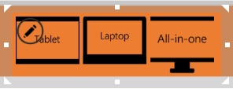

6. On the **Home** tab, click **Gallery1**, and then type **CategoryGallery**.

	**Note:** If you've added and deleted a gallery before you added this one, the name of the gallery will end with a number that's greater than 1.

	

7. Click an empty area of the screen to select it, click **Screen1** on the **Home** tab, and then type **MainScreen**.

	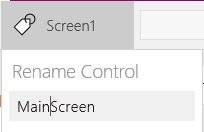

8. Save your changes by pressing Ctrl-S (or by opening the **File** menu and then clicking **Save**).

## Show the OEM logos ##
In this procedure, you'll add another gallery and then configure it to show the logo of each OEM. You'll also update the template for that gallery, which will automatically update every item in the gallery to match.

6. On the **Insert** tab, click **Gallery**, and then click the vertical **Image Only** gallery.

	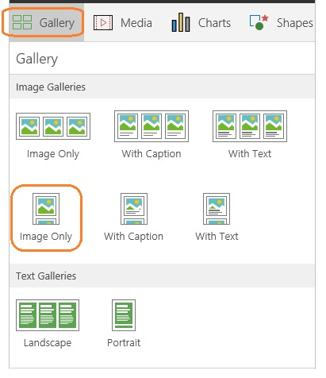

8. Name the gallery that you just added **OemGallery**, and set its **Items** property to **OEM**.
7. Move the **OemGallery** to the left edge of the screen (under the orange banner), and resize the gallery so that it shows most of four logos.

	

8. Click the first the image in the gallery to select the gallery template.

	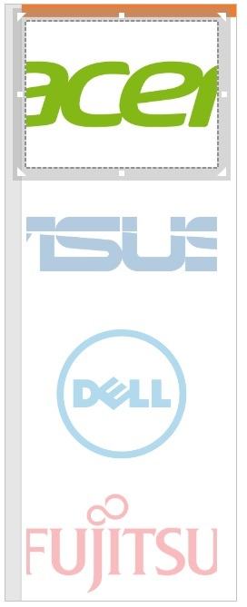

9. On the **Image** tab, click **ImagePosition**, and then click **ImagePosition!Fit**.

	

	Each logo appears entirely in the gallery.

	

## Show the devices ##
In this procedure, you'll add a third gallery, which will show an image of each device, its manufacturer, and its category. In the last step, you'll configure the gallery to show the price of each device instead of its category. The prices in Excel don't appear with a dollar sign so you'll add one by specifying an expression. 

In an expression, you indicate literal text (in this case, a dollar sign) between quotes. You also concatenate two pieces of text by separating them with an ampersand. For an element in a gallery, you specify which column of a table to show by using **ThisItem**, followed by an exclamation mark, followed by the column name.

1. On the **Insert** tab, click **Gallery**, and then click the horizontal **Image With Text** gallery.

	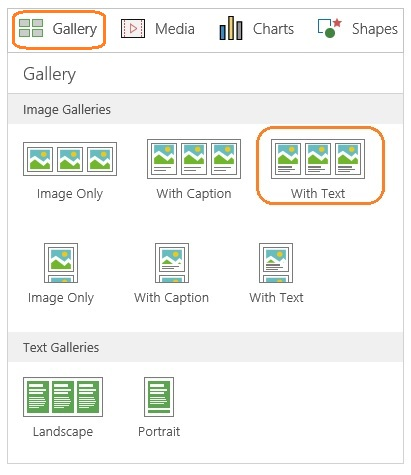

2. Name the newest gallery **DevicesGallery**, and set its **Items** property to **Devices**.

	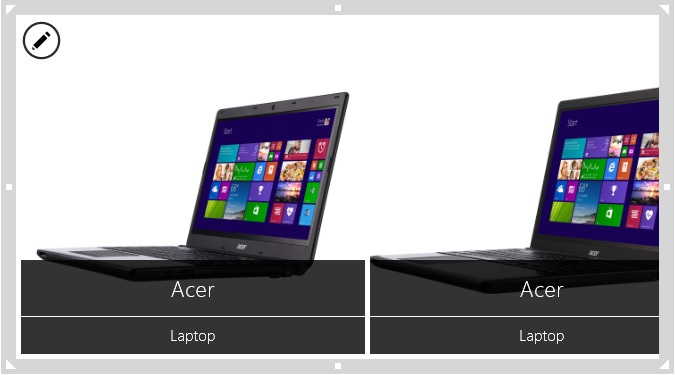

2. Position the **DevicesGallery** so that it touches the right edge of the **OemGallery**, near the vertical center.
3. Click the first image in the **DevicesGallery**, and then set its **ImagePosition** property to **Fit**.
4. Under the first image in the **DevicesGallery**, click the bottom label, and then set its **Text** property to this expression, so that the price of each device appears:

	**"$" & ThisItem!Price**

	

	**Note:** The price expression contains two elements and an ampersand:

	- The first element (the dollar sign) is a literal string, which means that it will appear exactly as you type it. To specify a literal string in an expression, you surround the string with quotation marks.
	- The ampersand concatenates whatever elements precede and follow it, so they appear as a continuous element.
	- The last element is a placeholder for the price of the device. The element is automatically converted to whatever value is in the **Price** column of the table that the gallery shows.

## Filter the devices ##
In this procedure, you'll configure the **DeviceGallery** so that users can filter it by both category and manufacturer. You'll also test the filter in Preview, with which you can verify that your app works exactly as you expect.

1. Set the **Items** property of the **DevicesGallery** to this expression:

	**Filter(Devices, MFR = OemGallery!Selected!MFR && DeviceType = CategoryGallery!Selected!PcCategory)**

	[More information]() about **Filter** and other functions in KratosApps

2. Press F5 to open Preview.
3. Click a category and an OEM logo to show only devices in that category from that manufacturer. 
4. Return to the default workspace by pressing Esc.

## Highlight devices by price##
In this procedure, you'll highlight less expensive devices by using a conditional statement. With the **If** function, you specify a condition that is either true or false and a result if the condition is true. You can also specify a result if the condition is false.

In this case, you'll specify that if the price of the device is less than $700, the **Fill** color of the price label will be light green. If the price is $700 or more, the **Fill** color will be light gray. You'll also change the text in that label to a black bold font.

1. Under the first image in the **DevicesGallery**, click the bottom label, and then set its **Fill** property to this expression:

	**If(Price<700,LightGreen,LightGray)**
2. Set the **Color** property of the same label to **Black**, and set its **FontWeight** property to **Bold**.
3. (optional) Find a device that costs less than $700, and verify that its price appears in a green, not gray, box.

	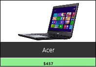

## Create a custom list ##
In this procedure, you'll add a checkbox to each item in the **DevicesGallery**. Users can select the checkbox for one or more devices to add them to a custom list, called a [collection](). Users can remove a device from the list by clearing the checkbox.

To automatically add a control, such as a checkbox, to each item in the gallery, you add the control to the gallery template. You can't click the template itself to select it because the image and two labels completely cover it. But, as the procedure describes, KratosApps offers an icon you can click instead.

After you add the checkbox, you then specify what you want the app to do when the user selects or clears it. You can [add similar behavior properties]() to any control in KratosApps so that the app responds appropriately to user input.

1. In the **DevicesGallery**, click any item except the first one, and then click the pencil icon in the upper-left corner of the gallery.

	*Screen shot*

	You've selected the gallery template, instead of a specific element in the template.

	*Screen shot*

1. On the **Insert** tab, click **Controls**, and then click **Checkbox**.

	*Screen shot*

1. Shrink the height of the image element, and then move the checkbox under it.

	*Screen shot*

1. Change the checkbox's text by double-clicking **Option** and then typing **Save**.

	*Screen shot*

1. With the checkbox still selected, click the **Behavior** tab, and then click **OnCheck**.

	*Screen shot*

1. Click **Collect**, click the down arrow for the lower list, and then click **ThisItem**.

	*Screen shot*

	The properties list shows **OnCheck**, and the Function Bar shows the expression for adding the selected item to a collection, named **Collection1**.

	*Screen shot*

1. With the checkbox still selected, click **OnUncheck** on the **Behavior** tab.

1. Click **Remove**, click the down arrow for the lower list, and then click **ThisItem**.

## Add a screen and navigation##
In this procedure, you'll start to create the screen that will show the custom list of devices. To navigate between the two screens, you'll add a button to the first screen and a back arrow to the second screen. When users click either of these controls, the other screen will appear.

1. On the **Home** tab, click **New Screen**.

	*Screen shot*

1. Name the new screen **SummaryScreen**, and then return to the **MainScreen** by clicking it in the left navigation bar.
2. On the **Insert** tab, click **Button**.

	*Screen shot*

1. Move the button near the right edge of the banner, change its text to **View Device Mix**, and change its fill to black.

	*Screen shot*

1. With the button still selected, click the **Behavior** tab, and then click **Navigate**.

	*Screen shot*

	The properties list autotmatically shows the **OnSelect** property, and the Function Bar shows the expression for navigating to the **SummaryScreen** with a fade transition.

	*Screen shot*

1. Show the **SummaryScreen** by clicking it in the left navigation bar.
2. On the **Insert** tab, click **Shapes**, and then click the back arrow to add it to the screen.

	*Screen shot*

1. With the arrow still selected, click the **Behavior** tab, and then click **Navigate**.

	The properties list shows the **OnSelect** property, and the Function Bar shows the expression for navigating to the **MainScreen** with a fade transition.

	*Screen shot*

1. (optional) Test navigation:
	1. Press F5 to open Preview.
	2. Alternate clicking the button on the **MainScreen** and the arrow on the **SummaryScreen**.
	3. Press Esc to return to the default workspace.

## Show the custom list ##
In this procedure, you'll add items to a custom list and then show it in a gallery. To keep this procedure short, you'll copy the gallery from the **MainScreen**, paste it into the **SummaryScreen**, and then change the gallery's data source to the collection you created.

1. From the **MainScreen**, press F5 to open Preview.

2. Select the checkbox for more than one device, and then press Esc to return to the default workspace.

2. Click the orange banner, and then hold down Ctrl as you click any item in the **DevicesGallery** except the first one.

	A selection box appears around both the banner and the **DevicesGallery**.

	*Screen shot*

3. Press Ctrl-C to copy those two controls to the Clipboard, show the **SummaryScreen**, and then press Ctrl-V to paste them onto that screen.

1. Rename the gallery that you pasted to **SelectedDevicesGallery**, and set its **Items** property to **Collection1**.

	*Screen shot*

4. Click the banner, click **Reorder** on the **Home** tab, and then click **Send to Back**.

	*Screen shot*

6. Change the **Fill** property of the back arrow to white, and move it to the closer to the left edge of the banner, near the vertical center.

	*Screen shot*

##Specify a quantity for each device ##
In this procedure, you'll replace the checkbox in each item of the gallery with a slider and add a label for clarity. Users will adjust the slider for each device to specify a quantity so that, in the next procedure, the app can show the total cost of all devices.

1. In the first item of the **SelectedDevicesGallery**, click the checkbox, and then press Delete.
2. Select the template for the **SelectedDevicesGallery** by clicking any item except the first one and then clicking the pencil icon in the upper-left corner of the gallery.

	*Screen shot*

3. On the **Insert** tab, click **Controls**, and then click **Slider**.

	*Screen shot*

4. Rename the slider **QuantitySlider**, and move it below the image in the template.

	*Screen shot*

1. With the template still selected, click **Label** on the **Insert** tab.

	*Screen shot*

2. Double-click the label, and then type **QTY:** to change its text.
3. Move the label near the left edge of the slider.

	*Screen shot*

## Show total cost ##
In this procedure, you'll add a label and configure it with an expression that calculates the overall cost of all devices in the custom list. The expression combines the following:

- A literal string, surrounded by quotation marks, to indicate what the value represents and precede it with a dollar sign
- An ampersand to concatenate the literal string and the value
- A **Sum** function inside a **Text** function
	- The **Sum** function uses parameters to multiply the per-unit price of each device in the list by the quantity that you specify with the slider for that device. 
	- The **Text** function uses parameters to add a comma if the value includes four or more digits.

KratosApps supports [many functions]() besides **Sum** and **Text**.

1.  Click a blank area of the **SummaryScreen**, click the **Insert** tab, and then click **Label**.
2.  Move the label so it appears near the right edge of the banner.

	*Screen shot*

3. With the label selected, open the properties list, click **Text**, and then replace the default text with this expression:

	**"Total Cost: $" & Text(Sum(SelectedDevicesGallery!AllItems, Price * QuantitySlider!Value), "###,###")**

	After you add the expression, the label will resemble this graphic, though the actual value will depend on which devices you selected.

	*Screen shot*

1. (optional) Press F5 to open Preview, adjust the sliders to verify that the total cost updates to reflect your changes, and then press Esc to return to the default workspace.

## Add pen input ##
In this procedure, you'll add a pen control so that users can use a mouse or a stylus to add notes about each device in the custom list. With a couple more clicks, you'll show controls with which users can:

- switch between write and erase mode
- clear all lines from the control
- change the color or width of the lines they can draw

You can also [add and configure controls]() such as a camera and a microphone so that users can add data other than text and values to your app.

1. On the **SummaryScreen**, select the **SelectedDevicesGallery**, and then double its height.

	*Screen shot*

2. In the template of that gallery, move the two labels so that they appear near the bottom of the slider.

	*Screen shot*

1. With the same template selected, click the **Insert** tab, click **Text**, and then click **Pen**.

	*Screen shot*

2. Move and resize the pen control so that it fits in the template, under the bottom label.

	*Screen shot*

1. With the pen control still selected in the gallery template, click the **Pen** tab, and then click **ShowControls**, so that **true** appears in the Function Bar.

	*Screen shot*

	A set of buttons appears near the bottom of the pen control.

	*Screen shot*

1. (optional) Test the pen control:
	1. Press F5 to open Preview.
	2. Write some text or draw a picture in the pen control.
	3. Erase some or all of the text or picture that you created.
	3. Press Esc to return to the default workspace.

## Next Steps ##

- [Save your custom list]() When you close this app, the information in your custom list will be lost unless you save it on your local device.
- [Publish your app]() After you finish developing and testing your app, share it with others by publishing it to the KratosApps portal.
