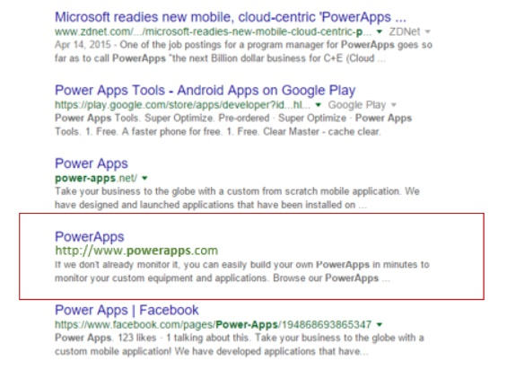
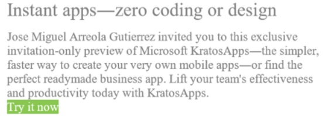
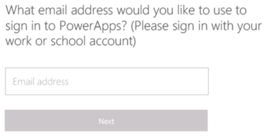
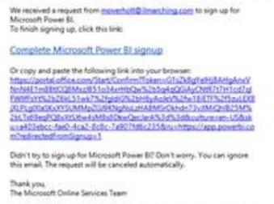
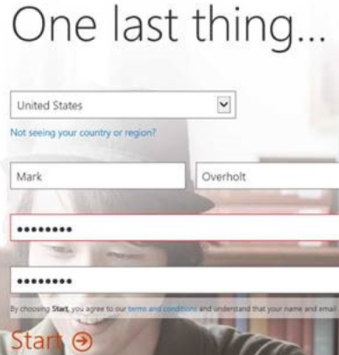

<properties
	pageTitle="Sign in to KratosApps"
	description=""
	services="kratosapps"
	authors="AFTOwen"
 />

# Sign in to KratosApps #
1. Do any of the following:
	
	- If you found KratosApps by using a search engine, click the link in the search result.

		

	- If a co-worker invited you to try KratosApps or a specific app, click the link in the invitation.

		

	- If you found KratosApps in the Windows Store, type your email address, and then click **Next** (or **Sign up for PowerApps**?).

		
1. On the product website, type your email address, and then click **USE IT FOR FREE**.

	

1. In your email program, open the message from the Microsoft Office 365 Team, and then click the link to complete sign up.

	

1. Click your country or region in the drop-down list, type your full name in the text boxes.
1. Type a password, type it again to confirm it, and then click **Start**.

	

1. Do any of the following:
	- On the **New** tab, click a template to create an app or a PowerFlow.
	- Click **Apps** to show all the apps that you can run.
	- Click **Flows** to show all the PowerFlows that you can access.
	- Click **Connections** to show all the data connections that you can use.
