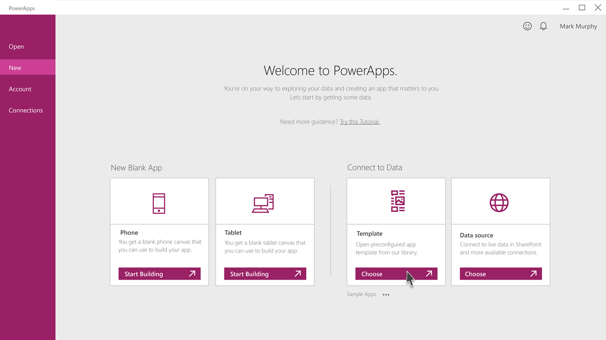
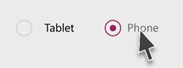
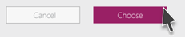
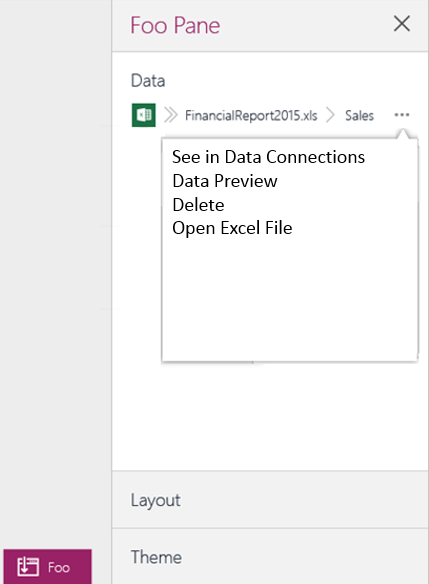
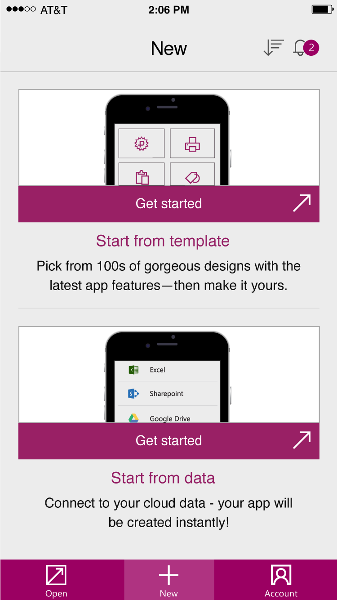
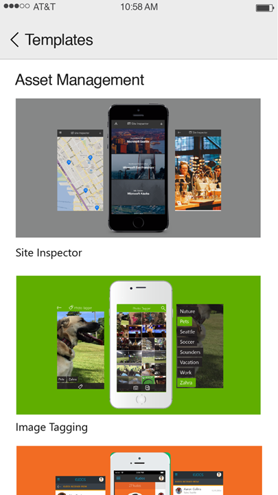
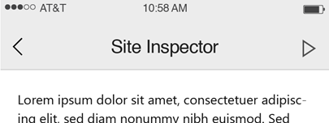
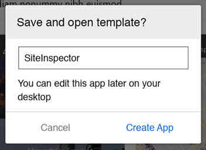

<properties
	pageTitle="Using Templates in KratosApps Studio"
	description="In KratosApps Studio, create a new app based on a template to jump start the app creation process"
	services="kratosapps"
	authors="evcohen"
 />

#Using Templates in KratosApps Studio

Get started building an app by using a template.

**What is a template?**
A template is a pre-built app that comes with:
- Sample Excel Data
- Sample Images (only in some cases)

# Build an app from a Template on Desktop
## Choosing a Template ##

1. In KratosApps Studio click **New** and select **Template**.

	

2. Select *CATEGORY_GOES_HERE* from the list of categories on the left.

	

3. Choose *APP_NAME_GOES_HERE* from the list of templates in the center column

	

4. Ensure that you have selected *Phone* as the app type

 	

5. Click on the *Edit* button to choose where you want to upload the sample Excel data.
	If you already have a storage connection established and it is already selected you can skip to Step 6.

	

	Create a new connection or select an existing one from the pop-up.
	(This connection will be added to [Connections](kratosapps-connections.md))
	

6. Click *Choose* to use the selected template
	
	
	
	Your sample data and images will be uploaded to the connection you chose and your app will be launched in *Edit* mode.

## Modifying Data ##

1. Preview your app
	Press the play button on the top right to preview your app.
	

2. Make Changes to your data
	A. Select the first item listed in the gallery on the first page
	B. Click Edit
	C. Change the title of the item to "SOME_NEW_TITLE"

3. See your data updated in the cloud
	
	A. Select open the Express Pane by clicking the toggle on the bottom of the screen
	B. Click on the more button ("...")
	C. Select "Open on DropBox"
	

	D. Find the item in your excel file with the new title "SOME_NEW_TITLE"

	Congratulations, you now have an app that talks to Excel in the Cloud!

## Saving Your App##

To save your app please see the (Saveing to PowerApps Tutorial) [Connections](kratosapps-saveing.md)).

# Build an app from a Template on Mobile
## Choosing a Template ##

1. In KratosApps Mobile tap **New** from the bottom navigation menu and select **Template**.

	

2. Select *CATEGORY_GOES_HERE* from the list of categories on the left.

	

3. Choose *APP_NAME_GOES_HERE* from the list of available templates

	

4. Click on the *Change* button to choose where you want to upload the sample Excel data.
	If you already have a storage connection established and it is already selected you can skip to Step 5.

	

	Create a new connection or select an existing one from the slide-out.
	(This connection will be added to [Connections](kratosapps-connections.md))
	

5. Tap the *Play* in the top right to use the selected template
	
	

6. Name your app and press "Create App"

	
	
	Your sample data and images will be uploaded to the connection you chose and your app will be opened.

## Modifying Data ##

Once your app is running you can make changes to the data and then see them reflected in the sample data you've stored in the cloud.

1. Make Changes to your data
	A. Select the first item listed in the gallery on the first screen
	B. Click Edit
	C. Change the title of the item to "SOME_NEW_TITLE"

2. See your data updated in the cloud
	
	A. Open the cloud storage solution that you used to store your sample data
	B. Navigate to the sample data and open it
		By default data is uploaded to a folder called /KratosApps/
	C. Find the item in your excel file with the new title "SOME_NEW_TITLE"

	Congratulations, you now have an app that talks to Excel in the Cloud!