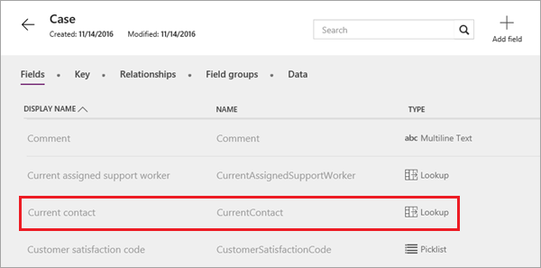
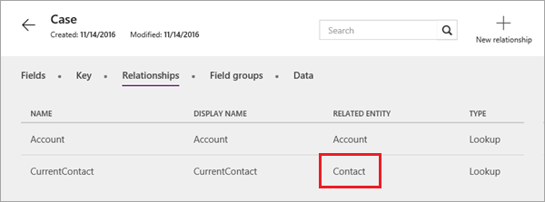
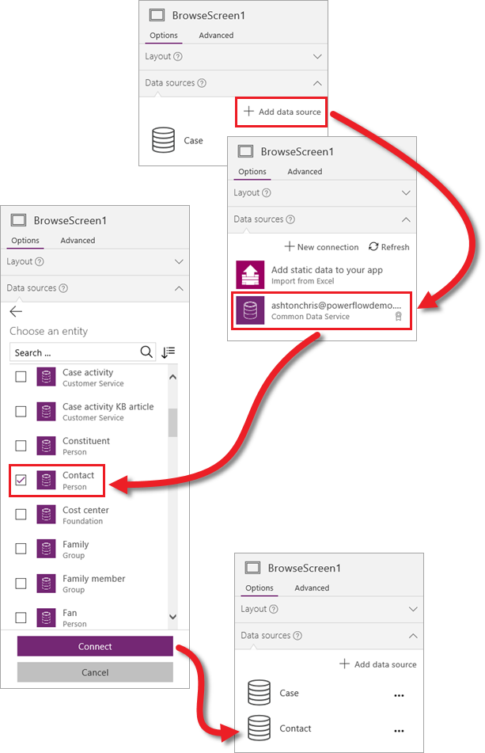
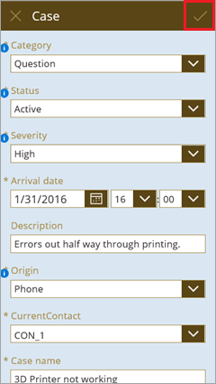
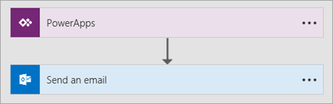
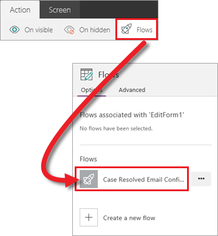

<properties
   pageTitle="Add a data source and flow (Common Data Service) | Microsoft PowerApps"
   description="Bring in additional data and trigger a flow from the app"
   services=""
   suite="powerapps"
   documentationCenter="na"
   authors="mgblythe"
   manager="anneta"
   editor=""
   tags=""
   featuredVideoId="Y057qUJ2NNk"
   courseDuration="11m"/>

<tags
   ms.service="powerapps"
   ms.devlang="na"
   ms.topic="get-started-article"
   ms.tgt_pltfrm="na"
   ms.workload="na"
   ms.date="12/09/2016"
   ms.author="mblythe"/>

# Add a data source and flow (Common Data Service)
So far in this section, we have generated an app based on the Case entity from the Common Data Service, explored the app to see how it's put together, and customized the app in several ways. In the final topic for this section, we will bring in another standard entity, and use Microsoft Flow to send an email. The app will trigger a flow so that the person who opened a case is notified when the case is updated. We're completing a particular scenario in this topic, but the skills you learn are applicable across many kinds of apps. Let's get started with the entities.


## Review entity relationships
We'll add the Contact entity shortly, but first we'll look at how the Case and Contact entities relate to each other. In the Case entity, you see that one of the fields is **CurrentContact**, with a data type of **Lookup**. This means that this field is used in a relationship with another table.



On the **Relationships** tab, you see that the related entity is **Contact**. Keep that in mind because we will use this relationship later in this topic.




## Add an entity to the app
Adding a data source in PowerApps is straightforward. In the right-hand pane, click or tap **Data sources**, then **Add data source**. In this case, then choose the **Common Data Service** connection and select the **Contact** entity. After you click or tap **Connect**, the entity is added to the app. 



Note that in this example, we're adding data from another entity, but you can combine data from many sources in your apps. 


## Look up contact information
Now that we have access to the Contact entity data in our app, it's time to put it to use. As mentioned in the introduction, we want to send an email when a case is updated. We will use two formulas and a flow to accomplish this. The first formula is for the edit screen, specifically the OnSelect property of the save button.



By default, this button uses the formula `SubmitForm(EditForm1)` to submit the update when a user edits data in the form. We need to add to the formula so that it first looks up the contact information for the person who opened the current case, and then stores that information locally in the app: 

```UpdateContext({contact:LookUp(Contact, ContactId=BrowseGallery1.Selected.CurrentContact.ContactId)}); SubmitForm(EditForm1)```

Yes, it's a little complex, but James does a great job of explaining this formula in more detail, starting at 2:04 in the video.


## Trigger a flow from the app
Now that we know who the contact is for each case, we can send an email to them. We could send an email directly from the app, but for this example we'll show you how to trigger a flow from the app. Here's the flow, which is as simple as it gets: send an email based on an action in an app. We won't get into more detail on flows here, but there is a whole Guided Learning series for Microsoft Flow. 



Back in the app, we need to call the flow based on an event. We'll use the OnSuccess property of the edit form, so the flow is triggered when the edit succeeds. Click or tap the edit form, then on the ribbon click or tap **Action** > **Flows**. Select the flow you want to use. 



The flow is now associated with the OnSuccess event of the edit form, and we can refer to the contact for the email. The following formula calls the flow with the email address of the person who opened the case, as well as a subject line and the body of the email. 

```CaseResolvedEmailConfirmation.Run(contact.EmailPrimary, "Your case has been updated", "Check it out")```

That's it for adding a data source to the app, and triggering a flow that sends an email. If you haven't watched the videos in this section already, we encourage you to do it. They fill in lots of the details that we've moved through quickly in the topics.

## Wrapping it all up
This brings us to the end of this section. We hope you've enjoyed it and learned a ton. We started out generating a basic app from an entity, and explored the app a little to understand how it's put together. We spent a good deal of time on customizing the app, then added a data source and saw how to trigger a flow. We built out a specific case management app in this section, but the skills you learned could be applied to many types of apps. As we mentioned at the beginning of this section - if you want to dig into a more complex case management app, be sure to check out the template that's available in PowerApps Studio for Windows. 

Next up we'll move into managing apps. The management section shows you how to share and version apps, and introduces environments, which are containers for apps, data, and other resources. 