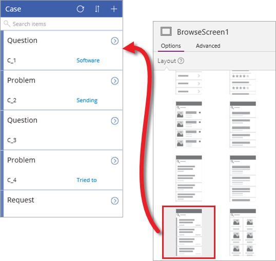
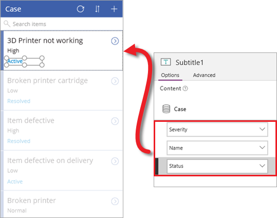
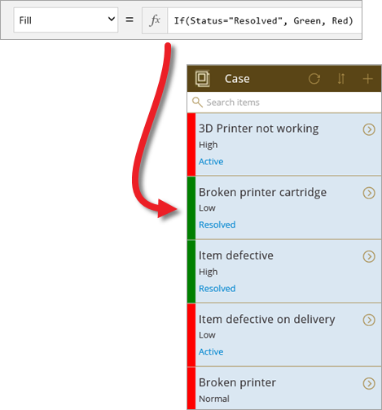
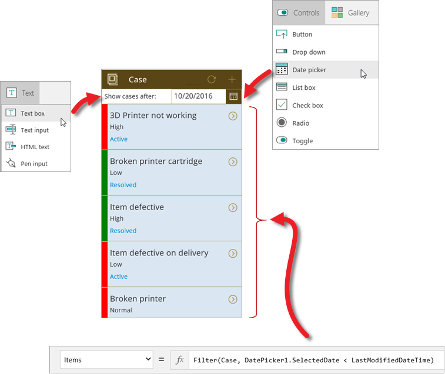
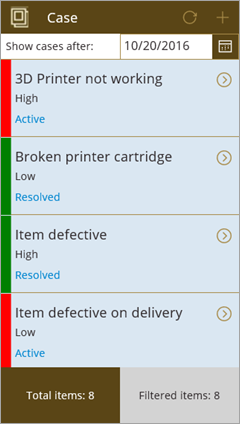

<properties
   pageTitle="Customize the app (Common Data Service) | Microsoft PowerApps"
   description="Update app screens, controls, and fields"
   services=""
   suite="powerapps"
   documentationCenter="na"
   authors="mgblythe"
   manager="anneta"
   editor=""
   tags=""
   featuredVideoId="wHy72cOe8Os"
   courseDuration="12m"/>

<tags
   ms.service="powerapps"
   ms.devlang="na"
   ms.topic="get-started-article"
   ms.tgt_pltfrm="na"
   ms.workload="na"
   ms.date="12/09/2016"
   ms.author="mblythe"/>

# Customize the app (Common Data Service)
In the first two topics in this section, you generated an app from a Common Data Service entity and explored the app to get a better understanding of how three screen apps are composed. The app that PowerApps generated is useful, but you will often customize an app after it's generated. In this topic, we'll walk through some changes for the browse screen of the app. You can customize any of the screens, but we wanted to focus on one and provide a bit more depth to the customizations. We encourage you to take any app you generate - from an entity, an Excel file, or another source - and see how you can customize it. It really is the best way to learn how apps are put together.

## Change gallery and data bindings
When PowerApps generated the app, it decided on a layout to use, and particular fields to show on each screen. For this app, let's choose a gallery control that has a status bar (we'll customize the status bar shortly). In the right-hand pane, on the **Layout** tab, select the layout you want. You see the results right away because PowerApps updates the app as you make changes.

With the right basic layout, now change the fields that are displayed. Click or tap a field in the first item, then in the right-hand pane, change the data that is displayed for each item. This provides a better summary of each item in the entity.

## Change the app theme
PowerApps provides a set of themes you can use in your app, much like PowerPoint. In the following screen, you see the **Dune** theme applied, and a simple logo that we pasted into the app. These are basic changes, but can do a lot to improve the appearance of your app. 

## Use a formula to show the case status
One of the major benefits of PowerApps is not having to write traditional application code - you don’t have to be a developer to create apps! But you still need a way to express logic in an app and to control an app’s navigation, filtering, sorting, and other functionality. This is where formulas come in.

If you have used Excel formulas, the approach that PowerApps takes should feel familiar. Suppose you want to show the status bar in green if a case is resolved, or in red otherwise. To do this, you select the status control on the screen, and then set the **Fill** property of that control to this formula in the formula bar: `If(Status="Resolved", Color.Green, Color.Red)`. This is like an Excel formula, but PowerApps formulas refer to controls and other app elements rather than cells in a spreadsheet. The following image shows where to set the formula, and the result in the app.

## Sort and filter based on date
On the browse screen, the generated app lets you search for cases and sort the list of items in the gallery. We're going to remove the search and sort functionality in favor of showing cases based on a date. You could combine these methods, but we'll focus on the date-based approach for this app. In the image below, you see the items we added:

- A text label ("Show cases after:") so users know what to do: **Insert** > **Text** > **Label**; change the **Fill** formula to **White**.
- A date picker: **Insert** > **Controls** > **Date picker**.
- A formula that connects the browse gallery **Items** property to the date picker: `Filter(Case, DatePicker1.SelectedDate < LastModifiedDateTime)`.

The date is set to Oct 20 and you see the result that the app is showing the cases created after this date. Note that by default, all cases in the entity have the same last modified date. You can update one or more to see how filtering works. We cover working with entity data later in the course.

## Show total number of cases
We're covering a lot of ground here, but we're almost done with the customizations. The last thing we'll do in this topic is add labels that show two numbers: the total number of cases and the number of cases that match our date-based filter.

The video goes into detail about how to add the two labels, but here's the basics on which properties we set for each label:

- **Align** = `Center`
- **Width** = `Parent.Width/2`
- Left box **Text** = `"Total cases: " & CountRows(Case)`. This includes all cases that are in the entity. 
- Right box  **Text** = `Filtered cases: " & CountRows(BrowseGallery1.AllItems)`. This includes only those cases that match the date-based filter.

OK, that wraps up the app customizations - in the next topic we'll add a data source, and a flow, and show you the finished app.