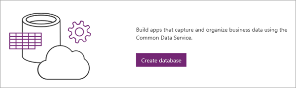
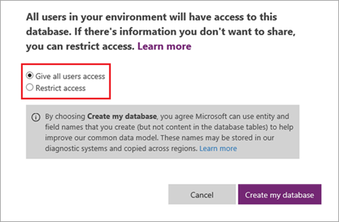
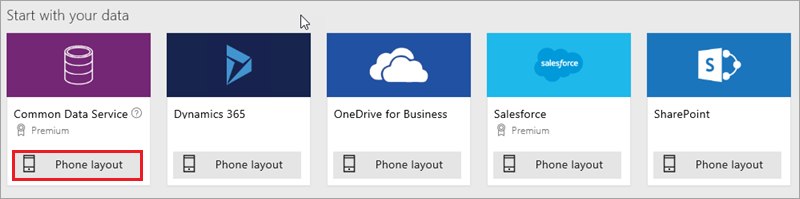

<properties
   pageTitle="Generate an app (Common Data Service) | Microsoft PowerApps"
   description="Generate a three screen app from the Common Data Service"
   services=""
   suite="powerapps"
   documentationCenter="na"
   authors="mgblythe"
   manager="anneta"
   editor=""
   tags=""
   featuredVideoId="Gi5TQF7_pz8"
   courseDuration="6m"/>

<tags
   ms.service="powerapps"
   ms.devlang="na"
   ms.topic="get-started-article"
   ms.tgt_pltfrm="na"
   ms.workload="na"
   ms.date="12/09/2016"
   ms.author="mblythe"/>

# Generate an app (Common Data Service)
In this section of the course, we'll create an app based on _entities_ in the Common Data Service. Entities are chunks of shared data that can be modified, stored, retrieved, and interacted with. We'll generate the app from an entity, show you how to customize the app, add another data source, and call a flow from the app. If you already completed the section on creating an app from a SharePoint list, we will cover some of the same territory but in more depth, especially around customizing the app.

We'll create a case-management app that an IT department could use to track, prioritize, and act on hardware and software issues across an organization. As you go through the topics, you might also think of other uses for an app like this. We're using data from the Common Data Service because it's well-suited to storing app data, but you could build the same app with a different data source.

PowerApps includes a more complex Case Management template that uses the same entities as the app we'll build. After you've completed this section, we encourage you to explore that template to get a sense of what you can build in PowerApps.

## Create a Common Data Service database
The first step in building this app is to create a Common Service database if you don't already have one. You create a Common Data Service database in an _environment_. An environment is a container for apps and other resources (you'll learn more about environments later in the course). An _environment admin_ can follow these steps to create a database (if you're not an admin, check with an admin in your organization).

From the **Home** tab, click **Create Database**.

Specify whether you want to restrict access to the database (we'll keep it open), then click **Create my database**.

When the process is complete, you see all the standard entities that are included in the common data model. Some of them are shown below.

## Generate an app from the Case entity
Now that the database is created, we connect to the Case entity and generate an app. Click **New app**, then **PowerApps Studio for web**.

We're building a phone app for a Common Data Service entity, so under **Common Data Service** click or tap **Phone layout**.

In the next screen, you choose a connection and an entity to connect to, then click **Connect**.

After you click **Connect**, PowerApps starts to generate the app. PowerApps makes all sorts of inferences about your data so that it generates a useful app as a starting point.

## View the app in PowerApps Studio
Your new three-screen app opens in PowerApps Studio. All apps generated from data have the same set of screens:

- The **browse** screen: where you browse, sort, filter, and refresh the data pulled in from the list, as well as add items by clicking the (+) icon.
- The **details** screen: where you view more detail about an item, and can choose to delete or edit the item.
- The **edit/create** screen: where you edit an existing item or create a new one.

In the left navigation bar, click or tap an icon in the upper-right corner to switch to the thumbnail view.

Click or tap each thumbnail to view the controls on that screen.

Next we'll explore the app in more detail and then customize it to better suit our needs.
