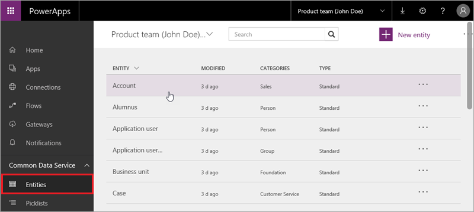

<properties
   pageTitle="Understand Common Data Service entities | Microsoft PowerApps"
   description="Define and use entities that map to your business data and processes"
   services=""
   suite="powerapps"
   documentationCenter="na"
   authors="mgblythe"
   manager="anneta"
   editor=""
   tags=""
   featuredVideoId="JJa6n_YaD-w"
   courseDuration="8m"/>

<tags
   ms.service="powerapps"
   ms.devlang="na"
   ms.topic="get-started-article"
   ms.tgt_pltfrm="na"
   ms.workload="na"
   ms.date="12/09/2016"
   ms.author="mblythe"/>

# Understand entities
In the first topic in this section, we introduced you to the Common Data Service, which includes a common data model. The model in turn contains entities. Entities are chunks of shared data that can be modified, stored, retrieved, and interacted with. In this topic, you'll learn more about entities, fields, and data types.

## Standard entities
The common data model comes with a set of standard entities that cover a range of common business needs. Some of the standard entities are shown below.

The entities are grouped into categories so it's easy to see which ones typically work together in a solution.

| Functional group                  | Description                                                                                                                                                                                     |
|-----------------------------------|-------------------------------------------------------------------------------------------------------------------------------------------------------------------------------------------------|
| Customer Service                  | The Customer Service entities manage issues from your customers, including tracking, escalation, and documentation.                                                                             |
| Foundation                        | The Foundation entities contain information that is relevant to nearly every other entity group. This group contains entities such as Address and Currency.                                     |
| People, Organizations, and Groups | These entities encompass a rich set of people and organizations that you might interact with, including employees, contractors, donors, volunteers, fans, alumni, and families.                 |
| Purchasing                        | The Purchasing entities let you create purchasing solutions.                                                                                                                                    |
| Sales                             | The Sales entities let you create end-to-end sales solutions, from tracking leads and opportunities, to following through with contacts, accepting and delivering orders, and sending invoices. |

## Fields and data types
Each entity contains a set of default fields that you can't change or delete. Some of those fields, like **Contact ID**, are specific to an entity. Others, like **Created on date time**, are common to all entities. You can extend standard entities by adding fields. Just click or tap **Add field** and specify the new field's properties.

If you need an entity that is completely different (i.e. extending a standard entity isn't enough), you create a custom entity. We will cover that in the next topic.

The fields in an entity each have a data type, like Number. Having different data types, rather than a single generic data type is helpful because it lets your apps to do all sorts of cool things. For example, when you have a field of type Number, your apps can use a slider control when a user edits that field. You can choose from more than a dozen data types - the following list shows some representative types:

- Basic types, like Text and Number
- More complex types, like Email and Phone
- Special types, like Lookup (for creating relationships) and Picklist (to hold a fixed set of values for a field)  

## Working with entities
When you open an entity, you see a lot of information and several actions that you can take. We'll briefly look at the tabs that are available, and the actions you can take to manage entity data.

- **Fields**: see fields and data types, and add fields, all of which we discussed above.
- **Key**: the field that identifies each row in an entity, like Contact ID for the Contact entity.
- **Relationships**: connections between related entities like Product and Product category. We'll see an example in the next topic.
- **Field groups**: used to control various behaviors, like which fields to automatically show when you create an app screen in PowerApps.
- **Data**: browse sample data and your own data after it's imported.

- **Open in Excel**: if you have the PowerApps add-in installed, use this option to explore and edit your data in Excel.
- **Import data**: bring in data from Excel and CSV files.
- **Export data**: export data to an Excel file.
- **Export template**: export the structure of an entity to an Excel file so you can populate the file and import it back into the entity.
- **Settings** and **Delete**: not available for standard entities.

## Connecting to a standard entity in PowerApps Studio
Now that you understand what entities are, we'll look at how to connect to the Contact entity in PowerApps Studio. Click **New**, then under **Common Data Service**, click **Phone layout**. You see available data connections on the left and the list of entities on the right. Try connecting on your own, and generate an app from the entity.

In the next topic, we'll show you how to create custom entities, as well as relationships between entities.
