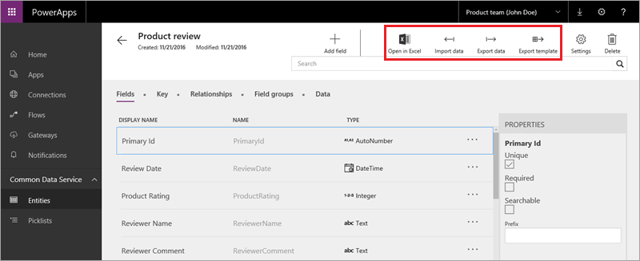
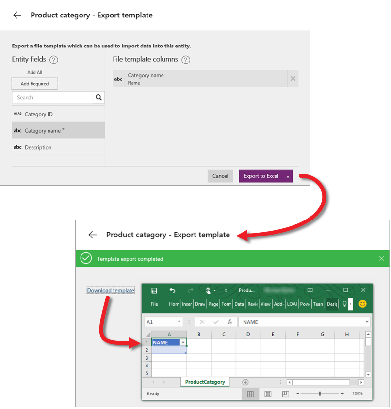

<properties
   pageTitle="Manage entity data | Microsoft PowerApps"
   description="Work with data in the service and Excel"
   services=""
   suite="powerapps"
   documentationCenter="na"
   authors="mgblythe"
   manager="anneta"
   editor=""
   tags=""
   featuredVideoId="n6RizzixvxM"
   courseDuration="7m"/>

<tags
   ms.service="powerapps"
   ms.devlang="na"
   ms.topic="get-started-article"
   ms.tgt_pltfrm="na"
   ms.workload="na"
   ms.date="12/09/2016"
   ms.author="mblythe"/>

# Manage entity data
In this topic, we'll cover data management in the Common Data Service. We have touched on importing and exporting data in other topics, but we'll spend more time now on working with data in Excel.

## Import data from Excel or CSV
In this example, we'll import data from Excel into the Product review entity that we created in the last topic. You can also import data from CSV files, which is a common format to move data around. Here's a reminder of what the entity looks like; the highlighted area is what we'll focus on in this topic.

In an entity, click **Import data**, then navigate to the file you want to import from. Click **Show mapping** and make sure the columns in the Excel file are associated with the right fields in the entity. When you're happy with the mappings, click **Save changes**. Back on the main import screen, click **Import**.

## Export data to Excel
Export data if you need access to it outside the Common Data Service. In an entity, click **Export Data**, and then wait for the zip file to be generated. Open the zip file and you see the exported data. 

## Export a template to Excel
In addition to downloading data, you can download a template. A template is an Excel file with a structure that matches the fields of an entity, but without the data. After you download the template, you populate it manually or programmatically, and import it back into the service. In an entity, click **Export Template**, then specify the fields you want (in this case I selected a single field). Click **Export to Excel**, and then wait for the Excel file to be generated. Open the Excel file and you see the exported template with the fields you selected.

## Open and work with data in Excel
The last thing we'll look at is the **Open in Excel** option. If you have the PowerApps add-in installed, you can use this option to explore and edit your data in Excel. In an entity, click **Open in Excel**, then open the file. Enable editing, then the add-in establishes a live connection to the entity in the service and populates the workbook. You edit directly in the workbook, and can add and delete rows. Click **Publish** to save changes. You can also refresh data to make sure you have an up-to-date copy; and filter data, which is especially handy if an entity has a lot of data in it.

That wraps up the topic on managing data in the Common Data Service—importing, exporting, and working with data in Excel. In the next topic, we'll talk about managing data security.
