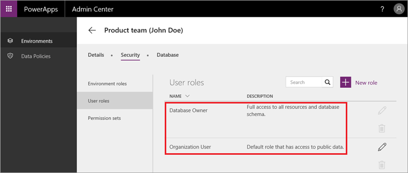

<properties
   pageTitle="Common Data Service security | Microsoft PowerApps"
   description="Use role-based security to control access to entities"
   services=""
   suite="powerapps"
   documentationCenter="na"
   authors="mgblythe"
   manager="anneta"
   editor=""
   tags=""
   featuredVideoId="uwm8ghMUCeI"
   courseDuration="8m"/>

<tags
   ms.service="powerapps"
   ms.devlang="na"
   ms.topic="get-started-article"
   ms.tgt_pltfrm="na"
   ms.workload="na"
   ms.date="12/09/2016"
   ms.author="mblythe"/>

# Common Data Service security
In this topic, we'll cover security in the Common Data Service. The service uses a role-based system to grant users permissions to data. The security model is a hierarchy, with each level representing a different level of access. At the lowest level are individual create, read, update, and delete permissions on a single entity. A collection of these entity-level permissions forms a permission set. One or more permission sets can then be used by a role. A role is at the top level - encompassing all the permissions needed by a user or a group of users.

## Understanding roles and permission sets
In most of this course, we've focused on powerapps.com and the PowerApps Studio. In this topic, we will be in the PowerApps admin center. If you click on an environment in the admin center, under **Security** you see tabs for **Environment roles** (whch we looked at in a previous topic), **User roles** and **Permission sets**. By default, there are two user roles:

- **Database Owner** is an administrative role that gives full access to all entities.
- **Organization user** is the default role assigned to all users. This role provides all users access to entities that contain public data.

By default there are two permission sets for each entity 

- **Maintain** gives full control: create, read, update, and delete permissions.
- **View** gives read-only access.

The following image shows the default permission sets for the Account entity. 

In the video, we show you how to create additional roles and permission sets so you can enable fine-grained access for your applications. We create a **Maintain product review** permission set that gives full access to the custom entity we created in an earlier topic and a **ReviewApp Owner** role that we assign the permission set to.  

## Restrict access to a database
When we created a database in an earlier topic, we stayed with the default of open access to the database. To change the access, on the **Database** tab click **Restrict access**, and then confirm that you want to make the change.

In restricted mode, every user must have one or more role assigned to them. A role can be set up for a given position within your company, and assigned to any person who is in that position. Users can also be automatically added to a role based on the Azure Active Directory groups they belong to.

## Wrapping it up

Security can be a complex topic, but just remember the hierarchy of permissions. It starts with create, read, update, and delete permissions on an entity, which can form permission sets, which are then assigned to roles. It's a flexible system that enables you to control data access in a fairly granular way. 

Well, this brings us to the end of our section on the Common Data Service and also the end of this Guided Learning course. We hope you've enjoyed it and learned a lot - let us know if you have any feedback, and check back because we plan to add content over time. For more in-depth content right now, check out the [PowerApps documentation](https://powerapps.microsoft.com/tutorials/getting-started/). 

