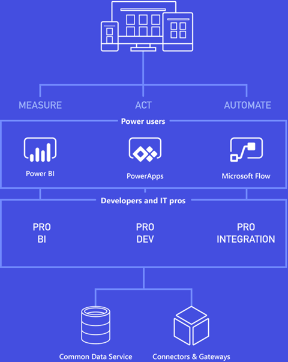
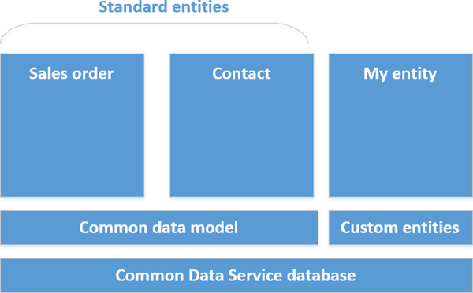
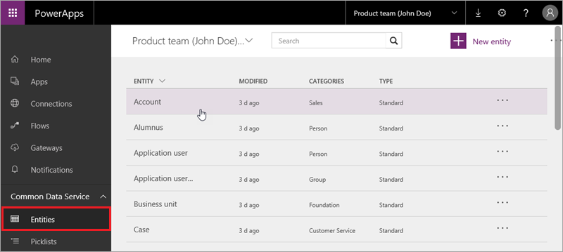

<properties
   pageTitle="The Common Data Service | Microsoft PowerApps"
   description="Understand this powerful way to store and model data"
   services=""
   suite="powerapps"
   documentationCenter="na"
   authors="mgblythe"
   manager="anneta"
   editor=""
   tags=""
   featuredVideoId="os33pHQ9jSU"
   courseDuration="5m"/>

<tags
   ms.service="powerapps"
   ms.devlang="na"
   ms.topic="get-started-article"
   ms.tgt_pltfrm="na"
   ms.workload="na"
   ms.date="12/09/2016"
   ms.author="mblythe"/>

# The Common Data Service
Data is at the heart of business applications and processes - data from Excel, from on-premises sources like SQL Server, and cloud sources like Salesforce and SharePoint Online. Data can be related to customers, sales, employees, and many other things, but the common theme is that data is crucial to your business, and it plays a key role in the apps you build in PowerApps. You have seen and worked with different types of data sources so far in the course, and we introduced the Microsoft Common Data Service earlier. In this section, we'll spend some time getting into the details, explaining the benefits, and showing you how to use the service.

## Understanding the service
Let's get oriented with a couple of diagrams. You might have seen the first diagram before - it shows the components of the Microsoft business application platform. You're obviously acquainted with PowerApps by this point, but you might have also used Microsoft Flow, Power BI, or other components. What you see is that the Common Data Service and connectors and gateways are relevant for all of these components. Right now, the Common Data Service is used primarily with PowerApps and Microsoft Flow, but it will be available for other components in time.

Now that you understand where the Common Data Service fits in, let's look at its parts. Think of the Common Data Service as a hierarchy. At the bottom level, the service stores data in a scalable and reliable way, and makes the data available so that multiple applications can use it. The next level is the common data model that includes many entities used in applications and business processes: entities like Account, Contact, Product, and Sales Order. You can extend the standard entities and create custom ones to meet your business needs.

An entity is just a combination of the metadata that describes it (field names, data types, and so on) and the data that you store in it. If you know Access or another database, an entity is very much like a table. We will get into entities more in the next topic, but for now consider the benefits of working with entity data in the Common Data Service:

- **Easy to manage**: Both the metadata and data are stored in the cloud. You don't need to worry about the details of how they're stored.
- **Easy to share**: You can easily share data with your colleagues because PowerApps manages the permissions.
- **Easy to secure**: Data is securely stored so that users can see it only if you grant them access. Role-based security allows you to control access to entities for different users within your organization.
- **Rich metadata**: Data types and relationships are leveraged directly within PowerApps. For example, defining a field type URL will present your data as a hyperlink within your app.
- **Productivity tools**: Entities are available within the add-ins for Microsoft Excel and Outlook to increase productivity, and ensure your data is accessible.
- **Picklists**: Include picklists from a rich set of standard picklists to provide quick drop downs within your entities and apps.

## Create a Common Data Service database
You create a Common Data Service database in an _environment_. You learned about environments earlier in the course, so just a quick recap: an environment is a container for apps and other resources, like the Common Data Service. Each environment can have one instance of the service associated with it. If you are an Environment Admin, and you want to add the service to an environment, follow these steps.

From the **Home** tab, click **Create Database**.

Specify whether you want to restrict access to the database, then click **Create my database**.

When the process is complete, you see all the standard entities that are included in the common data model. Some of them are shown below.

Some of this topic might have been unfamiliar territory if you haven't worked with databases before. But the general concept is pretty straightforward: the Common Data Service provides a secure and reliable way to store data and to treat that data in terms of common entities like Account, Contact, Product, and Sales Order. In the next topic, we'll dive a deeper into entities.