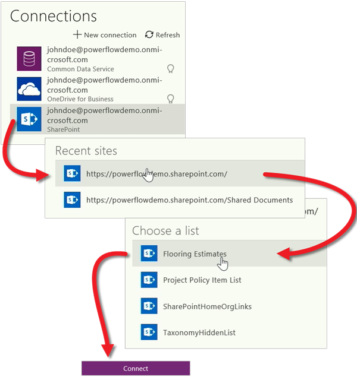
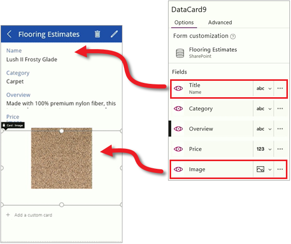

<properties
   pageTitle="Create your first app | Microsoft PowerApps"
   description="Generate an app from a SharePoint list"
   services=""
   suite="powerapps"
   documentationCenter="na"
   authors="mgblythe"
   manager="anneta"
   editor=""
   tags=""
   featuredVideoId="UCpmP6FOK-s"
   courseDuration="8m"/>

<tags
   ms.service="powerapps"
   ms.devlang="na"
   ms.topic="get-started-article"
   ms.tgt_pltfrm="na"
   ms.workload="na"
   ms.date="10/30/2016"
   ms.author="mblythe"/>

# Create your first app in PowerApps
You are now familiar with all the parts of PowerApps and the options for creating apps, so it's time to actually build an app. For this topic, we'll generate a phone app from a SharePoint Online list, but you could use data from lots of other sources, including Excel, cloud services like SalesForce, and on-premises sources like SQL Server.

## Connect to a data source
The first step in generating an app from data is to choose which PowerApps Studio to use, then connect to your data source. In web.powerapps.com, click or tap **New app**, then choose whether to use PowerApps Studio for Windows or PowerApps Studio for web.

In PowerApps Studio you have the option of starting from data, from a template, or from scratch. We're building a phone app for a SharePoint list, so under **SharePoint** click or tap **Phone layout**. 

Generated apps are always based on a single list or table (you can add more data to the app later). The next three screens take you through the process of connecting to the **Flooring Estimates** list in SharePoint Online.

After you click **Connect**, PowerApps starts to generate the app. PowerApps makes all sorts of inferences about your data so that it generates a useful app as a starting point.

## Explore the generated app
Success! Your new three screen app opens in PowerApps Studio. All apps generated from data have the same set of screens:
- The **browse** screen: where you browse, sort, filter, and refresh the data pulled in from the list, as well as add items by clicking the  icon.
- The **details** screen: where you view more detail about an item, and can choose to delete or edit the item.
- The **edit/create** screen: where you edit an existing item or create a new one.
Click or tap on each screen in the left navigation bar.

Click or tap  in the top right to run the app. If you navigate through the app, you see that it includes all the data from the list and provides a good default experience. Next we customize the app so it better suits our needs.

## Customize the app
The app that PowerApps generated is useful, but you will often customize an app after it's generated. We'll walk through some basic changes for each screen in this app, but there is a lot more you can do to customize an app. We'll get to that later in the course.

### Browse screen
We'll start with the browse screen. The SharePoint list contains an image for each product but the image isn't displayed by default. Let's fix that. In the right-hand pane, on the **Layout** tab, select a different layout for the browse screen. You see the results right away.

With the right basic layout, now change the fields that are displayed. Click or tap a field in the first item, then in the right-hand pane, change the data that is displayed for each item. This provides a better summary of each item in the list.

### Details screen
On the details screen, we want to change the order of the fields and display the image also. This is a different type of screen, so the process is a little different from the browse screen. Click or tap a field, then in the right-hand pane, drag the **Title** field to the top. Then click or tap the **Image** field to display it.

### Edit/create screen 
Finally, on the screen where you edit and create entries, we want to change a field so it's easier to enter text. Click or tap the Overview text box then choose the **Edit Multi-line Text** control.

Wow, that was pretty easy! In a few minutes you learned how to connect to a data source, generate an app, and get acquainted with PowerApps Studio and the three app screens. You have a working application that you have customized to fit your needs. In the next topic we review this section of the course and get you ready for future lessons. 

