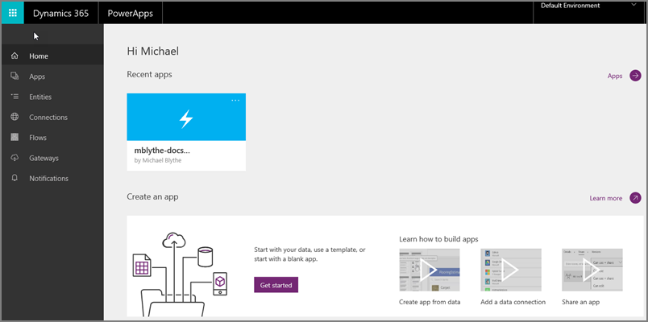
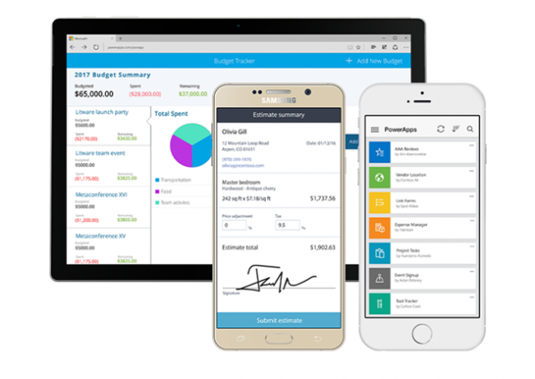
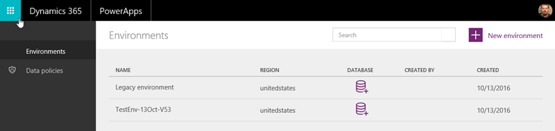
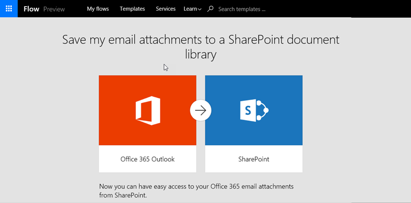
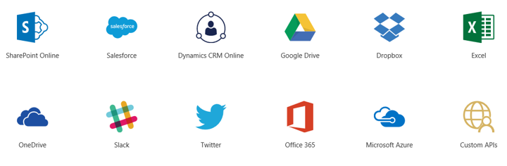
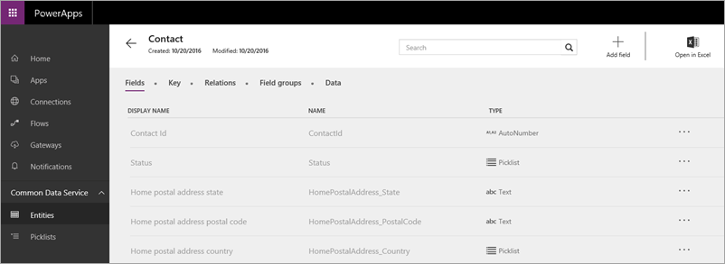
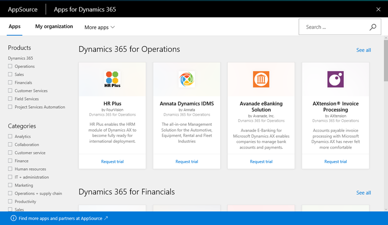
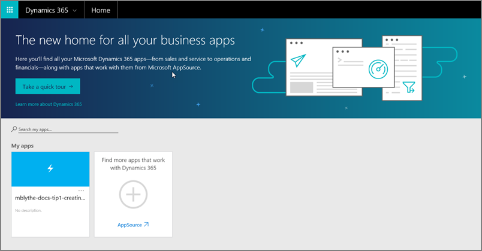

<properties
   pageTitle="Parts of PowerApps | Microsoft PowerApps"
   description="See the different parts of PowerApps, and how they relate"
   services=""
   suite="powerapps"
   documentationCenter="na"
   authors="mgblythe"
   manager="anneta"
   editor=""
   tags=""
   featuredVideoId=""
   courseDuration="5m"/>

<tags
   ms.service="powerapps"
   ms.devlang="na"
   ms.topic="get-started-article"
   ms.tgt_pltfrm="na"
   ms.workload="na"
   ms.date="10/04/2016"
   ms.author="mblythe"/>

# The parts of PowerApps
In the first Guided Learning topic you read about the main parts of PowerApps. Now we're going to provide a little more detail on each of the parts. PowerApps is a set of software services and apps that work together, and there are related technologies that help make this a powerful ecosystem. The PowerApps components are:

- **web.powerapps.com** - manage and share the apps you build
- **PowerApps Studio** - build powerful apps with easy to use visual tools
- **PowerApps Mobile** - run apps on Windows, iOS, and Android devices
- **PowerApps admin center** - administer PowerApps environments and other components

We don't expect you to take a ton of time just to learn what PowerApps _is_, but we think it's helpful to flesh things out a bit more.

## web.powerapps.com
If you build apps, this is where you spend most of your time. You learn from the **sample apps and templates** that are available here, and see all the apps you have created. You create apps in **PowerApps Studio for web** or **PowerApps Studio for Windows**, and share those apps with individuals and organizations. You manage data: **connections**, **gateways**, and **entities** (all of which we'll cover shortly.) And you see all the **flows** created in **flows.microsoft.com**, which you can integrate with your apps.

## PowerApps Studio
**PowerApps Studio** is available as a web application that you can use in any modern browser, and as a Windows application. PowerApps Studio has three panes and a ribbon that make app creation feel **similar to building a slide deck in PowerPoint**:

1. **Left navigation bar**, which shows thumbnails of all the screens in your app
2. **Middle pane**, which contains the app screen you are working on
3. **Right-hand pane**, where you set options like layout and data sources
4. **Formula bar**, where you add formulas (like in Excel) that define app behavior
5. **Property** drop-down list, where you select the properties that formulas apply to
6. **Ribbon**, where you add controls and customize design elements

## PowerApps Mobile
**PowerApps Mobile for Windows, iOS, or Android** provides an environment where you can find and use apps. Instead of going to separate app stores, you stay in PowerApps and have access to all the apps that you've created and that others have shared with you. When you use apps in PowerApps Mobile, you get the most out of your device's capabilities like camera controls, GPS location, and more.

## Admin center
The **PowerApps admin center** is the centralized place to administer PowerApps for an organization. This is where you define different **environments**, which house apps, data connections, and other elements. The admin center is also where you create Common Data Service databases, and manage permissions and data policies.

## Related technologies
The following technologies are often used with PowerApps to build and share robust apps across your organization. Your apps can integrate data from multiple sources and include workflows that automate tasks. 

- **Microsoft Flow** - create automated workflows between your favorite apps and services
- **Data sources, connections and connectors, and gateways** - bring cloud and on-premises data into your apps
- **Common Data Services** - integrate business data using the common data model
- **Microsoft AppSource** - share your apps into this centralized place for Microsoft and our many partners
- **Microsoft Dynamics 365** - run all your business apps in the web

### Microsoft Flow
**Microsoft Flow** is a service for automating workflow across the growing number of apps and services that business users rely on. Microsoft Flow can accelerate your business so you spend less time on mundane, repetitive tasks, and more time on what you want to do. Use Microsoft Flow in conjunction with PowerApps to **build apps that trigger and respond to workflows**.

### Data sources, connections and connectors, and gateways
There are many **data sources** that you might care about, and PowerApps uses **connectors** to make **connections** to these data sources. Some of the most popular data sources are shown below—many of them are cloud services, like Salesforce. Connectors might not feel like the coolest part of app development, but they are essential to working with data that you, your colleagues, and your customers care about. For data that is stored on-premises rather than in the cloud, you use a **gateway** to provide a reliable connection between PowerApps and your data source.

### Microsoft Common Data Services
**Common Data Services** makes it easy to integrate business data from multiple sources. The service features a **common data model** that includes many **entities** common to apps and business processes: entities like employees, customers, and sales. The service stores the data in a scalable and reliable way, and makes the data available so that multiple applications can use it. The applications can be apps that you build in PowerApps, other Microsoft applications, or third party applications. The image below shows a portion of the **Contact** entity in web.powerapps.com.

### Microsoft AppSource
**AppSource** is the place to **easily find and evaluate apps from Microsoft and our partners**. When you share an app from PowerApps, you make it available in AppSource. You can choose to make it available just for people in your organization, or you can make it available publicly.

### Microsoft Dynamics 365
**Dynamics 365** is a cloud service with purpose-built apps that enable you to address specific business needs like sales automation, operations, or customer service. In PowerApps, you share apps into AppSource, then users you share with view and run those apps in Dynamics 365, as well as on mobile devices. The advantage of having the apps in Dynamics 365 is that you have **one place to run all your business apps**-from creators in your organization, from Microsoft, and from third parties.

Now you have a little more information about all the parts of PowerApps and related technologies. Don't feel like you have to memorize the list, because we will continue to deepen your knowledge on each of the parts throughout this course. Next up is an introduction to the options you have for creating apps.