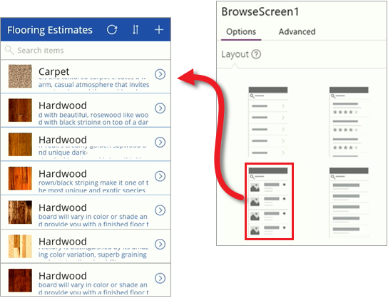
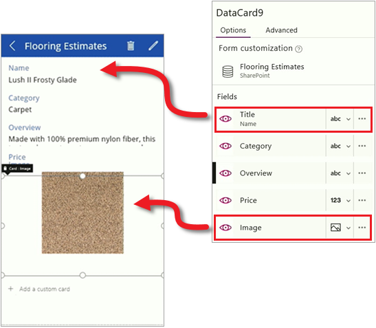

<properties
   pageTitle="Customize the app (SharePoint list) | Microsoft PowerApps"
   description="Update app screens, controls, and fields"
   services=""
   suite="powerapps"
   documentationCenter="na"
   authors="mgblythe"
   manager="anneta"
   editor=""
   tags=""
   featuredVideoId="KydeusvKndQ"
   courseDuration="5m"/>

<tags
   ms.service="powerapps"
   ms.devlang="na"
   ms.topic="get-started-article"
   ms.tgt_pltfrm="na"
   ms.workload="na"
   ms.date="12/09/2016"
   ms.author="mblythe"/>

# Customize the app (SharePoint list)
In the first two topics in this section, you generated an app from a SharePoint list and explored the app to get a better understanding of how three screen apps are composed. The app that PowerApps generated is useful, but you will often customize an app after it's generated. In this topic, we'll walk through some basic changes for each screen in the app. There is a lot more you can do to customize an app - we'll get to that in later topics. In the meantime, you can take what you learn in this topic and build on it. Take any app you generate-from a list, an Excel file, or another source-and see how you can customize it. It really is the best way to learn how apps are put together.

## Browse screen
We'll start with the browse screen. The SharePoint list contains an image for each product but the image isn't displayed by default. Let's fix that. In the right-hand pane, on the **Layout** tab, select a different layout for the browse screen. You see the results right away because PowerApps updates the app as you make changes.

With the right basic layout, now change the fields that are displayed. Click or tap a field in the first item, then in the right-hand pane, change the data that is displayed for each item. This provides a better summary of each item in the list.

## Details screen
On the details screen, we want to change the order of the fields and display the image also. There are different controls on this screen, so the process is a little different from the browse screen. Click or tap a field, then in the right-hand pane, drag the **Title** field to the top. Then click or tap the **Image** field to display it.

## Edit/create screen
Finally, on the screen where you edit and create entries, we want to change a field so that it's easier to enter text. Click or tap the drop-down list for the **Overview** field, and then click or tap the **Edit Multi-line Text** control.

You can see how a few basic steps can do a lot to improve the appearance and experience of using a generated app. In this topic, we focused on the PowerApps Studio UI, which provides a lot of options for customizing your apps. In the next topic, we'll get into formulas, which play an important role in driving app behavior.  
