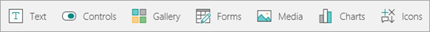
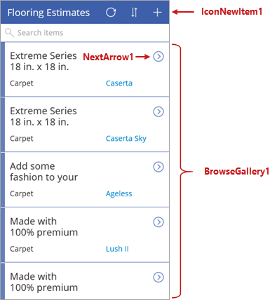
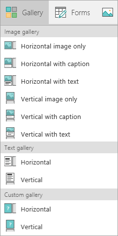
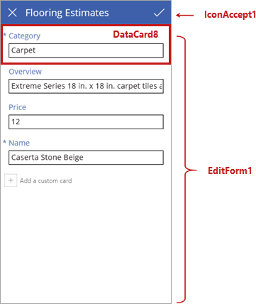

<properties
   pageTitle="Explore a generated app (SharePoint list) | Microsoft PowerApps"
   description="Explore screens and controls from the app"
   services=""
   suite="powerapps"
   documentationCenter="na"
   authors="mgblythe"
   manager="anneta"
   editor=""
   tags=""
   featuredVideoId="OJ8a9VINeKU"
   courseDuration="5m"/>

<tags
   ms.service="powerapps"
   ms.devlang="na"
   ms.topic="get-started-article"
   ms.tgt_pltfrm="na"
   ms.workload="na"
   ms.date="12/09/2016"
   ms.author="mblythe"/>

# Explore the generated app (SharePoint list)
In this topic, we look more closely at the generated app - reviewing the screens and controls that define the app's behavior. We won't go through all the details, but seeing more about how this app works will help you to build your own apps. In a later topic, we'll look at the formulas that work with screens and controls.

## Understanding controls in PowerApps
A control is simply a UI element that has behaviors associated with it. Many controls in PowerApps are the same as controls that you've used in other apps: labels, text-input boxes, drop-down lists, navigation elements, and so on. But PowerApps has more specialized controls like **Galleries** (which display summary data) and **Forms** (which display detail data and enable you to create and edit items). And also some other really cool controls like **Image**, **Camera**, and **Barcode**. To see what's available, click or tap **Insert** on the ribbon, and then click or tap each of the options in turn, **Text** through **Icons**.

## Explore the browse screen
Each of the three app screens has a main control and some additional controls. The first screen in the app is the browse screen, named **BrowseScreen1** by default. The main control on this screen is a gallery named **BrowseGallery1**. **BrowseGallery1** contains other controls, like **NextArrow1** (an icon control - click or tap it to go to the details screen). There are also separate controls on the screen, like **IconNewItem1** (an icon control - click or tap it to create an item in the edit/create screen).

PowerApps has a variety of gallery types so you can use the one that best suits your app's layout requirements. You will see more ways to control layout later in this section.

## Explore the details screen
Next is the details screen, named **DetailScreen1** by default. The main control on this screen is a display form named **DetailForm1**. **DetailForm1** contains other controls, like **DataCard1** (a card control, which displays the flooring category in this case). There are also separate controls on the screen like **IconEdit1** (an icon control - click or tap it to edit the current item on the edit/create screen).

There are lots of gallery options, but forms are more straightforward - it's either an edit form or a display form.

## Explore the edit/create screen
The third screen in the app is the edit/create screen, named **EditScreen1** by default. The main control on this screen is an edit form named **EditForm1**. **EditForm1** contains other controls, like **DataCard8** (a card control, which allows you to edit the flooring category in this case). There are also separate controls on the screen like **IconAccept1** (an icon control - click or tap it to save the changes you made on the edit/create screen).

Now that you have a sense of how the app is composed of screens and controls, we'll look at how you customize the app in the next topic.
