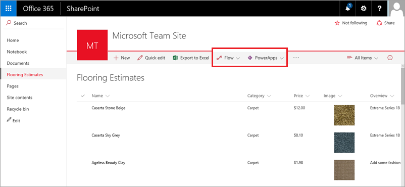

<properties
   pageTitle="Generate an app (SharePoint list) | Microsoft PowerApps"
   description="Generate a three screen app from a SharePoint list"
   services=""
   suite="powerapps"
   documentationCenter="na"
   authors="mgblythe"
   manager="anneta"
   editor=""
   tags=""
   featuredVideoId="m6KfAwEdtYU"
   courseDuration="3m"/>

<tags
   ms.service="powerapps"
   ms.devlang="na"
   ms.topic="get-started-article"
   ms.tgt_pltfrm="na"
   ms.workload="na"
   ms.date="12/09/2016"
   ms.author="mblythe"/>

# Generate an app (SharePoint list)
In this section of the course, we'll create an app from a "Flooring Estimates" SharePoint list. The app could be used by someone, such as an estimator out at customer sites, to refer to the list and keep it up-to-date. In the Getting Started section, we showed you how to generate an app from the same list - so why look at it again? First, instead of starting in PowerApps Studio, we now show you how PowerApps is integrated into SharePoint Online. Second, we dig deeper into how the app is put together, and show you how to customize it. You'll definitely get some new information going through this section, so let's jump in!

## Generate the app
The following image shows the "Flooring Estimates" SharePoint list, which contains basic information like name and price, and an image for each flooring type. You can see how PowerApps and Microsoft Flow are now integrated into SharePoint Online, so you can easily build apps and flows from your lists.

To build an app, click **PowerApps**, then **Create an app**. In the right hand pane, enter a name for the app, then click **Create**. After you click **Create**, PowerApps starts to generate the app. PowerApps makes all sorts of inferences about your data so that it generates a useful app as a starting point.

## View the app in PowerApps Studio
Your new three-screen app opens in PowerApps Studio. All apps generated from data have the same set of screens:

- The **browse** screen: where you browse, sort, filter, and refresh the data pulled in from the list, as well as add items by clicking the (+) icon.
- The **details** screen: where you view more detail about an item, and can choose to delete or edit the item.
- The **edit/create** screen: where you edit an existing item or create a new one.

In the left navigation bar, click or tap an icon in the upper-right corner to switch to the thumbnail view.

Click or tap each thumbnail to view the controls on that screen.

## Run the app in preview mode
Click or tap  in the top-right corner to run the app. If you navigate through the app, you see that it includes all the data from the list and provides a good default experience.

Next we'll explore the app in more detail and later customize the app so it better suits our needs.
