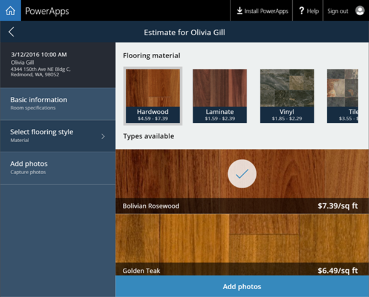
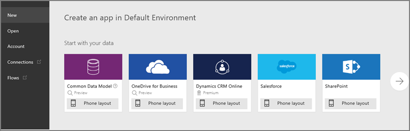
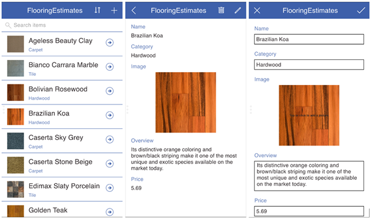
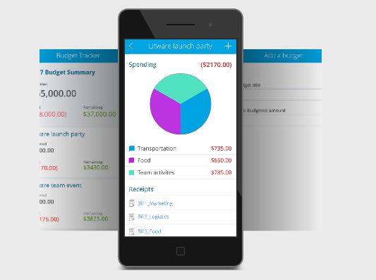

<properties
   pageTitle="Using PowerApps | Microsoft PowerApps"
   description="Look at the different ways you can create apps"
   services=""
   suite="powerapps"
   documentationCenter="na"
   authors="mgblythe"
   manager="anneta"
   editor=""
   tags=""
   featuredVideoId=""
   courseDuration="5m"/>

<tags
   ms.service="powerapps"
   ms.devlang="na"
   ms.topic="get-started-article"
   ms.tgt_pltfrm="na"
   ms.workload="na"
   ms.date="10/04/2016"
   ms.author="mblythe"/>

# Creating apps in PowerApps

Now that you know the basics of PowerApps, let's jump into **a tour of how to create apps**. Right now, we'll quickly look at sample apps, creating apps from a data source, and creating apps from a template. In a later section, we will get more hands-on with app creation.

## Check out some sample apps

If you're the first person in your organization to try out PowerApps, you'll be greeted with several sample apps that you can use in your web browser. Explore these apps to **get a quick sense of what's possible** and how PowerApps can help your business.

Each sample app is designed for a specific purpose, such as managing a budget, inspecting a site, or tracking service tickets. These apps contain sample data to **inspire your thinking**. This app illustrates how a flooring company could help service representatives deliver accurate and immediate cost estimates when visiting customer locations.

If your team has started using PowerApps, people might have **apps shared with you** already. When people share apps with you, they show up in AppSource and also in Dynamics 365 if you choose to include them there.

## Create an app from a data source

Create apps in **PowerApps Studio for web** or **PowerApps Studio for Windows**. You'll be able to connect to data sources and start composing apps in a visual designer that doesn't require code.

A great way to get started is to **generate an app from your own data**. Just point PowerApps at the data source of your choice (for example, a SharePoint list) and watch as PowerApps **automatically builds a three-screen app** for browsing the list, viewing detailed records, and editing data. You can **then start customizing this app** to look and behave exactly how you want.

## Create an app from a template

Another good way to start is by **building an app from a template**. Templates are basically sample apps that you can open to understand how they are put together. They use sample data to help you get a sense of what's possible, and opening them in PowerApps Studio will help you **see hands-on how an app is built**.

For example, with the **Budget Tracker** template, you can create an app that helps you track the budget for projects and events, with custom categories, easy data entry, and visuals that clearly show expenditures.

You can also build applications from scratch and add all the pieces as you go, but **the easiest way to learn about PowerApps is to start with a sample or a template**, or connect to your data source and have PowerApps generate the app for you. Then you can branch out and let your imagination run wild—there will be plenty of that later in the course!