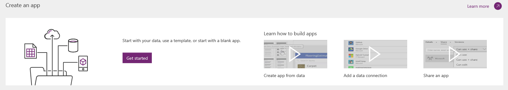
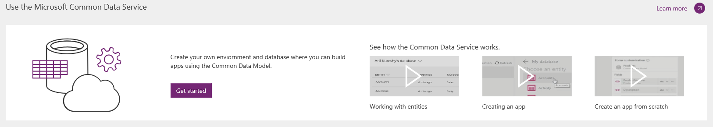
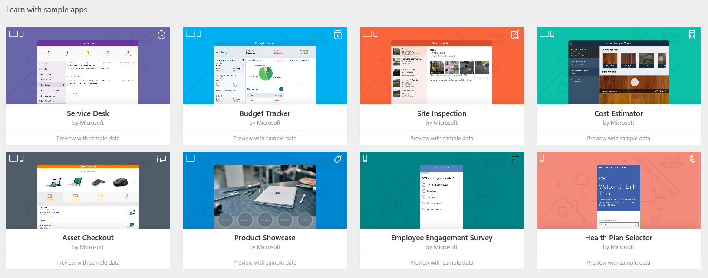
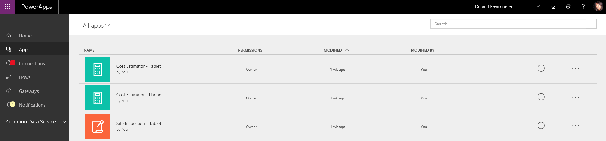

<properties
    pageTitle="Introduction to Maker Portal | Microsoft PowerApps"
    description="A new home for all makers of apps."
    services=""
    suite="powerapps"
    documentationCenter="na"
    authors="linhtranms"
    manager="anneta"
    editor=""
    tags=""
 />
<tags
    ms.service="powerapps"
    ms.devlang="na"
    ms.topic="article"
    ms.tgt_pltfrm="na"
    ms.workload="na"
    ms.date="10/28/2016"
    ms.author="litran"/>

# Introduction to Maker Portal and Microsoft PowerApps #
As we march into November, the PowerApps team is re-introducing [powerapps.com](http://web.powerapps.com) as the new home for creators of PowerApps. This means, we are re-designing the [powerapps.com](http://web.powerapps.com) as the primary site for creators to easily get started on creating apps, use the Microsoft Common Data Service and manage their apps all in one location. In this article, I will walk you through the following:

- our new [powerapps.com](http://web.powerapps.com)'s header
- our new [powerapps.com](http://web.powerapps.com)'s homepage
- our new **Apps** page

## New PowerApps portal header ##
- When you sign up and first sign in to powerapps.com, you will notice a new site header we have for PowerApps.

	

- To the left of the new header is the Office waffle. This is a quick place for you to access all other Office products such as PowerPoint, OneNote, and Word, as well as Microsoft Flow, Dynamics 365, etc.

	

- On the right hand side of the header, you will first see an environment dropdown with *Default environment* is likely selected by default. This is the place where you can quickly switch between environments. [Learn more about environment](environments-overview.md).

	

- Next to environment, you will see an icon for download. Click this icon to display a modal with links to download PowerApps Mobile for iOS, Android or PowerApps Studio for Windows.

	

- Next to download, you will see an icon for settings. Click this icon to display a list of links for connections, gateways, and the admin center.

	

- Next to settings, you will see an icon for help. Click on this icon display a list of links for Guided learning, Documentation, Support, Community, Blogs, Legal and Privacy.

	

## New PowerApps homepage ##
Once you have sign in to [powerapps.com](http://web.powerapps.com), you will land on the homepage by default. We have changed the layout of this homepage to help the maker persona to get started quickly whether they are creating apps or want to explore our Microsoft Common Data Service.

- If this is *not* your first time login to PowerApps and you have run or created some apps before, the first section you will see on your homepage is a list of **Recent apps** sorted by most recently opened date.

	

	Notice at the top right corner, there is an arrow labeled *Apps* which links to **Apps** page directly so you can see all of your apps.

- If this is your first time login or you have not run nor created any app before, you will **not** see the **Recent apps** section. Instead you will see the banner **Create an app**.

	

	Clicking **Get started** on this banner will bring up a modal with options to create an app using our **PowerApps Studio for Windows desktop** or using **PowerApps Studio for the web**.

	

	Next to **Get started**, you can find the video links to our tutorial videos on how to quickly create an app from data, how to add a data connection or how to share an app. The **Learn more** arrow link will take you to our create app documentation article.

* Below the **Create an app** banner is the **Use the Microsoft Common Data Service** banner.

	>*This banner will be disabled from October 26th, 2016 until October 31st, 2016 for metadata upgrading. *

	

	Depends on your license or permission, you will see different buttons displayed under **Microsoft Common Data Service**. You will see button:

	- **Start trial** - When you don't have a P2 license, you will see **Start trial** button which will bring you to the page where you can sign up for P2 trial. Microsoft Common Data service requires users to have a P2 license. [Learn more about PowerApps licenses](signup-for-powerapps-admin.md).

	- **Get started** - When you are in an environment that doesn't have a Common Data Service's database or you don't have access to use the Common Data Service's database, you will see the button **Get started**. Clicking this option will allow you to create a new environment and database all together; so you can start using the Common Data Services for your apps. [Learn more about creating environment](environments-administration.md)

	

	If you don't want to create new environment, you can always switch to another environment that you have access to by using the environment switcher in the header.

	- **Create database** - When you are in an environment that doesn't have a Common Data Service database but you have access to create one, you will see a button **Create database**.

	

	Clicking this button will provision a database for this environment.

	

	- **Browse entities** - When you are in an environment that has a Common data Service's database provisioned already and you have access to it, you will see the button **Browse entities**. Clicking that button will take you directly to the **Entities** page.

	

- Below the **Use the Microsoft Common Data Service** banner, you will see a set of sample apps and connected sample apps we created for you to use.

	- **Sample apps** - This is a set of sample apps built with either phone or tablet layout with different business scenarios. You can quickly click on each of them to view the description of what the app does, what layout the app was built for and what capabilities the app showcases such as camera, GPS, radio buttons, etc. It's a quick way for new users to learn what PowerApps is capable of. An important thing to keep in mind is for each sample app we show here, you can create an app identical to it through the create app from template in PowerApps Studio for Windows.

	

	- **Connected sample apps** - This is a set of sample apps that connects to your data via data connections such as Office 365, Salesforces, Trello, Wunderlist. This set of apps is different from the sample aps above. When you click on a connected sample app, you actually provision a new instance of app (think of it as a template). It will prompt you to enter your credentials to connect to your data. The beautiful thing about connected sample app is an instance is provisioned for you right here and you can open it via PowerApps Studio to learn how the corresponding app was built. The downside of it is since it do a full provisioning, it can take pretty long (up to a minute) to create. So please be patient and let the browser open when you click on a connected sample app.

	

## New Apps page ##
You can access **Apps** page via the left navigation bar on [powerapps.com](http://web.powerapps.com).

The **Apps** page previously allowed you to switch between tile view and list view. From October 26th, 2016, we only support list view.

Please note that the list view shows only apps in the selected environment. To view apps in a different environment, don't forget to switch to a different environment using the environment switcher in the header. [Learn more about switching environment](working-with-environments.md)

What's new?

- Clicking an app now opens the app in PowerApps Studio for web in a new tab.
- The **Apps** page shows all apps you have permission to edit by *default*. To view **All apps** including apps you can only use, make sure to select the **All apps** filter.

	

We also have:

- **Apps I can use**, which lists all apps that have been shared with you with User permission (can only run the app). Please note that you can also acquire these apps via [Dynamics 365 portal](http://home.dynamics.com).
- **Apps I own** filter, which lists all apps you have authored.
- **Apps I contribute to** filter, which lists all apps that have been shared with you with Contributor permission.
- **Sample apps** filter, which lists all sample apps (not connected sample apps).

- Clicking the information circle will bring you to the app details page.

	

- Clicking the ellipsis on each app's row will show the different options you can do with an app such as Play, Edit, Share, Details.

	

That is mainly what's new on our PowerApps portal, which geared toward maker's persona. We hope this is helpful to you. Please leave comments on what you like so far and would like to see. We'd love to hear your feedback!
