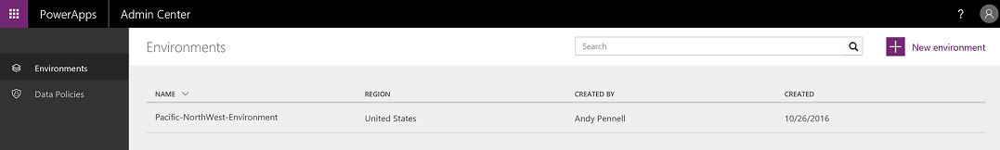

<properties
    pageTitle="PowerApps Admin center | Microsoft PowerApps"
    description="Introduction to the Microsoft PowerApps Admin center."
    services=""
    suite="powerapps"
    documentationCenter="na"
    authors="msftman"
    manager="anneta"
    editor=""
    tags=""/>

<tags
   ms.service="powerapps"
   ms.devlang="na"
   ms.topic="article"
   ms.tgt_pltfrm="na"
   ms.workload="na"
   ms.date="10/28/2016"
   ms.author="deonhe"/>

# The Admin Center

  

## What is the Admin center?
The admin center is the central location where admins can manage environments and data loss prevention (DLP) polices for an organization. Any changes you make in the admin center are immediately available to users within the organization.     

## Access the Admin center
The PowerApps admin center is accessed via https://admin.powerapps.com.

## Environments
Learn more about how [environments](environments-administration.md) are used to manage users, permissions and roles.

## Data loss prevention (DLP) policies
Learn more about how [data loss prevention policies](./prevent-data-loss.md) are used to create rules that manage how business data is shared with services in PowerApps.

## Other requirements
You need PowerApps Plan2 to access the Admin center. If you are Office 365 Global admin, then you can access Admin center without PowerApps Plan2 for managing Data loss prevention policies for the organization. To manage Environments, you will still need PowerApps Plan2.

## Next steps
- [Learn more about environments](environments-administration.md)   
- [Learn more about Microsoft PowerApps](./getting-started.md)   
