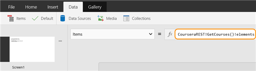

<properties
	pageTitle="Access data using REST APIs in KratosApps Studio"
	description="Display data from Coursera, DropBox, Visual Studio Online, or your own REST API service in KratosApps."
	services="kratosapps"
	authors="AFTOwen"
 />

# Access data using a REST API in KratosApps #

Display data in KratosApps Studio by using REST API calls to retrieve information from another app. For example, display data from Coursera, DropBox, Visual Studio Online, or your own REST API service.

Apps that you build in KratosApps Studio access the data from a service using a WADL file. This WADL file is simply an XML file that tells your app how to access the REST based web service and the data that's returned. WADL files are created with a specific format based on the [WADL standard](http://www.w3.org/Submission/wadl/). Use basic or OAuth authentication, and pass parameters to the REST API calls from your app to customize the data that's returned. Specify these parameters when you design your app, or take them from the values of other fields in your app.

**Note:** If you're not sure how to use REST API calls, find a developer who can help you create a WADL file, [load it](#load-a-wadl-file-and-access-the-data), and then finish creating your app.

## Create a WADL file ##

Create a WADL file in any combination of these ways:

- Generate a WADL file by using [a tool](#generate-a-wadl-file).
- Copy and update [a sample WADL file](#modify-a-sample-wadl-file) to suit your needs.
- Add [one or more sections](#add-sections-manually) manually.

###Generate a WADL file###

This [WADL generator tool](https://gallery.technet.microsoft.com/WADL-Generator-for-Siena-7792b022) isn't supported but, in most situations, can generate a file for you much more quickly than creating it manually. You can start with a generated file and then modify it as necessary.

If the REST API service that you want to access uses OAuth to authenticate users, you'll often need to create an app for that service first. This step gives you the client ID that you need. You'll also need to provide a callback URL to the tool. This URL is just a placeholder because you're not authenticating from a web app, so simply provide a valid URL. This URL isn't used, but the WADL generator tool must be able to load the page.

1. Start the WADL generator, and create a WADL file that's named based on your service.

1. Add any functions that you want to use from your service.

	When you load the WADL file into KratosApps Studio, these functions will appear with the same names.

	For some REST services that use OAuth 2.0 authentication, you will get an error when you try out the function that you have added. In this case, paste a sample response into the tool that would be returned by this call to the REST API. Then save the function.

1. Export the generated WADL file, and save it as an .xml file to use from KratosApps Studio. 

	Don't forget to save a WADL generation file when you close the tool. That way, you can use the tool to add more functions in the future to your WADL file.

Look at a [sample WADL file](#sample-wadl-files) to review its structure.

[Load a WADL file and access the data](#load-a-wadl-file-and-access-the-data) in KratosApps Studio to confirm whether it behaves as you expect.

###Modify a sample WADL file###

You can create your own .xml file by copying the XML from a sample file for [Coursera](#sample-file-for-coursera) or [Dropbox](#sample-file-for-dropbox).

####Sample file for Coursera####

This WADL file is very basic, simply accessing course information from Coursera without any authentication.

	<?xml version="1.0" encoding="utf-16"?>
	<application xmlns:siena="http://schemas.microsoft.com/MicrosoftProjectSiena/WADL/2014/11" 
						xmlns:xs="http://www.w3.org/2001/XMLSchema" 
						xmlns:sienatool="http://www.todo.com" 
						siena:serviceId="CourseraREST" 
						xmlns="http://wadl.dev.java.net/2009/02">
	  <grammars>
		<siena:jsonTypes targetNamespace="http://www.todo.com" xmlns:wadl="http://wadl.dev.java.net/2009/02">
		  <siena:object name="GetCourses_Root">
			<siena:property name="elements" typeRef="GetCourses_elements_Array" />
			<siena:property name="linked" typeRef="GetCourses_linked_Object" />
		  </siena:object>
		  <siena:object name="GetCourses_elements_Object">
			<siena:property name="id" type="number" />
			<siena:property name="shortName" type="string" />
			<siena:property name="name" type="string" />
			<siena:property name="links" typeRef="GetCourses_links_Object" />
		  </siena:object>
		  <siena:object name="GetCourses_links_Object" />
		  <siena:array name="GetCourses_elements_Array" typeRef="GetCourses_elements_Object" />
		  <siena:object name="GetCourses_linked_Object" />
		</siena:jsonTypes>
	  </grammars>
	  <siena:authenticationProviders />
	  <siena:template />
	  <resources base="https://api.coursera.org">
		<resource path="api/catalog.v1/courses">
		  <method name="Get" id="GetCourses" siena:requiresAuthentication="false">
			<request />
			<response siena:resultForm="single">
			  <representation mediaType="application/json">
				<param name="GetCourses_Name" type="sienatool:GetCourses_Root" style="Plain" path="" />
			  </representation>
			</response>
		  </method>
		</resource>
	  </resources>
	</application>

####Sample file for Dropbox####

This file uses OAuth 2.0 authentication and contains two functions:

- GetFileAndFolderInfo gets the file and folder information from Dropbox for a specific folder
- DisplayImage gets the URL to display an image stored on Dropbox.

When you add items in KratosApps Studio that use these functions, you can specify the folder and the location for the image. These strings can be the text from another field in your app. That field could be data from a call to a REST API too.

	<?xml version="1.0" encoding="utf-16"?>
	<application xmlns:siena="http://schemas.microsoft.com/MicrosoftProjectSiena/WADL/2014/11"
						xmlns:xs="http://www.w3.org/2001/XMLSchema" xmlns:sienatool="http://www.todo.com" siena:serviceId="Dropbox"
						xmlns="http://wadl.dev.java.net/2009/02">
	  <grammars>
		<siena:jsonTypes targetNamespace="http://www.todo.com" xmlns:wadl="http://wadl.dev.java.net/2009/02">
		  <siena:object name="GetFileAndFolderInfo_Root">
			<siena:property name="read_only" type="boolean" />
			<siena:property name="hash" type="string" />
			<siena:property name="revision" type="number" />
			<siena:property name="bytes" type="number" />
			<siena:property name="thumb_exists" type="boolean" />
			<siena:property name="rev" type="string" />
			<siena:property name="modified" type="string" />
			<siena:property name="size" type="string" />
			<siena:property name="path" type="string" />
			<siena:property name="is_dir" type="boolean" />
			<siena:property name="modifier" type="string" />
			<siena:property name="root" type="string" />
			<siena:property name="contents" typeRef="GetFileAndFolderInfo_contents_Array" />
			<siena:property name="icon" type="string" />
		  </siena:object>
		  <siena:object name="GetFileAndFolderInfo_contents_Object">
			<siena:property name="rev" type="string" />
			<siena:property name="thumb_exists" type="boolean" />
			<siena:property name="path" type="string" />
			<siena:property name="is_dir" type="boolean" />
			<siena:property name="client_mtime" type="string" />
			<siena:property name="icon" type="string" />
			<siena:property name="read_only" type="boolean" />
			<siena:property name="modifier" type="string" />
			<siena:property name="bytes" type="number" />
			<siena:property name="modified" type="string" />
			<siena:property name="size" type="string" />
			<siena:property name="root" type="string" />
			<siena:property name="mime_type" type="string" />
			<siena:property name="revision" type="number" />
		  </siena:object>
		  <siena:array name="GetFileAndFolderInfo_contents_Array" typeRef="GetFileAndFolderInfo_contents_Object" />
		</siena:jsonTypes>
		<siena:jsonTypes targetNamespace="http://www.todo.com" xmlns:wadl="http://wadl.dev.java.net/2009/02">
		  <siena:object name="DisplayImage_Root">
			<siena:property name="url" type="string" dtype="hyperlink" />
			<siena:property name="expires" type="string" />
		  </siena:object>
		</siena:jsonTypes>
	  </grammars>
	  <resources base="https://api.dropbox.com" siena:authenticationProviderHref="#Dropbox_Auth">
		<resource path="1/metadata/auto/photos">
		  <method name="Get" id="GetFileAndFolderInfo" siena:requiresAuthentication="true">
			<request>
			  <param name="list" style="Query" required="true" siena:sampleDefault="true" />
			</request>
			<response siena:resultForm="single">
			  <representation mediaType="application/json">
				<param name="GetFileAndFolderInfo_Name" type="sienatool:GetFileAndFolderInfo_Root" style="plain" path="" />
			  </representation>
			</response>
		  </method>
		</resource>
	  </resources>
	  <resources base="https://api.dropbox.com" siena:authenticationProviderHref="#Dropbox_Auth">
		<resource path="1/media/auto/">
		  <method name="Get" id="DisplayImage" siena:requiresAuthentication="true">
			<request>
			  <param name="path" style="Query" required="true" siena:sampleDefault="/Photos/i-b858zMh-M.jpg" />
			</request>
			<response siena:resultForm="single">
			  <representation mediaType="application/json">
				<param name="DisplayImage_Name" type="sienatool:DisplayImage_Root" style="plain" path="" />
			  </representation>
			</response>
		  </method>
		</resource>
	  </resources>
	  <siena:authenticationProviders>
		<siena:oauth2 id="Dropbox_Auth">
		  <siena:grantType>
			<siena:implicit>
			  <siena:endpoints>
				<siena:authorization url="https://www.dropbox.com/1/oauth2/authorize" />
				<siena:callback url="https://fabrikam-prime-oauth.azurewebsites.net/" />
			  </siena:endpoints>
			  <siena:credentials clientId="[templated]" />
			</siena:implicit>
		  </siena:grantType>
		  <siena:resourceAuthorization placement="Query" />
		</siena:oauth2>
	  </siena:authenticationProviders>
	  <siena:template>
		<siena:variable name="Dropbox__ClientID">
		  <siena:doc title="Client ID/API Key" />
		  <siena:modifyAuth tag="credentials" href="#Dropbox_Auth" attribute="clientId" />
		</siena:variable>
		<siena:variable name="Dropbox__URI">
		  <siena:doc title="Redirect URI" />
		  <siena:modifyAuth tag="callback" href="#Dropbox_Auth" attribute="url" />
		</siena:variable>
	  </siena:template>
	</application>

###Add sections manually###

Each WADL file needs the following elements:

- &lt;application> - the root element.
- &lt;grammars> - defines formats of the returned data. 
- &lt;resources> - contains the REST API call and any parameters for each method that you call. 
- &lt;siena:authenticationProviders> - empty unless you need authentication to access the REST API.
- &lt;siena:template> - provides the details for the authentication if it is required; otherwise, it's empty.

Some elements differ from or extend the [WADL standard](http://www.w3.org/Submission/wadl/) in ways that are specific to KratosApps Studio. These [differences and extensions](#differences-and-extensions) are described later in this topic. 

**&lt;application>**

Add this root element to your XML file, but replace &lt;name\_of\_your_service> with whatever your service is called. KratosApps Studio shows this name when you load your WADL file.

	<application xmlns:siena="http://schemas.microsoft.com/MicrosoftProjectSiena/WADL/2014/11" 
						xmlns:xs="http://www.w3.org/2001/XMLSchema"  
						siena:serviceId="<name_of_your_service>" 
						xmlns="http://wadl.dev.java.net/2009/02">
             <!-- Add the other elements here -->
	</application

**&lt;grammars>**

This element defines whether the data is in JSON or XML format and the name and the type of each field. In this example, the data is JSON. If your REST API call returns XML, add an element &lt;siena:sampleXmlTypes> instead.

	<grammars>
	  <siena:jsonTypes targetNamespace="http://www.todo.com" xmlns:wadl="http://wadl.dev.java.net/2009/02">
		<siena:object name="GetFileAndFolderInfo_Root">
		  <siena:property name="read_only" type="boolean" />
		  <siena:property name="hash" type="string" />
		  <siena:property name="revision" type="number" />
		  <siena:property name="bytes" type="number" />
		  <siena:property name="thumb_exists" type="boolean" />
		  <siena:property name="rev" type="string" />
		  <siena:property name="modified" type="string" />
		  <siena:property name="size" type="string" />
		  <siena:property name="path" type="string" />
		  <siena:property name="is_dir" type="boolean" />
		  <siena:property name="modifier" type="string" />
		  <siena:property name="root" type="string" />
		  <siena:property name="contents" typeRef="GetFileAndFolderInfo_contents_Array" />
		  <siena:property name="icon" type="string" />
		</siena:object>
		<siena:object name="GetFileAndFolderInfo_contents_Object">
		  <siena:property name="rev" type="string" />
		  <siena:property name="thumb_exists" type="boolean" />
		  <siena:property name="path" type="string" />
		  <siena:property name="is_dir" type="boolean" />
		  <siena:property name="client_mtime" type="string" />
		  <siena:property name="icon" type="string" />
		  <siena:property name="read_only" type="boolean" />
		  <siena:property name="modifier" type="string" />
		  <siena:property name="bytes" type="number" />
		  <siena:property name="modified" type="string" />
		  <siena:property name="size" type="string" />
		  <siena:property name="root" type="string" />
		  <siena:property name="mime_type" type="string" />
		  <siena:property name="revision" type="number" />
		</siena:object>
		<siena:array name="GetFileAndFolderInfo_contents_Array" typeRef="GetFileAndFolderInfo_contents_Object" />
	  </siena:jsonTypes>
	  <siena:jsonTypes targetNamespace="http://www.todo.com" xmlns:wadl="http://wadl.dev.java.net/2009/02">
		<siena:object name="DisplayImage_Root">
		  <siena:property name="url" type="string" dtype="hyperlink" />
		  <siena:property name="expires" type="string" />
		</siena:object>
	  </siena:jsonTypes>
	</grammars>

**&lt;resources>**

When accessing a REST resource, a typical starting point is a resource URI, which is also known as a REST endpoint. For example, https://api.dropbox.com.

In WADL, the &lt;resources> and &lt;resource> elements are used to describe a resource URI. The complete path name of the resource is generated by concatenating the value of the base attribute in the &lt;resources> element and the value of the path attribute in the &lt;resource> element. In the example below, the resource URIs are:

https://api.dropbox.com/1/metadata/auto/photos

https://api.dropbox.com/1/media/auto

The sample below shows a &lt;resources> element for each specific URI that you want to use as a function in KratosApps Studio. When you create your own file, you can have multiple &lt;resource> child elements if the base path for each URI is the same as the one in the &lt;resources> element.

Methods associated with a REST resource are described using the &lt;method> element. A &lt;resource> element can have one or more &lt;method> elements as its children. The &lt;method> element basically describes an HTTP protocol method that can be applied to the REST resource. The id attribute in the &lt;method> element is the identifier that appears in the list of functions in KratosApps Studio.

Each &lt;method> element has a &lt;request\> and &lt;response> element. Parameters to the resource URI are defined with a &lt;param> element which is a child of the &lt;request> element. For example, the list parameter is supplied for the GetFileAndFolderInfo method.

	<resources base="https://api.dropbox.com" siena:authenticationProviderHref="#Dropbox_Auth">
	<resource path="1/metadata/auto/photos">
	  <method name="Get" id="GetFileAndFolderInfo" siena:requiresAuthentication="true">
		<request>
		  <param name="list" style="Query" required="true" siena:sampleDefault="true" />
		</request>
		<response siena:resultForm="single">
		  <representation mediaType="application/json">
			<param name="GetFileAndFolderInfo_Name" type="sienatool:GetFileAndFolderInfo_Root" style="plain" path="" />
		  </representation>
		</response>
	  </method>
	</resource>
	</resources>
	<resources base="https://api.dropbox.com" siena:authenticationProviderHref="#Dropbox_Auth">
	<resource path="1/media/auto/">
	  <method name="Get" id="DisplayImage" siena:requiresAuthentication="true">
		<request>
		  <param name="path" style="Query" required="true" siena:sampleDefault="/Photos/i-b858zMh-M.jpg" />
		</request>
		<response siena:resultForm="single">
		  <representation mediaType="application/json">
			<param name="DisplayImage_Name" type="sienatool:DisplayImage_Root" style="plain" path="" />
		  </representation>
		</response>
	  </method>
	</resource>
	</resources>

**&lt;siena:authenticationProviders> and &lt;siena:template>**

These elements handle the authentication process depending on the authentication method. This example is for Dropbox using OAuth 2.0 and needs a callback URL. Your app isn't a web app and doesn't have a URL, so you must pass a valid URL as a placeholder.

	<siena:authenticationProviders>
	  <siena:oauth2 id="Dropbox_Auth">
		<siena:grantType>
		  <siena:implicit>
			<siena:endpoints>
			  <siena:authorization url="https://www.dropbox.com/1/oauth2/authorize" />
			  <siena:callback url="https://fabrikam-prime-oauth.azurewebsites.net/" />
			</siena:endpoints>
			<siena:credentials clientId="[templated]" />
		  </siena:implicit>
		</siena:grantType>
		<siena:resourceAuthorization placement="Query" />
	  </siena:oauth2>
	</siena:authenticationProviders>
	<siena:template>
	  <siena:variable name="Dropbox__ClientID">
		<siena:doc title="Client ID/API Key" />
		<siena:modifyAuth tag="credentials" href="#Dropbox_Auth" attribute="clientId" />
	  </siena:variable>
	  <siena:variable name="Dropbox__URI">
		<siena:doc title="Redirect URI" />
		<siena:modifyAuth tag="callback" href="#Dropbox_Auth" attribute="url" />
	  </siena:variable>
	</siena:template>

###Differences and extensions###

This section contains extensions to the WADL standard that KratosApps Studio supports, in addition to parts of the same standard that KratosApps Studio doesn't support. The section numbers refer to the sections in the WADL standard itself. 

**Cross-referencing isn't supported ([Section 2.1](http://www.w3.org/Submission/wadl/#x3-60002.1))**

Section 2.1 refers to cross-referencing, but KratosApps Studio supports only self-contained WADLs. All types must be listed inline.

**Application support [(Section 2.2)](http://www.w3.org/Submission/wadl/#x3-70002.2)**

Supported elements: &lt;doc>, &lt;grammars>, &lt;resources>, &lt;method>

Unsupported elements: &lt;representation>, &lt;resource type\>

| KratosApps Studio Specific Attribute | Required | Description |
| ------------------------------------ | -------- |------------ |
| siena:serviceid | Required | This attribute identifies the name of the service when you import the WADL file into KratosApps Studio |
| siena:author | Optional | This attribute doesn't appear in KratosApps Studio, but it could be useful to know who created the WADL file. |

**Documentation [(Section 2.3)](http://www.w3.org/Submission/wadl/#x3-80002.3)**

This is supported on all nodes in the WADL file, but only the &lt;method> and &lt;siena:function> elements use the &lt;doc> element.

**Grammars [(Section 2.4)](http://www.w3.org/Submission/wadl/#x3-90002.4)**

The WADL file must be self-contained, so the &lt;include> element isn't supported.

KratosApps Studio supports only two types of elements for &lt;grammars>: &lt;siena:sampleXmlTypes> and &lt;siena:jsonTypes>.

**Resources [(Section 2.5)](http://www.w3.org/Submission/wadl/#x3-110002.5)**

A new attribute is supported: siena:authenticationProviderhref.

**Resource [(Section 2.6)](http://www.w3.org/Submission/wadl/#x3-120002.6)**

Child elements: &lt;doc>, &lt;method>, &lt;param> (supported attributes: template / unsupported attributes: matrix, query, header)

Supported attributes: path

Unsupported attributes: id, type, queryType

Attributes that are specific to KratosApps Studio: siena: authenticationProviderHref, siena: additionalParameters

**Resource Type [(Section 2.7)](http://www.w3.org/Submission/wadl/#x3-140002.7)**

Resource type isn't supported.

**Method [(Section 2.8)](http://www.w3.org/Submission/wadl/#x3-150002.8)**

Supported child elements: &lt;doc> (optional), &lt;request> (optional), &lt;response> (optional)

Supported attributes:

- Name - this is the HTTP method (PUT, GET, POST, DELETE and PATCH are supported)
- id is supported. KratosApps Studio requires this id for locally defined methods. This is the default name for the function for the method.

| KratosApps Studio Specific Attribute | Required | Description |
| ------------------------------------ | -------- |------------ |
| siena:requiresAuthentication       | Optional |Indicates the method needs authentication (false by default)|
| siena:disableTryIt | Optional | Disables the Try It button for this function in KratosApps Studio |

**Request [(Section 2.9)](http://www.w3.org/Submission/wadl/)**

Supported child elements: &lt;doc> (optional), &lt;representation> (optional), &lt;param> (optional) - supports query and header

Extensions for KratosApps Studio: siena:additionalParameters

**Response [(Section 2.10)](http://www.w3.org/Submission/wadl/)**

Supported child elements: &lt;doc> (optional), &lt;representation> (zero or one)

Unsupported child element: &lt;param>

Unsupported attributes: status

KratosApps Studio extensions: resultform attribute

**Representation [(Section 2.11)](http://www.w3.org/Submission/wadl/)**

For KratosApps Studio, there are differences between the &lt;representation> element as a child of the &lt;request> or &lt;response> element.

*For &lt;representation> as a child of either request or response:*

- Supported child element: &lt;doc> (optional)
- Unsupported child elements and attributes: &lt;representation> reference element, id attribute, profile attribute

*For &lt;representation> as a child of request:*

- Supported MediaTypes: application/json, application/x-www-form-urlencoded, multipart/form-data
- Unsupported attributes: element

*For &lt;representation> as a child of response:*

- Supported MediaTypes: application/json, application/xml, image (equivalent to image/\*), audio (equivalent to audio/\*) 
- Only application/json and application/xml support child &lt;param> elements. 
- The &lt;representation> element as a child of the &lt;response> element is supported only when the siena:resultform attribute for the response has a value of either single or aggregate.

**Parameter [(Section 2.12)](http://www.w3.org/Submission/wadl/)**

Parameter refers to the &lt;param> element.

Supported as a child of these elements: &lt;request>, &lt;resource>, &lt;representation>

Not supported as a child of these elements: &lt;parameter reference>, &lt;application>, &lt;response>

Supported attributes: name, style, type, path, required, fixed, default (as the parameter default and not the server default) 

Unsupported attributes: id, repeating

Supported values for the style attribute of the &lt;param> element:

| Value    | Parent element of &lt;param> | Usage |
|----------|------------------------------|------ |
| header   | <request>                    | Specifies an HTTP header for the HTTP request. |
| query    | <request>                    | Specifies a URI query parameter based on the rules for the media type specified by the queryType attribute. |
| query    | <representation>             | Specifies a component of the representation as a name value pair formatted according to the rules of the media type. (Typically used with these media types: application/x-www-form-urlencoded, multipart/form-data.) |
| template | <resource>                   | The parameter is represented as a string encoding of the parameter value and is substituted into the value of the path attribute of the resource element |
| plain    | <representation>             | Specifies a component of the representation formatted as a string encoding of the parameter value according to the rules of the media type. |

**Option [(Section 2.12.3)](http://www.w3.org/Submission/wadl/)**

The &lt;option> element can be used to supply the possible values for &lt;param> elements that are used as parameters for functions in KratosApps Studio. This element is then used for IntelliSense in KratosApps Studio.

**Link [(Section 2.12.4)](http://www.w3.org/Submission/wadl/)**

This isn't supported for KratosApps Studio.

**Extensions for KratosApps Studio**

*siena: additionalParameters*

This element defines an additional parameter that can be used with all functions in KratosApps Studio. This is supported for &lt;resource> and &lt;request> elements only.

*siena: resultForm*

This lets you create a WADL that's easier for others to use by adding rules for the return values for methods and functions. This is only supported for &lt;response> elements.

These types of variables are supported:

| Variable  | Description                                               |
|-----------|-----------------------------------------------------------|
| void      | Ignores the returned response but checks it is successful |
| self      | Returns the body of the response based on the media type  |
| single    | Returns the value identified by the single &lt;param>     |
| aggregate | Returns a record for each &lt;param> with key value pairs |

*siena: authenticationProviderhref*

Identifies the authentication provider used for the resource or method. This is supported by the &lt;resources> and &lt;resource> elements. OAuth1 and OAuth2 are supported. See the sample WADL file for [Dropbox](#sample-file-for-dropbox).

*siena: function*

This supports custom functions. It takes the user supplied information and passes this to the REST API.

## Load a WADL file and access the data ##

1. On the **Data** menu, click **Data Sources**.
1. Under **Add new source**, click **REST**.
1. Click **Choose your configuration file**, browse to your WADL file, and then click **Open**.

	The data source appears.
1. To verify that the correct data is returned, select a function, and then click **Try it**.
1. To show the data, add a gallery, and then set its **Items** property to a function that follows this syntax:

	*DataSourceName*!*FunctionName*()!*Elements*

	For example: CourseraREST!GetCourses()!elements

	KratosApps Studio makes this easier by helping you with the syntax.

	

	Data from your REST API service appears in your app. KratosApps Studio guesses which fields from your data you want to show in each gallery element. If these choices are incorrect or a warning icon appears, you can manually choose which fields to show.

If your REST API service uses OAuth authentication, the username and password aren't stored in your app. The user must enter a valid username and password for the service to authorize their access. An authorization token is normally valid for a specific period of time for a service. The user will be prompted to re-enter a valid username and password if the token has expired.

##Q & A##

**Q:** How can I use the value of another field when I access data from a REST API?

**A:** In the expression for **Items**, pass the value of that field into the function that calls the REST API. For example, to show the photo for a course, use the value from the gallery that displays all the courses. In this case, the gallery is called **CoursesGallery**, and the field with the ID is **courseID**: 

CourseraREST!GetCourseDetails(CoursesGallery!Selected!courseID!Text)!elements!photo

Then, as you click each item in the gallery, the correct photo appears.