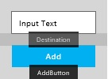
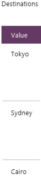
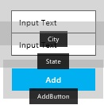
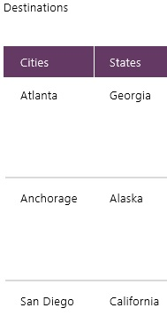
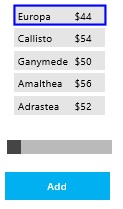
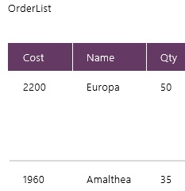
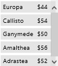

<properties
	pageTitle="Add data from users in KratosApps Studio"
	description="In KratosApps Studio, add data from users to a collection, which you can save, or to a context variable, which is discarded when the app is closed."
	services="kratosapps"
	authors="AFTOwen"
 />

#Add data from users in KratosApps Studio
Add data from the user to a collection if you want to keep that data after your app is closed and reopened. Track temporary data from the user (for example, a running total of costs that automatically updates as the user adds items) in a context variable.

###Prerequisites
* [Create an app](kratosapps-tutorial-inventory.md) to understand how to perform basic tasks, such as adding a control.

##Add data from the user to a collection

###Create a collection that has one column
1. On the **Insert** tab, click **Text**, and then click **Input Text**.

2. In the lower-left corner, name the control that you just added **Destination**.

3. Add a button, and set its **OnSelect** property to this function:

 **Collect(Destinations, Destination!Text)**
1. (optional) Name the button **AddButton**, and set its **Text** property to **Add**.

 
 
1. Press F5, type some text into the box, and then click the button.

2. Alternate typing text into the box and clicking the button a few times, and then press Esc.

3. (optional) To display the collection that you created, press Alt-D, and then click **Collections** in the left navigation bar.

 

###Create a collection that has more than one column
1. On the **Insert** tab, click **Text**, and then click **Input Text**.

2. In the lower-left corner, name the control that you just added **City**.

3. Add another input-text box, and name it **State**.

4. Add a button, and set its **OnSelect** property to this function:

 **Collect(Destinations, {Cities:City!Text, States:State!Text})**

 **Note:** Use the same function to add rows to an existing collection that contains columns that are named, for example, **Cities** and **States**.
 
5. (optional) Name the button **AddButton**, and set its **Text** property to **Add**.

 

6. Press F5 to open **Preview**, type some text into each box, and then click the button.

7. Add a few more entries, and then press Esc.
 
 To display the collection that you created, press Alt-D, and then click **Collections** in the left navigation bar.

 
 
###Add one or more columns to an existing collection
1. Show a set of data in a custom gallery, as the first procedure in [this topic](kratosapps-show-data.md) describes, and name the gallery **PriceGallery**.

2. (optional) Indicate which gallery item is selected, as [Create an app](KratosApps-tutorial-inventory.md) describes.

3. Add a slider, name it **OrderQty**, and move it under the gallery.

4. Add a button, set its **Text** property to **Add**, and move it under the **OrderQty** slider.

 

5. Set the **OnSelect** property of the **Add** button to this expression:

 **Collect(OrderList, {Name:PriceGallery!Selected!Name, Qty:OrderQty!Value, Cost:OrderQty!Value*LookUp(PriceList, PriceGallery!Selected!Name in Name, Price)});SaveData(OrderList, "orderfile")**

 When you click this button later in this procedure, you'll create and save a collection named **OrderList**. The collection will contain the name of a product that you specify in the gallery, a quantity that you specify with the slider, and the total cost calculated by multiplying the quantity by the price of the product.

6. Set the **OnVisible** property of the screen to this expression:

 **If(IsEmpty(PriceList), LoadData(PriceList, "pricefile"));If(IsEmpty(OrderList), LoadData(OrderList, "orderfile"))** 

7. Press F5 to open **Preview**. 

8. Click a product in the gallery, specify a value with the slider, and then click the **Add** button.

9. Repeat the previous step, and then press Esc to return to the design workspace.

10. Press Alt-D, and then click **Collections** to display a preview of the **OrderList** collection.

 
 
11. Press Esc to return to the design workspace.

**Note:** To remove all items from the order list, add a button, set its **Text** property to **Clear**, and set its **OnSelect** property to this expression:

**Clear(OrderList);SaveData(OrderList, "orderfile")**

To remove one item at a time, show the **OrderList** collection in a gallery, and then set the **OnSelect** property of a label in that gallery to this function:

**Remove(OrderList, ThisItem);SaveData(OrderList, "orderfile")**

##Track dynamic data from the user
###Filter a gallery on another page
1. In the lower-left corner, name the default screen **FilterScreen**.

2. On the **Insert** tab, click **New Screen**, and name the new screen **GalleryScreen**.

3. Show the **GalleryScreen** by clicking it in the left navigation bar, and then create the custom gallery that the first procedure in [Show a set of data](kratosapps-show-data.md) describes.

 

4. On the **FilterScreen**, click the **Insert** tab, click **Controls**, and then click **Drop-down**.

5. Name the list you just added **FilterList**, and set its **Items** property to this function: 
 **PriceList!Name**
 The list shows the name of each product in the **PriceList** collection.
6. On the **Insert** tab, click **Shapes**, click the Next arrow, and move it under the drop-down list. 

7. Set the **OnSelect** property of the arrow to this expression:
 **Navigate(GalleryScreen, ScreenTransition!Fade, {FilterName:FilterList!Selected!Value})**
 
8. On the **GalleryScreen**, set the **Items** property of the gallery to this function:

 **Filter(PriceList, FilterName in Name)**
 
9. On the **FilterScreen**, press F5, choose a product in the drop-down list, and then click the Next arrow.

 The gallery shows only the product you specified.