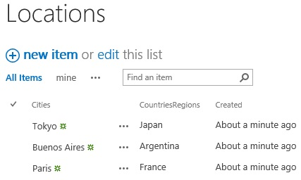
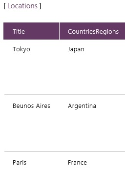
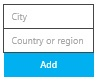
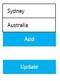
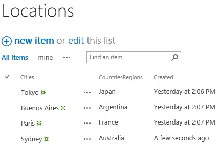
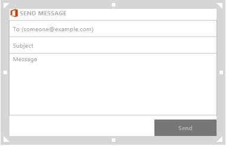

<properties
	pageTitle="Share data in KratosApps"
	description="Post data to a SharePoint list, send data in an email, or export data for use in another app."
	services="kratosapps"
	authors="AFTOwen"
 />

# Share data in KratosApps Studio #

To share data from an app created in KratosApps Studio:

- Export your data from one app created in KratosApps Studio and import it into another.
- Post your data to a SharePoint list.
- Share your data through Office 365 Preview (for example, by sending it in an email message).

**Prerequisites**

[Create an app](kratosapps-tutorial-inventory.md) to learn how to perform basic tasks, such as adding a control and configuring its properties.

## Export and import data ##

To transfer data from one app created in KratosApps Studio to another, first export the data into a compressed file by following the steps in the next procedure. If the target app is on a different device, copy the compressed file to that device. Finally, add an import control to the target app, and configure the control to add the data to a collection in that app.

1. If you don't have a collection, [create one](kratosapps-add-user-data.md).

1. On the **Insert** tab, click **Controls**, click **Export**, and then set its **Data** property to the collection that you want to export.

1. Press F5, and then click the export control.

1. Specify where you want to save the file that contains your data, specify a file name, and then click **Save**.

	Your data is exported and compressed in a file in the location that you specified.

1. Press Esc to return to the design workspace.

1. [Add and configure an import control](kratosapps-tutorial-inventory.md).

## Share data in a SharePoint list ##

**Create a SharePoint list**

1. In SharePoint, create a list that's named **Locations** and that contains columns named **Cities** and **CountriesRegions**.

	

1. (optional) Add one or more entries to the list.

1. In the address bar of your browser, copy the URL for the list.

**Import the data from SharePoint**

1. In KratosApps Studio, press Alt-D, click **SharePoint**, and ensure that the appropriate option button is selected for the type of list you created.

1. Paste the URL for the list into the text box, and then click **Connect**.

1. If prompted, provide the requested credentials.

1. In the list that appears, select the **Locations** check box, and then click **Import data**.

1. When a preview of your list appears, press Esc to return to the design workspace.

	

**Add data**

1. On the **Insert** tab, click **Text**, and then click **Input Text**.

1. Add a second input-text box, move it just under the first one, and name the boxes **City** and **CountryRegion**.

1. Add a button, set its **Text** property to **Add**, and set its **OnSelect** property to this function:

	**Collect(Locations, {Cities:City!Text, CountriesRegions:CountryRegion!Text})**

1. Move the button that you just added so that it appears under the text boxes.

	

**Add a SharePoint Update control**

1. On the **Insert** tab, click **Controls**, click **SharePoint Update**, and then move the control that you just added so that it appears under the **Add** button.

1. Change the **Data Source** property of the **Update** control to **Locations**.

**Test the app**

1. Press F5, and type some text into each box.

	

1. Click the **Add** button, and then click the **Update** control.

1. Open your SharePoint list in a browser, or refresh the view of that list. (For example, press F5 to refresh the list in Internet Explorer.)

	The list contains a row for the entry you added.

	

## Send data in an e-mail message ##

1. In a new app, set the **OnSelect** property of a button to this function:

	**Collect(Stock, {Company:"Contoso", Value:"100"}, {Company:"Fabrikam", Value:"75"}, {Company:"AdventureWorks", Value:"130"})**

1. Press F5, click the button, and then press Esc.

1. On the **Insert** tab, click **Connected Visuals**, and then click **Send Message**.

	A composite control appears with labels in which you can specify a recipient, a subject line, and a message body.

	

1. Click in the label for the recipient, and then type the address of the person or group of people to whom you'll send this message.

1. Click in the label for the subject line, and then type **Buy, sell, or hold?**

1. Select the label for the message body, and set its **Default** property to this expression:

	**"Contoso stock is now at $" & LookUp(Stock, Company="Contoso", Value) & ". What do you want to do?"**

	Text between quotations marks (for example, **The stock is now at $**) appears exactly as you type it. The LookUp function shows the data in the **Value** column of the **Stock** collection where the **Symbol** column contains text that you specify. Ampersands concatenate the other elements.

1. Press F5, and then click **Send**.

	After a bit of time, the mail that you created arrives in the inbox of the recipient or recipients that you specified.

