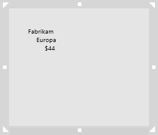
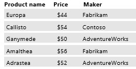
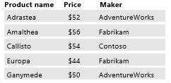
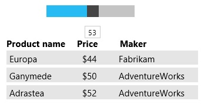
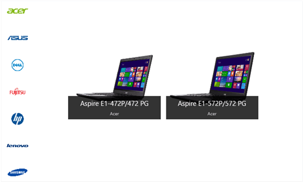
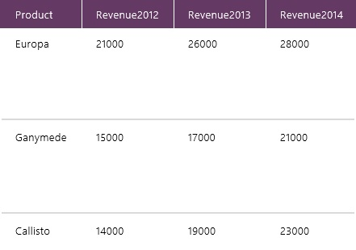
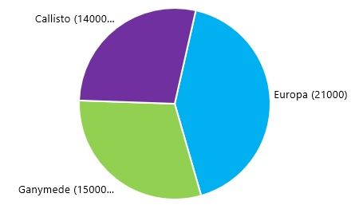
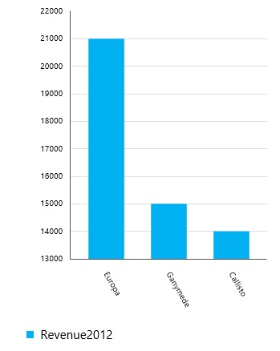
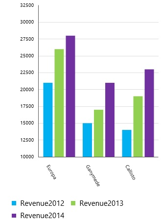

<properties
	pageTitle="Show a set of data in KratosApps Studio"
	description="Show, sort, and filter data in a table or a gallery, show data in a chart, or choose an option in one table or gallery to filter the data in another table or gallery."
	services="kratosapps"
	authors="AFTOwen"
 />

# Show a set of data in KratosApps Studio #

Show a set of data in a custom gallery, where you can sort the data in ascending or descending order by a column you specify and filter the data by one or more criteria. Show a set of data in pie, column, or line chart.

In this topic, you'll download one or more compressed files and import data from each file into a collection. But you can follow the same techniques with any set of data, whether you add it from an external source, specify the data yourself, or prompt users for it.

**Prerequisite**

- [Create an app](kratosapps-tutorial-inventory) to understand how to perform basic tasks, such as adding a control.

## Show a set of data in a custom gallery ##
1. Download [PriceList.zip](https://gallery.technet.microsoft.com/Sample-data-for-Show-a-set-5933d4c7), and import it into a collection named **PriceList**.

1. On the **Insert** tab, click **Gallery**, scroll down to **Custom Galleries**, and then click the custom gallery in portrait orientation.

1. Set the **Items** property of the gallery you just added to **PriceList**, and move it to the right side of the import control.

1. Click the first item of the gallery (the gallery template), click the **Insert** tab, and then click **Label**.

1. Add two more labels, and then set the **Text** property of each label to one of these expressions:

	**ThisItem!Name**

	**Text(ThisItem!Price, "$#")**

	**ThisItem!Maker**

	Each item in the gallery identifies the name of a product, its price, and its maker.

	

1. Resize and arrange the labels in a row near the top of the template, and then shrink the height of the template to fit the labels more exactly.

	To select the template, click just below the labels in the first item.

1. Select the gallery by clicking any item in it except the first one, and then shrink the height and width of the gallery to fit the items more exactly.

1. (optional) Add labels over the gallery to identify each column.

	

## Sort a set of data ##

1. Follow the steps in the previous procedure, and then set the **Items** property of the gallery to this function:

	**Sort(PriceList, Name)**

	The gallery is sorted by product name in ascending order.

	

1. Set the **Items** property of the gallery to this function:

	**Sort(PriceList, Name, Descending)**

	The gallery is sorted by product name in descending order. 

## Filter a set of data ##
1. Follow the steps in the first procedure in this topic.

1. Add a slider, name it **PriceFilter**, and move it over the gallery.

1. (optional) Configure the slider so that users can't set it to a value outside the range of prices in the list:

	- On the **Data** tab, click **Min**, and then type or paste this function in the Function Bar:

		**Min(PriceList, Price)**

	- On the **Data** tab, click **Max**, and then type or paste this function in the Function Bar:

		**Max(PriceList, Price)**

1. Set the **Items** property of the gallery to this expression:

	**Filter(PriceList, Price<=PriceFilter!Value)**

1. Adjust the slider to a value that's between the highest and the lowest price in the gallery.

	As you adjust the slider, the gallery shows only those products that are no more expensive than the value you specify.

	

1. On the **Insert** tab, click **Text**, click **Input Text**, and name the new control **MakerFilter**.

1. Set the **Items** property of the gallery to this function:

	**Filter(PriceList, Price<=PriceFilter!Value && MakerFilter!Text in Maker)**

1. Set the slider to **50**, and type the letter **f** in the input-text box.

	The gallery shows the only product that costs less than $50 and that was made by Fabrikam.

	

## Filter a gallery by another gallery ##
1. Download [OEMs.zip and Devices.zip](https://gallery.technet.microsoft.com/Sample-data-for-Show-a-set-5933d4c7).

1. Import OEMs.zip into a collection named **OEMs**, and import Devices.zip into a collection named **Devices**.

1. On the **Insert** tab, click **Gallery**, and then click the vertical **Image Only** gallery.

1. Set the **Items** property of the gallery you just added to **OEMs**, and move it to the right of the other controls.

1. Click the image in the first item of the gallery, and set its **ImagePosition** property to **ImagePosition!Fit**.

1. Name the gallery **OEMGallery**, and make it narrower to show more images.

	

1. Add a horizontal **Image Gallery with Text**, set its **Items** property to **Devices**, and move it to the right of the **OEMs** gallery.

1. (optional) Swap the data that appears in the two labels within the gallery, so that name of each device appears in larger letters above the name of the OEM.

	
1. Set the **Items** property of the devices gallery to this function:

	**Filter(Devices, 'OEM name' = OEMGallery!Selected!'OEM name')**

	When you click any logo in the **OEMGallery**, the devices gallery shows products from only that OEM.

## Show data in a chart ##
Your data should be structured with each series in the first row and the labels in the leftmost column, as in this example:

1. Download [ChartData.zip](https://gallery.technet.microsoft.com/Sample-data-for-Show-a-set-5933d4c7), and import it into a collection named **ProductRevenue**.

1. On the **Insert** tab, click **Charts**, and then click **Pie Chart**.

1. Set the **Items** property of the pie chart to **ProductRevenue**.

	The pie chart shows relative revenue of the products in 2012.

	

1. On the **Insert** tab, click **Charts**, and then click **Column Chart**.

1. Set the **Items** property of the column chart to **ProductRevenue**.

	The column chart shows revenue for each product in 2012.

	
1. On the **Chart** tab, click **Number of Series**, and then type **3** in the Function Bar.

	The column chart shows revenue data for each product over three years.

	