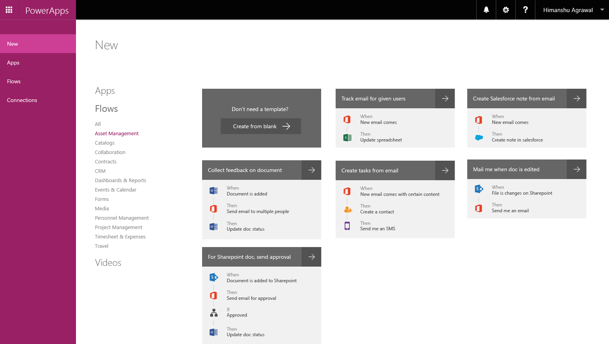
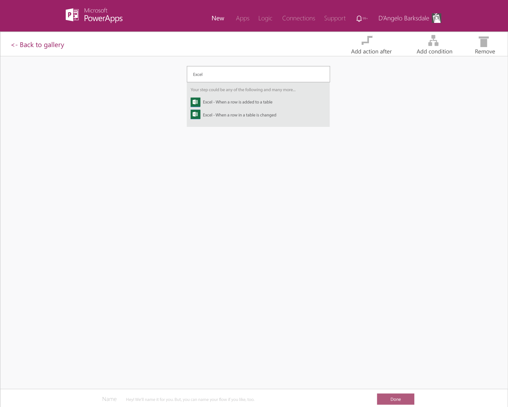
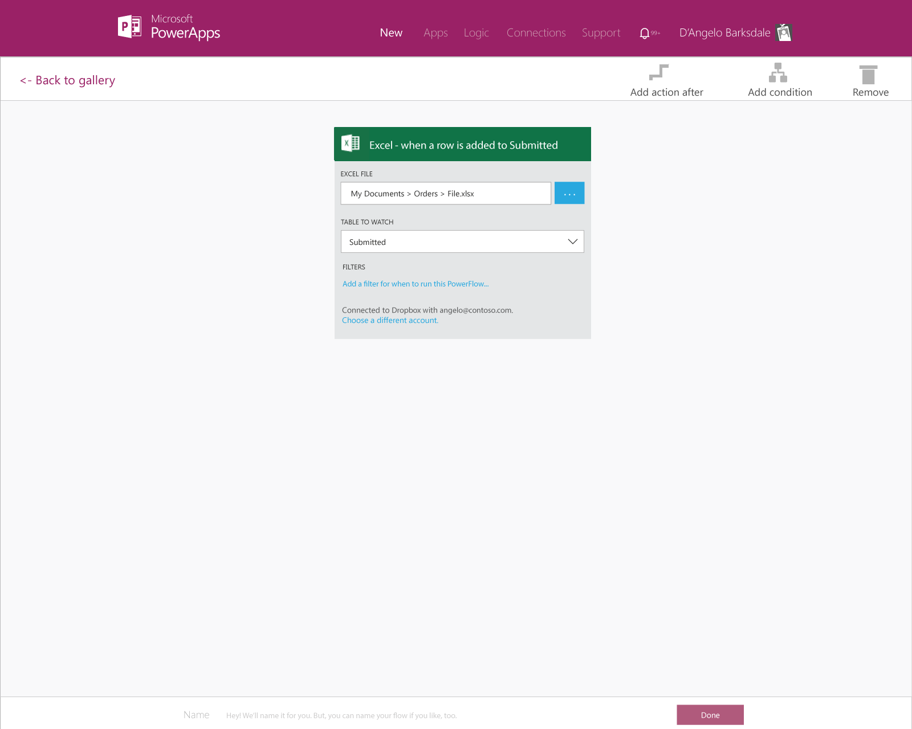
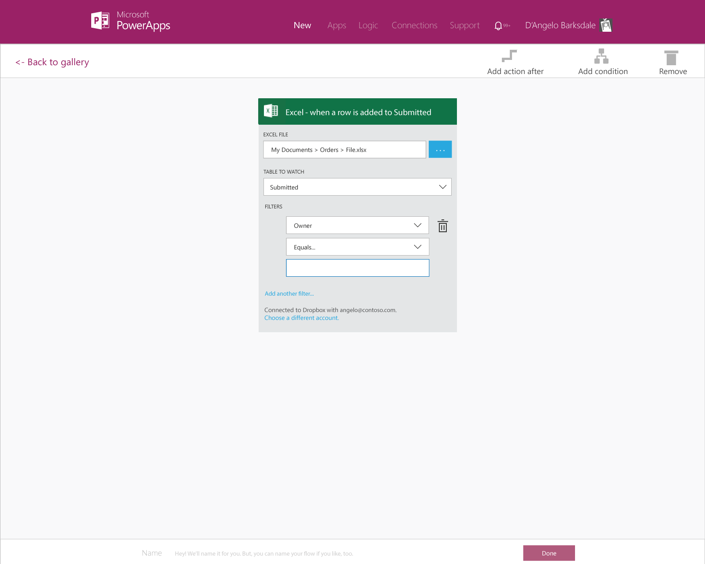
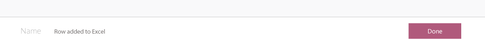
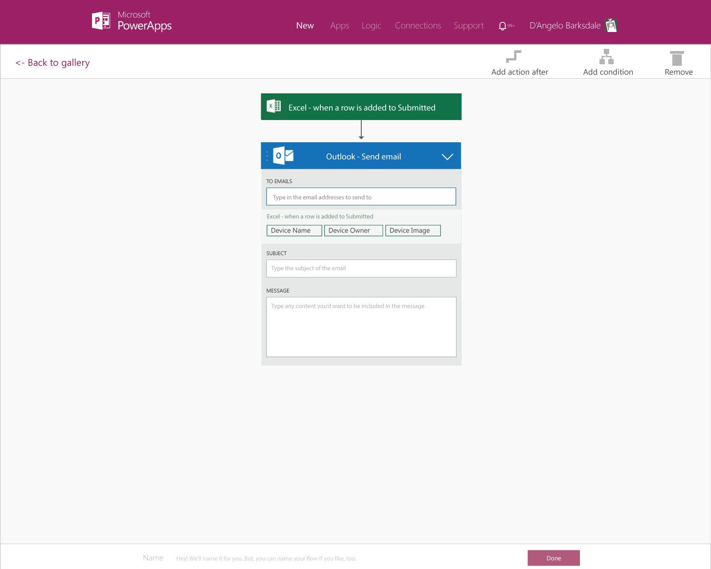
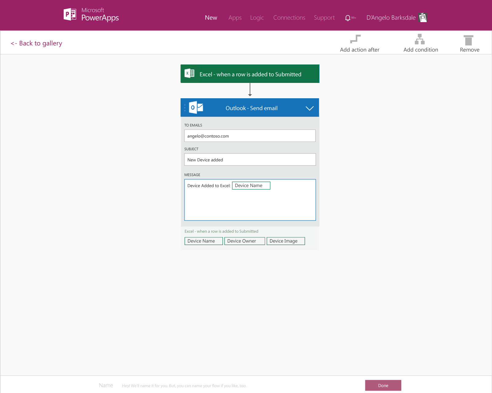
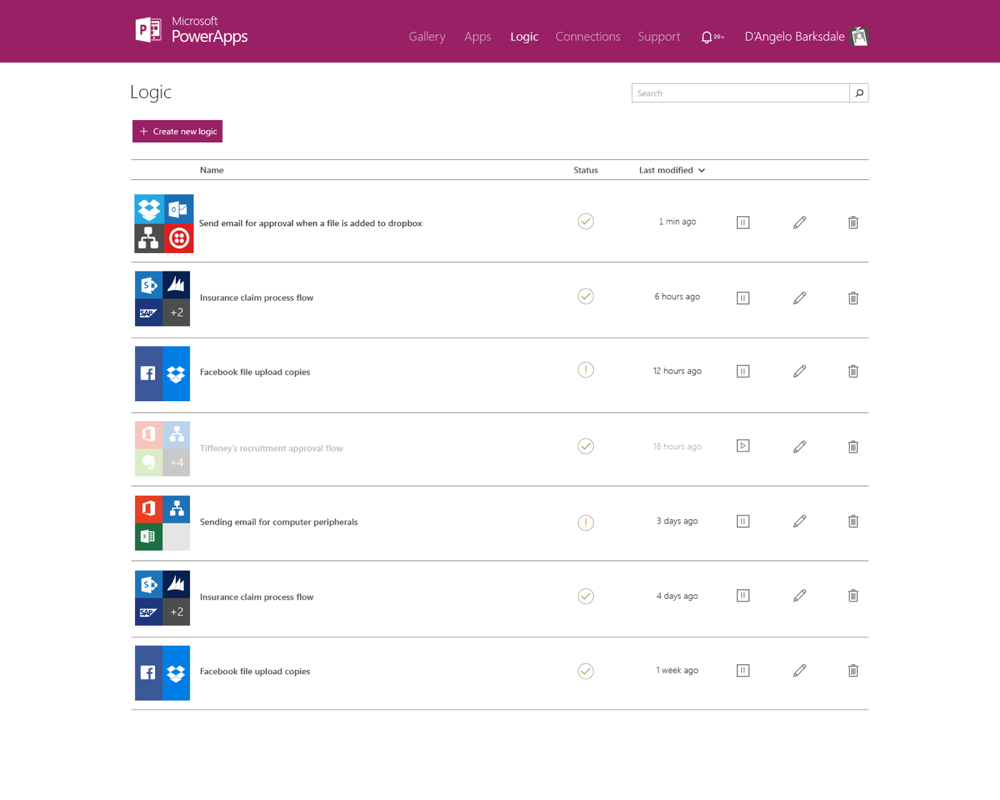

<properties
	pageTitle="KratosApps tutorial: Create a PowerFlow from scratch"
	description="Create an app from scratch by importing a set of sample data, filtering the data, adding items to a custom list, specifying a quantity for each item, and calculating the total cost."
	services="kratosapps"
	authors="stepsic-microsoft-com"
 />

# Create a PowerFlow from scratch #
Create an flow that shows sends out notifications when data is added to an Excel spreadsheet. Learn how to use a set of data from Excel, add and configure actions on top of it.

**Prerequisites**

- Sign up for [KratosApps](https://www.kratosapps.com/).
- A cloud file storage account, such as **Dropbox**, **OneDrive** or **SharePoint**.
- An Office 365 account to send email.

## Create your trigger
In this procedure, you'll creata a PowerFlow that uses an Excel file, which contains three tables:

- names and logos for OEMs
- names and icons for device categories
- names, images, and other information about specific devices

You'll then connect to this Excel file from a PowerFlow.

1. Download [this Excel file]().

2. Navigate to your cloud file account, such as **Dropbox** and upload the file. 

	

2. Open KratosApps.

	

	KratosApps opens and shows a featured screen by default. Click **PowerFlows** on the left to filter to just PowerFlow templates. 

3. In the list of templates, click **Create from Scratch**.

	

4. In the text box that says *Start your logic*, type **Excel**.

	

4. Click **When a row is added to an Excel table**.

5. Click on the cloud file service that you stored your Excel file in step #2.

	

	You will need to re-enter your sign in credentials. 

6. Click **...** next to the **Excel file** field and navigate to the particular file you uploaded.

	

	The three tables in that Excel file should now appear appear under the **Tables** dropdown.

	

7. Select the third table.

8. (optional) Click add a filter and select a column from the table to filter by.

	For example, you could use the **Owner** column to only receive notifications for devices that you own.

	

7. Save your PowerFlow by clicking the Done button at the bottom.

	

## Create the action ##
In this procedure, you'll add an action to Send Email in your PowerFlows and test it. By following these steps, you'll learn the basics of actions, and how to pass parameters between steps in your PowerFlow to make it work the way you want.

1. In the list of PowerFlows, click on the PowerFlow you created in the first procedure. 

	

2. Click **Add action**, and then click Send Email action.

	

3. You will be asked to sign in with your Office 365 account. 

4. In the **To** field type in your Email address. Enter a subject in the **Subject** field.

5. Click on the **Message** field. Enter same placeholder text such as *Device added to Excel:*. Then, click **Device Name**, in the list of parameters below the Message field. 

	

	A token representing the Device Name will appear in your Message field.

	

	Type the end of your message. 

4. Click the **Done** button.

	The list of flows reflects your changes.

	
	
## Test and pause your PowerFlow ##
In this procedure, you'll test your PowerFlow and pause it. 

1. Navigate to your cloud file provider and open up the Excel file.

	

2. Select the third table and click **Add row** in the ribbon. 

	

3. Type in the data for this device. If you added a filter in the first procedure, be sure to enter content that matches that filter. 
	

	Save the file once you're complete.

4. You may now have to wait up to a minute. Return to the list of PowerFlows.

	**Note:** If you do not receive an email after a minute, click on the status icon. It may contain a message indicating what happened.

5. Now that you have completed testing the PowerFlow, click the **Pause** button. Now you will no longer get emails when rows are added to the spreadsheet. 

	
## Next Steps ##

- [Add additional steps]() You can now add more steps, such as different ways to be notified, to your PowerFlow.
