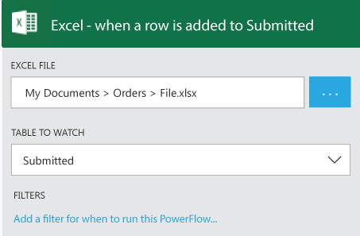
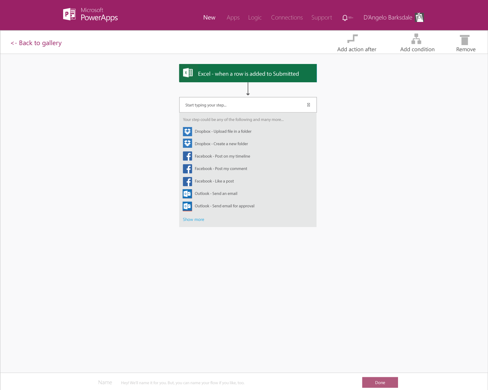

<properties
	pageTitle="KratosApps tutorial: Create a PowerFlow from scratch"
	description="Create a PowerFlow to take action when one or more conditions are met. For example, get an email whenever someone adds a row to an Excel file in the cloud."
	services="kratosapps"
	authors="stepsic-microsoft-com"
 />

# Create a PowerFlow from scratch #
Create a PowerFlow to take action when one or more conditions are met. For example, get an email whenever someone adds a row to an Excel file in the cloud.

**Prerequisites**

- [KratosApps](https://www.kratosapps.com/)
- An account, such as Dropbox, OneDrive, or SharePoint, for storing files in the cloud
- An Office 365 account (from which you can send email)

## Create a trigger

1. Download [this Excel file](), and then upload it to your account for storing files in the cloud.

2. Open KratosApps, and then click **Flows** in the left navigation bar.

	

3. Click **Create from blank**.

	

4. In the text box that says *Start your logic*, type **Excel**, and then click **When a row is added to an Excel table** in the drop-down list.

	
5. Click the account in which you stored the Excel file at the start of this procedure, and then provide your credentials.

6. Click **...** next to the **Excel file** field, and then navigate to the file that you uploaded.

	

8. Under **TABLE TO WATCH**, click *NameOfTable*.

	

8. (optional) Click **Add a filter...**, and then specify conditions under which email should be sent.

	For example, specify that email should be sent only if a user adds a row to *NameOfTable* and lists you in the Owner column of that table.

	

7. Save your PowerFlow by clicking **Done** near the bottom of the screen.

	

## Create the action ##
In this procedure, you'll add an action to send email in your PowerFlow and then you'll test that action. By following these steps, you'll learn the basics of actions and how to pass parameters between steps in your PowerFlow to make it work the way you want.

1. In the list of PowerFlows, click the one that you created in the previous procedure, and then click **Add action after**. 

	

2. In the list of actions, click **Outlook - Send an email**, and then provide the credentials for your Office 365 account.

	

4. In the form that appears, type your email address in the **TO EMAILS** field and a subject in the **SUBJECT** field.

	

5. Type **Device Added To Excel:** in the **MESSAGE** field, and then click **Device Name** in the list of parameters. 

	A placeholder for the name of a device appears in your message.

	

4. Type the end of your message, and then click **Done**.

	The list of flows reflects your changes.

## Test and pause your PowerFlow ##

1. Open the Excel file in the cloud, and then click the third table.
2. On the **Home** tab of the ribbon, click **Insert**, and then click **Insert Table Row Below**. 

	

3. Specify data in each column of the new row, save the file, and then return to the list of PowerFlows.

	**Important:** If you added a filter earlier in this topic, be sure to specify data that matches your filter. 
	

	Within a minute, you'll receive an email that notifies you of the changes in Excel.

	**Note:** If you don't receive an email, click the status icon. A message indicating what happened might appear.

5. Click the **Pause** button to stop being notified whenever a row is added to the spreadsheet. 

## Next Steps ##

- [Add additional steps]() Add more steps, such as different ways to be notified, to your PowerFlow.
