<properties pageTitle="Create an app in KratosApps Studio" description="Create your first app in KratosApps Studio, including importing data and adding controls" services="kratosapps" authors="AFTOwen"
 />

# Create an app in KratosApps Studio

Create a Windows app to manage organizational data (such as text, numbers, and images) without learning a programming language. Import one or more sets of data from sources such as Excel, SharePoint, an Azure mobile service, a REST source, or a social-media channel. Update the data to keep it current, and add records as your organization grows. Show data sets in tables, charts, or other ways that help your organization make better decisions.

**In this topic**

Create an app for tracking inventory by showing a picture of each product, its name, and the number of units in stock. As products are sold, update the quantity to reflect your current inventory.

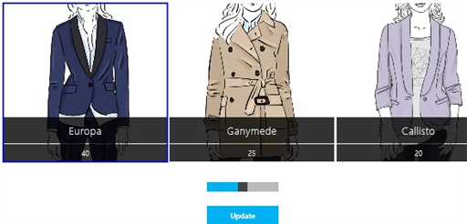

**Prerequisites**

##Open KratosApps Studio

1. Open KratosApps Studio the same way as you open any other Windows app.

 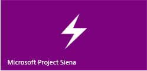
 
2. Watch the short video that automatically runs the first time you open KratosApps Studio, or click **Skip Tour** near the lower-right corner.

3. (optional) Save your app by pressing Ctrl-S, typing a name in the text box, and then clicking **Save**.

By default, KratosApps Studio files are saved in the Documents folder of the current user, but you can specify a different location.

##Add and configure a control

When you develop an app, you'll add UI elements, called controls or visuals, to show text, images, and other information. In this procedure, you'll add a label that appears near the top of the screen to identify your app, and then you'll configure the label by changing several of its properties. For example, you'll specify the text that appears in the control, the font size of that text, and the name, size, and location of the control itself. Other types of controls, such as buttons, have similar properties, and you can change them in similar ways.

1. On the **Insert** tab, click **Label**.

 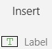

 A label appears near the upper-left corner.

 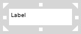
 
 A thick, grey box surrounds the label to indicate that it's selected. When a control is selected, the menu bar and other UI elements change so that you can configure properties of that control. If no control is selected, the options for the screen appear.

 A list of properties for the label appears near the upper-left corner of the screen. When you add a label, the list shows the **Text** property by default. Change this property by typing in the Function Bar, which is on the right side of the list of properties and the equals sign.
 
 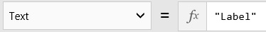
 
2. In the Function Bar, type **Track inventory** between the quotation marks.

 As an alternative, change the **Text** property by highlighting the default text in the label directly and then typing the text you want (without quotation marks).
 
 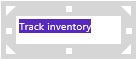
 
3. Rename the label itself by double-clicking **Label1** near the lower-left corner of the screen and then typing **Banner**.

 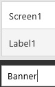
 
 If you've added more than one label, the default name might end in a number other than 1.

4. On the **Home** tab, open the list of font sizes, and then click **40**.

 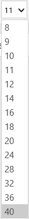
 
5. Make the label bigger by dragging the small, white triangle in the lower-right corner of the selection box until all the text appears on one line.

 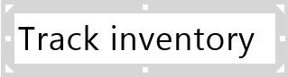

6. By dragging the selection box that surrounds the label, move it near the center of the top edge of the screen.

 **Note:** If you want to delete a control, select it, and then press Delete.

##Import a set of data

You can add text, numbers, and images to an app by adding one label or image control at a time, but many developers incorporate data from external sources into their apps. Not only can you add data more efficiently this way but you can also, in many cases, update the original source from within the app. In this procedure, you'll import a set of data from the compressed file that you downloaded earlier.

1. Download [CreateFirstApp.zip](https://gallery.technet.microsoft.com/Sample-data-for-Create-c77790e7), which contains sample data, and remember where you saved it.

2. On the **Insert** tab, click **Controls**, and then click **Import**.

 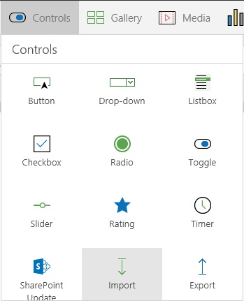
 
 An Import control appears near the upper-left corner of the screen.

 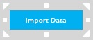
 
3. On the **Behavior** tab, click **OnSelect**.

 
 
  **OnSelect** appears in the properties list so that you can specify what happens when a user (in this case, you) clicks the control that you just added.
  
4. Copy this function, and then paste it in the Function Bar:

 **Collect(Inventory, Import1!Data)**
 
 This function specifies that, when the control is clicked, a collection named **Inventory** is created. In KratosApps Studio, a collection contains one or more columns of data and one or more rows for each record. For example, a collection of contact information might contain columns for a contact's name, address, and phone number, plus a row for each contact. In this case, the collection will contain the data from the compressed file that you downloaded and that you'll specify after you click the control.
5. Press F5 to open **Preview**.

 So far, you've been working in the design workspace, where you can add and configure controls. But not all functions, such as an importing data, work in the design workspace. In **Preview**, all functions work so that you can test them before you install your app on one or more devices. As you develop your app, you should frequently verify your app's behavior in **Preview**.
 
6. Click the Import control, browse to CreateFirstApp.zip, and then click it.

 
 
7. Click **Open**, and then press Esc to return to the design workspace.

You've just created the **Inventory** collection, which contains information about five products, including a design image, a product name, and the number of units in stock.

8. Preview the collection by pressing Alt-D and then clicking **Collections** in the left navigation bar.
 
  The first five rows in the **Inventory** collection appear.
9. Press Esc to return to the design workspace.

**Note:** If you delete the Import control, you'll also delete the collection that you just created. To hide the Import control, click it, click **Visible** in the list of properties, and then type **false** in the Function Bar.

##Show a set of data

You can display a preview of a collection, but it's hidden from users unless you show it in a gallery or another control. Galleries are groups of controls, such as labels and images, that work together to show a set of data. KratosApps Studio offers several pre-built galleries, such as for images only, text only, or a combination of images and text. Modify a pre-built gallery to suit your needs, or start with a custom gallery and build your own.

In this section, you'll show the **Inventory** collection in a gallery that supports images and two labels. The images will show the designs, and the two labels will show the names and the number of units in stock for each product. You'll also add a visual indicator of which item in the gallery is selected.

###Add and configure a gallery

1. On the **Insert** tab, click **Gallery**, and then click the horizontal image gallery with text.

 
 
 The gallery appears, and the properties list automatically shows the **Items** property.
2. In the Formula Bar, type or paste **Inventory**.

 As you type, KratosApps Studio suggests valid options that start with the letters that you've already typed. To accept a suggestion, press the arrow keys to highlight the option you want, and then press Enter.
 
3. Just as you did with the label, rename the gallery from **Gallery1** to **ProductGallery**, move it down and to the right so that it doesn't block the other controls, and widen it to show three products.

 
 
 The gallery contains an image control, which shows the design of each product, and two labels. You'll configure the lower label to show the number of units in stock for each product.

4. In the first item of the gallery, click the bottom label.

 
 
 The first item in any gallery is a template. By changing the first item, you automatically change all other items in the gallery.

5. Set the **Text** property of that label to this expression:

 **ThisItem!UnitsInStock**

 The bottom label shows the number of units in stock for each product.
 
 
 
###Show which gallery item is selected

1. Select the gallery template by clicking any item in the gallery except the first one and then clicking the icon that appears in the upper-left corner.

 
 
2. On the **Insert** tab, click **Shapes**, and then click the rectangle.
 
 A blue solid rectangle appears in each gallery item.
 
3. On the **Home** tab, open the **Fill** list, and then click **No Fill**.

4. Open the **Border** list, click **Border Style**, and then click the solid line.

 

5. Open the **Border** list, set the **Border Thickness** to 3, and then resize the rectangle so that it surrounds each gallery item.

6. On the **Shape** tab, click **Visible**, and then type or paste this expression in the Function Bar:

 **If(ThisItem!IsSelected, true)**

 
 
7. Click a few gallery items to confirm that the rectangle appears only around the item that you clicked most recently.
 
8. Click the rectangle, click **Reorder** on the **Home** tab, and then click **Send to Back**.

 If you perform this step, you can click a gallery label to select it without the rectangle getting in the way.

##Develop your own app
* [Add one or more sets of data](Add+a+data+set+in+PowerApps+Studio.md) from Excel, SharePoint, Office 365, Bing, social media, a REST service, or another source.

* [Add data from your users](Add+data+from+users+in+PowerApps+Studio.md).

* [Show, sort, and filter data](Show+a+set+of+data+in+PowerApps+Studio.md) in a custom gallery, or show it in a chart.

* [Add and configure controls](Configure+a+control+in+PowerApps+Studio.md), such as lists and toggles, to add and show particular kinds of data.

* [Share data](Share+data+in+PowerApps+Studio.md) by exporting it and then importing it into another app that was created in KratosApps Studio, posting the data in a SharePoint list, or sending the data in an e-mail message. 

* [Build a function](Build+a+function+in+PowerApps+Studio.md) to calculate, update, and customize data.