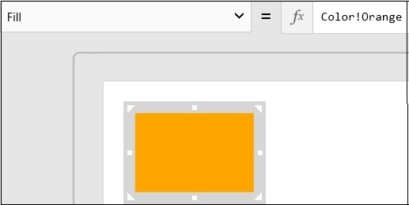

<properties
	pageTitle="KratosApps tutorial: Show and select items in a gallery"
	description="Create an app in which users can browse, filter, and choose tablets and other devices and then review the total cost of their choices."
	services="kratosapps"
	authors="AFTOwen"
 />

# Create a gallery-based app in KratosApps #
Create an app that shows sample data about tablets, laptops, and desktop computers from various manufacturers. Learn how to import a set of data from Excel, add and configure controls such as shapes and checkboxes, show images and other data in a gallery. Create a collection and perform mathematical calculations based on user choices.

The first screen of this app shows an image of each device, its manufacturer, and its price. Users can filter the list of devices by category or manufacturer and add one or more devices to a list of favorites.

The second screen of this app shows the list of favorite devices. Users can specify a quantity for each device, and the screen shows the total cost.

**Prerequisites**

- Download and install [KratosApps](https://www.kratosapps.com/downloads).

- Download and run the file that contains sample data for this app.

## Import sample data
1. Open KratosApps.

	

	KratosApps opens and shows a blank screen by default.

	Above the top of the screen, a ribbon contains tabs that you can click to show groups of options.

	A list of properties and the Function Bar, separated by an equals sign, appear betweeen the ribbon and the screen.

	A thumbnail view of each screen appears near the left edge of the screen.
## Create a banner ##

2. On the ribbon, click the **Insert** tab.

	
3. Click **Shapes**, and then click the rectangle shape to add it to the first screen of your app.

	

	Find out how to [add other controls](nameofffile.md) to your app.

	The rectangle appears near the upper-left corner of the screen.

	By default, a thick, gray box surrounds the rectangle to indicate that it's selected. When a control is selected, you can change properties of that control, such as the color of its fill. To select a control, click it. To select a screen so that you can change its properties, click a blank area of that screen.
4. On the **Home** tab of the ribbon, click **Fill**, and then click the orange option in the middle of the left column.

	

	The list of properties automatically shows **Fill**, and the Function Bar shows the RGBA values for the color you chose.
	
	Find out how to [change other properties](nameofffile.md) of a control.
5. Move the rectangle to the upper-left corner of the screen by dragging the selection box that surrounds it.
	
	

6. Resize the rectangle to create a banner by dragging a white square or triangle in its selection box.
	
	A thumbnail of the screen you're creating appears near its left edge.

	
## Show the device categories ##

3. [Add a horizontal image gallery](nameoffile.md), set its **Items** property to **PcCategory**, and then resize and position the gallery in the center of the orange banner.

	
4. [Name the gallery](nameoffile.md) **CategoryGallery**, name the screen **MainScreen**, and then [save the app](nameoffile.md).

## Show the OEM logos ##
6. Add a vertical image gallery, name it **OemGallery**, and set its **Items** property to **OEM**.
7. Move the **OemGallery** to the left edge of the screen (under the orange banner), and resize the gallery so that it shows four logos.
8. [Select the template](nameoffile.md) of the **OemGallery**, select the image in that template, and then set the **ImagePosition** property of the image to **Fit**.

	

## Show the devices ##
1. Add a horizontal image gallery with text, name it **DevicesGallery**, and set its **Items** property to **Devices**.
2. Position the **DevicesGallery** so that it touches the center of the right edge of the **OemGallery**.
3. [Set the **Width** property](nameoffile.md) of the **DevicesGallery** to 250, and set its **Height** property to 200.
3. In the template of the **DevicesGallery**, select the image, and then set its **ImagePosition** property to **Fit**.
4. In the template of the **DevicesGallery**, select the bottom label, and then set its **Text** property to this expression, so that the price of each device appears:

	**"$" & ThisItem!Price**

	

## Filter the devices ##
1. Set the **Items** property of the **DevicesGallery** to this expression:

	**[Filter](nameoffile.md)(Devices, MFR = OemGallery!Selected!MFR && DeviceType = CategoryGallery!Selected!PcCategory)**

2. (optional) [Open Preview](nameoffile.md), click a category and an OEM logo to show only devices in that category from that manufacturer, and then return to the workspace.

## Highlight devices by price##
1. In the template of the **DevicesGallery**, select the bottom label, and then set its **Fill** property to this expression:

	**[If](nameoffile.md)(Price<700,LightGreen,LightGray)**
2. Set the **Color** property of the same label to **Black**, and set its **FontWeight** property to **Bold**.
3. (optional) Find a device that costs less than $700, and verify that its price appears in a green, not gray, box.
	
