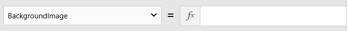
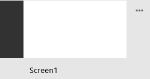
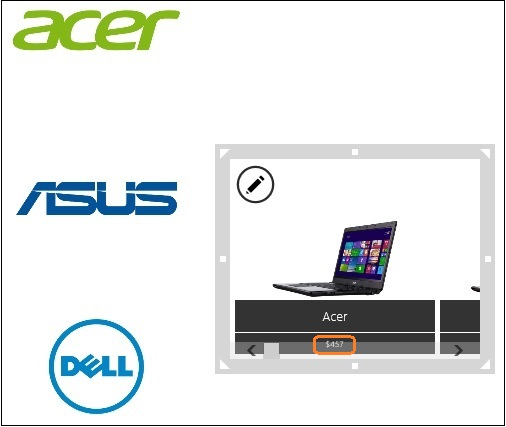

<properties
	pageTitle="KratosApps tutorial: Create an app from scratch"
	description="Create an app from scratch by importing a set of sample data, filtering the data, adding items to a custom list, specifying a quantity for each item, and calculating the total cost."
	services="kratosapps"
	authors="AFTOwen"
 />

# Create an app from scratch in KratosApps #
Create an app that shows sample data about tablets, laptops, and desktop computers from various manufacturers. Learn how to import a set of data from Excel, add and configure controls such as shapes and checkboxes, show images and other data in a gallery. Create a custom list, called a collection, and perform mathematical calculations based on user choices.

The first screen of this app shows an image of each device, its manufacturer, and its price. Users can filter the list of devices by category or manufacturer and then create a custom list of devices that interest them.

*Screen shot*

The second screen of this app shows the custom list of devices. Users can specify a quantity for each device, and the app shows the total cost.

*Screen shot*

**Prerequisites**

- Download and install [KratosApps](https://www.kratosapps.com/downloads).

## Import sample data
In this procedure, you'll download and decompress an executable file to install sample data in a folder on your local device. Then you'll configure the folder so that KratosApps can find the data that you downloaded. The sample data includes images and an Excel file, which contains three tables:

- names and logos for OEMs
- names and icons for device categories
- names, images, and other information about specific devices

You'll then import the sample data using techniques that are similar to [importing data from other sources]().

1. Download [this executable file](), and then double-click it to decompress sample data.

	When you double-click the executable file, the Excel file and the graphics are installed in this folder:

	**C:\\Users\\Public\\Pictures\\SienaAssets\\PcSelector**
1. In **C:\\Users\\Public\\Pictures**, right-click **SienaAssets**, point to **Include in library**, and then click **Pictures**.

	

2. Open KratosApps.

	

	KratosApps opens and shows a blank screen by default.

	Above the top of the screen, a ribbon contains tabs that you can click to show groups of options. For example, the **Data** tab shows options for adding data to your app.

	

	A list of properties and the Function Bar appear betweeen the ribbon and the screen. For example, the **Background Image** property appears by default, so that you can add a background image to the default screen.

	

	A thumbnail view of each screen appears near the left edge of the screen.

	
3. On the **File** menu, click **Data Sources** (or press Alt-D).

	

4. In the list of data sources, click **Excel**.

	

5. Browse to the Excel file that you downloaded and decompressed at the start of this procedure, and then click that file.

	

6. Click **Open**, confirm that all three checkboxes are selected, and then click **Import Data**.

	

	The three tables that you just imported appear under **Existing sources**.

	

1. (optional) Click each table to display a preview of the data that it contains.

	For example, the **OEM** table contains the logos that will appear along the left edge of the first screen of your app.

	

7. Return to the default workspace by clicking the Back arrow in the upper-left corner of the screen (or by pressing Esc).

	

## Create a banner ##
In this procedure, you'll add a rectangle to the first screen of your app, and then you'll configure the color, location, and size of the rectangle. By following these steps, you'll learn the basics of [adding other controls](), such as labels and buttons, and [configuring design properties]() to make the controls look the way you want.

2. On the ribbon, click the **Insert** tab.

	

3. On the **Insert** tab, click **Shapes**, and then click the rectangle to add it to the first screen of your app.

	

	The rectangle appears near the upper-left corner of the screen.

	

	By default, a thick, gray box surrounds the rectangle to indicate that it's selected.

	**Important:** To change the property of a control, click it so that it's selected, and then update the property. To change a property of a screen, click a blank area of that screen so that it's selected, and then update the property. To delete a control, click it, and then press Delete.

4. On the **Home** tab of the ribbon, click **Fill**, and then click a color in the list that appears.

	To follow this tutorial exactly, click the orange option in the middle of the leftmost column.

	

5. Move the rectangle to the upper-left corner of the screen, and then widen the rectangle to create a banner across the top of the screen.

	**Important:** To move a control, first select it, and then drag the selection box that surrounds the control. To resize a control, first select it, and then drag a white square or triangle in its selection box. 

	The thumbnail view of your screen reflects your changes.

	
## Show the device categories ##
In this procedure, you'll add a gallery that shows an icon for each category of device that the app will show. In KratosApps, each gallery contains multiple controls, such as images or labels, in which you can show a set of related data. The category gallery will contain only images, but you'll add another gallery later in this topic that will show not only an image but also other information about each device.

To specify the data that appears in a gallery, you set its **Items** property in the Function Bar. You can also [configure other controls]() to show specific types of information.

1. On the **Insert** tab, click **Gallery**, and then click the horizontal **Image Only** gallery to add it to your screen.

	

1. In the Function Bar, type **PcCategory** to set the **Items** property of the gallery.

	

2. Move the gallery to the center of the orange banner, and resize the gallery to fit inside the banner.

	

## Rename a screen and a gallery
In this procedure, you'll rename the default screen and the gallery that you added. If you give screens and controls descriptive names, you can identify them more easily as you continue to develop an app.

For example, you'll add navigation between screens later in this tutorial. If your app has several screens, you'll be able to specify them more easily if they have names more descriptive than **Screen1**, **Screen2**, and so forth.

At the end of this procedure, you'll save the app by using either the **File** menu or one of several [keyboard shortcuts]() that you can use in KratosApps.

4. Select the gallery, and then click **Gallery1** in the box in the lower-left corner of the screen.

	

	**Note:** If you've added and deleted a gallery before you added this one, the name of the gallery will end with a number that's greater than 1.

6. Rename the gallery by typing **CategoryGallery** in the box.
7. Click an empty area of the screen to select it, and then rename the screen by typing **MainScreen** in the box near the lower-left corner.

8. Save your changes by opening the **File** menu and then clicking **Save** (or by pressing Ctrl-S).

## Show the OEM logos ##
In this procedure, you'll add another gallery and configure it to show the logos of each OEM. You'll also update the first item in the gallery, which is a template for all items in the gallery. By updating the template, you'll automatically configure every other item in the gallery to match.

6. On the **Insert** tab, click **Gallery**, and then click the vertical **Image Only** gallery.

	

8. Name the gallery that you just added **OemGallery**, and set its **Items** property to **OEM**.
7. Move the **OemGallery** to the left edge of the screen (under the orange banner), and resize the gallery so that it shows most of four logos.

	

8. Click the first the image in the gallery, click **ImagePosition** in the property list, and type **ImagePosition!Fit** in the Function Bar.

	Each logo appears entirely in the gallery.

	

## Show the devices ##
In this procedure, you'll add a third gallery, which will show not just an image of each device but also its manufacturer and its category. In the last step, you'll configure a label in the gallery to show the price. The prices in Excel don't appear with a dollar sign so you'll add one by specifying an expression. 

In an expression, you indicate literal text (in this case, a dollar sign) between quotes. You also concatenate two pieces of text by separating them with an ampersand. For an element in a gallery, you specify which column of a table to show by using **ThisItem**, followed by an exclamation mark, followed by the column name.

1. On the **Insert** tab, click **Gallery**, and then click the horizontal **Image With Text** gallery.

*Screen shot*

2. Name the newest gallery **DevicesGallery**, and set its **Items** property to **Devices**.
2. Position the **DevicesGallery** so that it touches the right edge of the **OemGallery**, near the vertical center.

*Screen shot*

3. With the **DevicesGallery** selected, click **Width** in the properties list, and then type **250** in the Function Bar.
4. Using the previous step as a guide, set the **Height** property of the same gallery to **200**.

*Screen shot*

3. Click the first image in the **DevicesGallery**, and then set its **ImagePosition** property to **Fit**.
4. Under the first image in the **DevicesGallery**, click the bottom label, and then set its **Text** property to this expression, so that the price of each device appears:

	**"$" & ThisItem!Price**

	

## Filter the devices ##
In this procedure, you'll use an expression to filter the DeviceGallery by both manufacturer and category. The expression includes the **Filter** function, which is one of many [functions in KratosApps]().

To confirm that the filter works, you'll open Preview. As you develop your app, you can test some behavior in the default workspace. However, you'll need to open Preview to interact with your app exactly as a user will. By testing your app in Preview, you can completely confirm that your app works the way you expect before you share it with others.

1. Set the **Items** property of the **DevicesGallery** to this expression:

	**Filter(Devices, MFR = OemGallery!Selected!MFR && DeviceType = CategoryGallery!Selected!PcCategory)**

2. Open Preview, click a category and an OEM logo to show only devices in that category from that manufacturer, and then return to the default workspace.

## Highlight devices by price##
In this procedure, you'll use the **If** function to highlight less expensive devices. With this function, you specify a condition (for example, whether the price of a device is less than $700) and the result if the condition is true.

In this case, you'll specify that the fill of the price label is light green if the condition is true and light gray if the condition is false. You'll also change the text in that label to a black bold font.

1. Under the first image in the **DevicesGallery**, click the bottom label, and then set its **Fill** property to this expression:

	**If(Price<700,LightGreen,LightGray)**
2. Set the **Color** property of the same label to **Black**, and set its **FontWeight** property to **Bold**.
3. (optional) Find a device that costs less than $700, and verify that its price appears in a green, not gray, box.

	
