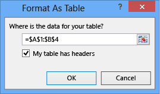
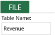
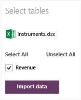
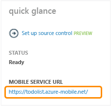
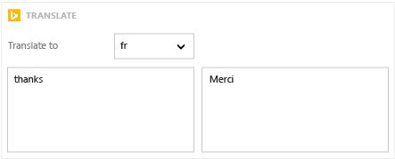
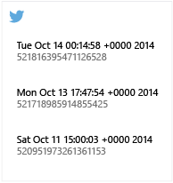
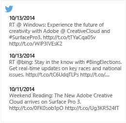
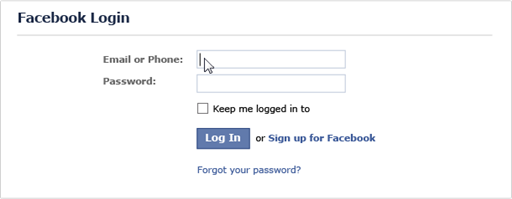
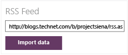

<properties
	pageTitle="Using Templates in KratosApps Studio"
	description="In KratosApps Studio, create a new app based on a template to jump start the app creation process"
	services="kratosapps"
	authors="evcohen"
 />

#Using Templates in KratosApps Studio

Get started building an app by using a template.

- [Create an app](kratosapps-tutorial-inventory) to understand how to perform basic tasks, such as adding a control.

## Selecting a template category ##

1. In KratosApps Studio click **New** and select **Template**.

	
2. Click a table format, ensure that the **My table has headers** check box is selected in the **Format As Table** dialog box, and then click **OK**.

	
3. On the **Design** tab of the ribbon, specify a name (such as **Revenue**) in the **Table Name** box, and then save and close the workbook.

	
4. In KratosApps Studio, press Alt+D to open the list of data sources.<Test123!> 
5. Under **Add new source**, click **Excel**.
6. Browse for the workbook from which you want to import data, click it, and then click **Open**.
7. Ensure that the check box for each table that you want to import is selected, and then click **Import Data**.

	
8. Press Esc, or click the Back button to return to the design workspace.
9. (optional) [Show the data in a gallery](kratosapps-share.md).

## Add data from Office 365 ##

1. In KratosApps Studio, press Alt+D, and then click **Office 365 Preview** in the list of data sources.
2. Click **Connect**, and then sign in.
3. After your app is registered, press Esc to return the design workspace.
4. (optional) Show your **Inbox** in a gallery:
	1. On the **Insert** tab, click **Gallery**, and then click a landscape or portrait **Text Gallery**.
	2. Set the **Items** property of the gallery to this function:

		**Office365!Emails("Inbox")!items**
	1. Set the **Text** property of the **Heading1** label to **ThisItem!Subject**.
	2. Set the **Text** property of the **Body1** label to **ThisItem!BodyPreview**.
	3. Set the **Text** property of the **Subtitle1** label to **ThisItem!DateTimeReceived**.
	4. (optional) Add a label, and set its **Text** property to this expression:

		**CountIf(Office365!Emails("Inbox")!items, DateTimeReceived > DateAdd(Now(), -7))**

		The label shows the number of email messages in your Inbox received in the last week.

## Add data from an Azure mobile service ##

1. In an Azure mobile service, create a two-column table named **zz_config**.

	If you don't own the service, work with its administrator to ensure that this table exists.

1. In the left column, named **Key**, put **"table"** (including the quotation marks) in a row for every table that you want to import.
2. In the right column, named **Value**, put the name of each table (enclosed in quotation marks) that you want to import, similar to this example:

	| Key     | Value          |
	|---------|----------------|
	| "table" | *"TableName1"* |
	| "table" | *"TableName2"* |

1. In the Azure management portal, click the **Dashboard** tab, and then note the URL for the service in the lower-left corner under **Quick Glance**.

	

	If you don't own the service, work with its administrator to get this information.
3. Near the bottom of the portal, click **Manage Keys**, and then note the application key for the service.
4. Open KratosApps Studio, press Alt+D, and then click **Azure Mobile Services** in the list of data sources.
5. Type or paste the URL and the app key for the service you want, and then click **Connect**.
6. Select the check box for each table that you want to import (or click **Select All**), and then click **Import data**.
7. Press Esc or click the Back button to return to the design workspace.
8. (optional) [Show the data in a gallery](kratosapps-share.md).

## Add data from BingSearch or BingTranslate ##

**Search the web**

1. On the Insert tab, click **Connected Visuals**, and then click **Bing News Search**.
2. In the **Primary Account Key** box, specify a primary account key from the [Microsoft Azure Marketplace](http://datamarket.azure.com/dataset/bing/search), and then click **Apply**.
3. Press F5, type one or more search terms in the box, and then click a result.

	The gallery shows news items about the term or terms that you specified and then opens the original webpage of the result that you clicked.

1. Press Esc to return to the design workspace.

**Translate text**

1. On the **Insert** tab, click **Connected Visuals**, and then click **Bing Translator**.
2. Press F5, click a language in the **Translate to** list, and then type one or more words in the box on the left.

	The box on the right translates the text that you typed into the language you specified.

	

1. Press Esc or click the Back button to return to the design workspace.
2. (optional) Hear the translation:
	2. Name the dropdown list **LangList**, and name the label that contains the translation **Result**.
	3. On the **Insert** tab, click **Media**, and then click **Audio**.
	4. Set the **Media** property of the control that you just added to this function:

		**BingTranslator!Speak(Result!Text, LangList!Selected!Value)**

	1. Press F5, and then click the play button.

		The audio player speaks the translated text.

	1. Press Esc to return to the design workspace.

## Add data from social media ##

**Show tweets from your Twitter account**

1. On the **Insert** tab, click **Connected Visuals**, and then click **Twitter Following**.
2. When prompted, enter your credentials, click **Sign in**, and then click **Authorize app**.

	**Note:** You must authorize the app only once.

	The accounts that you follow appear in a gallery.

	
2. Set the **Items** property of the gallery to this function, replacing *YourScreenName* with your screen name:

	**Twitter!UserTweets("YourScreenName")**

1. Delete the label that appears above the gallery, and delete the image from the first item of the gallery (the template).
2. In the gallery, widen both remaining labels so that they span the width of the gallery, and shrink the height of the top label so that its text appears along the top of each gallery item.
3. Move the bottom label so that it appears just below the top label, and increase the height of the bottom label so that its bottom edge touches the bottom of each gallery item.

	
4. Set the **Text** property of the top label to this function:

	**Text(DateValue(ThisItem!created_at), DateTimeFormat!ShortDate)**

1. Set the **Text** property of the bottom label to this function:

	**PlainText(ThisItem!text)**

	

Before you can publish your app, you'll need an API key, an API secret, and a callback URL. If you're not part of an organization that can provide you with this information, see [Creating and configuring web service keys](http://social.technet.microsoft.com/wiki/contents/articles/25324.creating-and-configuring-web-service-keys.aspx).

**Show photos from your Facebook account**

1. On the **Insert** tab, click **Connected Visuals**, and then click **Facebook Albums**.
1. When prompted, enter your credentials, and then click **Log in**.

	
2. Press F5, open the drop-down list, and then click the album that contains the photos you want to display.

	The gallery shows photos from the album you specified.

1. Press Esc to return to the design workspace.

Before you can publish your app, you'll need a client ID. If you're not part of an organization that can provide you with that information, see [Creating and configuring web service keys](http://social.technet.microsoft.com/wiki/contents/articles/25324.creating-and-configuring-web-service-keys.aspx).

**Show photos from your Instagram account**

1. On the **Insert** tab, click **Connected Visuals**, and then click **Instagram Feed**.

1. When prompted, enter your credentials, and then click **Sign in**.

	The gallery shows the most recent images from your feed, along with account names and (if provided by the person who owns the account) a description of each image.

Before you can publish your app, you'll need a client ID and a redirect URI. If you're not part of an organization that can provide you with that information, see [Creating and configuring web service keys](http://social.technet.microsoft.com/wiki/contents/articles/25324.creating-and-configuring-web-service-keys.aspx).

**Show a YouTube video**

1. On the **Insert** tab, click **Connected Visuals**, and then click **YouTube Watch**.

1. Select the video control by clicking in its center, and then set its **Media** property to the URL of the video you want to show.

	**Note:** Keep the double quotation marks around the URL.

1. Press F5, and then click the play button the middle of the video player.

	The video that you specified plays.

1. Press Esc to return to the design workspace.

If you use other YouTube functions, such as showing videos from a playlist, you'll need a client ID and a redirect URI before you can publish your app. If you're not part of an organization that can provide you with that information, see [Creating and configuring web service keys](http://social.technet.microsoft.com/wiki/contents/articles/25324.creating-and-configuring-web-service-keys.aspx).

## Add data from an RSS feed ##

1. In your web browser, copy the URL for an RSS feed.

	As an example, you can open [this blog page](http://blogs.technet.com/b/projectsiena/), click **RSS for posts** in the upper-right corner, and then copy the URL of the page that appears.

1. Open KratosApps Studio, press Alt+D to open the list of data sources, and then click **RSS Feed**.

1. Paste the URL for the feed in the box that appears, and then click **Import data**.

	

1. Press Esc or click the Back button to return to the design workspace.

1. (optional) Show the RSS feed in a gallery:

	1. On the **Insert** tab, click **Gallery**, and then click a landscape or portrait **Text Gallery**.
	1. Set the **Items** property of the gallery to the name of the feed you just added.
		The first feed that you add is named rss_1 by default.
	1. Set the **Text** property of **Heading1** to **ThisItem!title**.
	1. Set the **Text** property of **SubTitle1** to **ThisItem!pubDate**.
	1. Set the **Text** property of **Body1** to **ThisItem!description**.
		The gallery shows the title, publication date, and first few sentences of each item in the feed.
	1. Set the **OnSelect** property of **Heading1** to **Launch(ThisItem!link)**.
		If you press F5 and then click the title of an item, the original source opens in a browser.

## Add data from Coursera ##

1. On the **Insert** tab, click **Connected Visuals**, and then click **Coursera Search** or **Coursera Lessons**.

	If you click **Coursera Search**, you can search for courses by keyword. If you click **Coursera Lessons**, you can search for courses by category.

1. (optional) Create a list of classes that interest you:

	1. Add a button, and set its **OnSelect** property to this function:

		**Collect(Favorites, {Name:Gallery1!Selected!name, Time:Gallery1!Selected!estimatedClassWorkload})**

	1. Press F5, click a class in the gallery, and then click the button.

	1. Alternate clicking classes and the button a few times, and then press Esc to return to the design workspace.

	1. Press Alt-D, and then click **Collections** in the left navigation bar.

		The **Favorites** collection contains the name and the estimated workload (in hours per week) of each class that you specified.

	1. [Show your list in a gallery](kratosapps-show-data.md).
