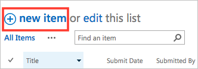

<properties
    pageTitle="PowerApps: Add an advanced parameter and multiple actions"
    description="Expand an existing Logic Flow to include an advanced parameter, such as setting email to high priority, and add another action for the same trigger."
    services="powerapps"
    documentationCenter="na"
    authors="stepsic-microsoft-com"
    manager="dwrede"
    editor=""
    tags=""/>

<tags
   ms.service="powerapps"
   ms.devlang="na"
   ms.topic="article"
   ms.tgt_pltfrm="na"
   ms.workload="na"
   ms.date="11/14/2015"
   ms.author="stepsic"/>

# Add multiple actions and advanced parameters to a Logic flow #
Customize a Logic Flow by adding one or more advanced parameters and multiple actions for the same trigger. For example, add an advanced parameter that sends an email message as high priority. In addition to sending mail when an item is added to a SharePoint list, create a file in Dropbox that contains the same information.

**Prerequisites**

- [Create a Logic Flow](get-started-logicflow.md).

## Add another action ##

In this procedure, you'll add an action in the middle of the flow. This action will save a file in your Dropbox, archiving the item in the list.

1. In Chrome, open [the PowerApps portal](https://portal.kratosapps.com/), and then click **Flows** in the left navigation bar.

2. In the list of Logic Flows, click the edit icon, which looks like a pencil, next to the Logic Flow that you want to edit.

1. In your Logic Flow, collapse the trigger and the action by clicking the title bar.

2. Click the "+" button, and then click **Add action**.

    

3. In the list of possible actions, search for **Create file**, and then click **Dropbox - Create File**.

4. If prompted, provide your Dropbox credentials.

5. In the form that appears, type or paste a path to a folder, or type a forward slash (**/**) to create files in the root of your account.

6. Give the file a name. To ensure that each file name is unique to a list item, click a placeholder. (Otherwise each new file will override the existing one.)

7. Add whatever content you want in the file, including as many placeholders as you want, and then click **Done**.

    

8. To test the flow:
  1. In SharePoint Online, click **new item** on the main page for the list.

    

  1. Specify data in each field, and then click **Save**.

    Within a minute, you should see a new file in your Dropbox account.

## Changing the order of your actions ##

When you have more than one step, you may want to change the order of them. In this example, assume you want to get the email only once the file has been successfully created in Dropbox. 

1. Click-and-hold on the title bar of the Dropbox action

2. Move you mouse up on page to drag the action. 

    
    
3. Leave the mouse over the arrow between the two steps. The cursor will indicate that you can drop the action. Release the mouse.

    The actions should now be re-ordered.
    
	**Note:** You cannot move a step before another if you are using any outputs from that step.

## Deleting actions ## 

If you no longer need a step, you can delete it from the menu at the top right of the action. 

1. Click the menu at the top-right of the action you want to delete.

    

2. You will be asked for a confirmation that you want to delete the step. Click **OK**.

	**Note:** You cannot delete actions if you are using any outputs from it anywhere in the logic flow. First, remove those outputs from the fields and then you will be able to delete it. 
	
## Adding advanced parameters

Start with a logic flow that has a step for **Send email**. 

1. Near the bottom of the **Send email** form, click the **...** icon to show advanced parameters.

    

2. In the **Importance** list, click **High**, and then click the **...** icon again to hide the advanced parameters.

3. Near the bottom of the screen, click **Done** to save your change.

    