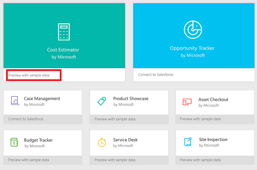
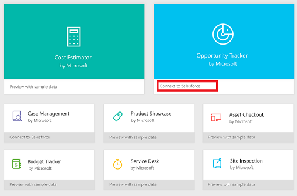

<properties
	pageTitle="Open and run a sample app | Microsoft PowerApps"
	description="Step-by-step instructions for opening and running a sample app in powerapps.com."
	services=""
	suite="powerapps"
	documentationCenter="na"
	authors="linhtranms"
	manager="erikre"
	editor=""
	tags=""/>

<tags
   ms.service="powerapps"
   ms.devlang="na"
   ms.topic="article"
   ms.tgt_pltfrm="na"
   ms.workload="na"
   ms.date="04/16/2016"
   ms.author="litran"/>

# Open and run a sample app #
In [powerapps.com](http://web.powerapps.com), you can access two types of sample apps:

- Apps such as **Cost Estimator** contain sample data.

	

- Apps such as **Opportunity Tracker** connect to your live data in a Salesforce or other account.

	

Both types of apps are built in PowerApps so that you can explore how they work and discover concepts that you can apply to your own apps.

## Apps that have sample data ##

- [Cost Estimator](cost-estimator.md)
- [Site Inspection](site-inspection.md)
- [Budget Tracker](budget-tracker.md)
- [Service Desk](service-desk.md)

## Apps that connect to your live data ##

- [Opportunity Tracking with Salesforce](opportunity-tracking-salesforce.md)
- [Case Management with Salesforce](case-management-salesforce.md)
