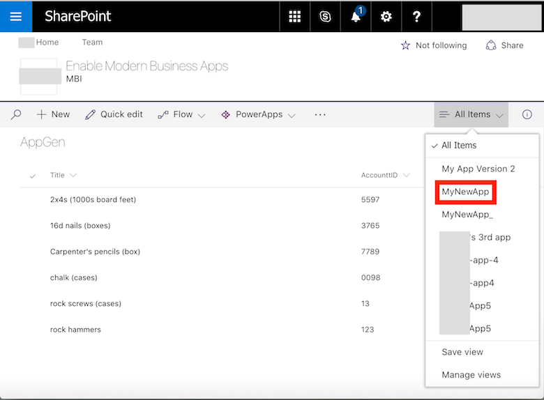
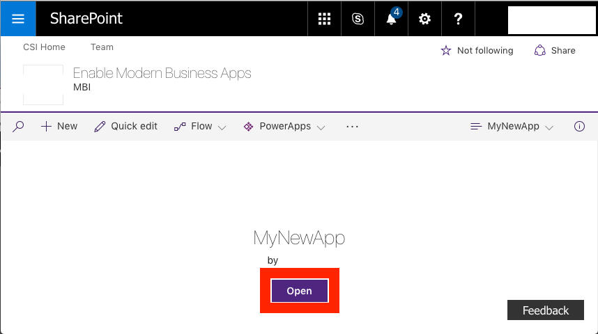
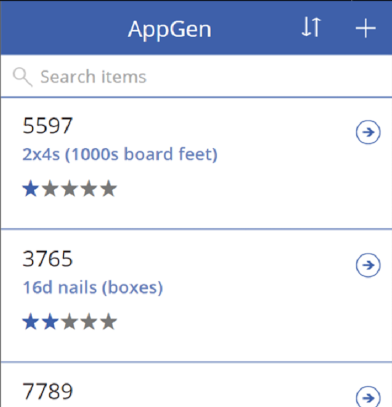
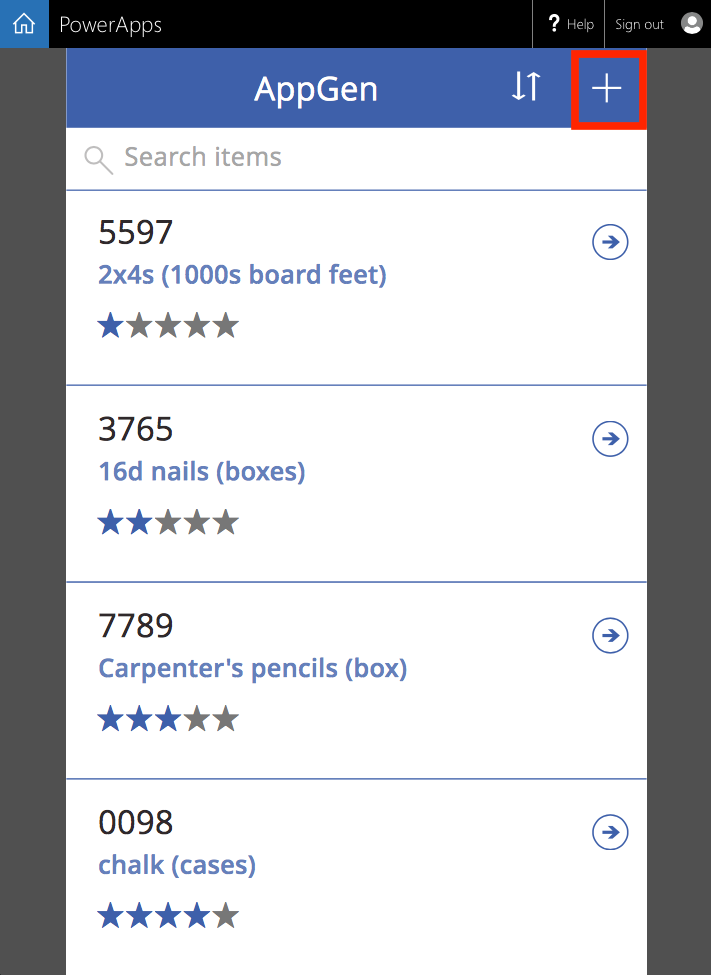
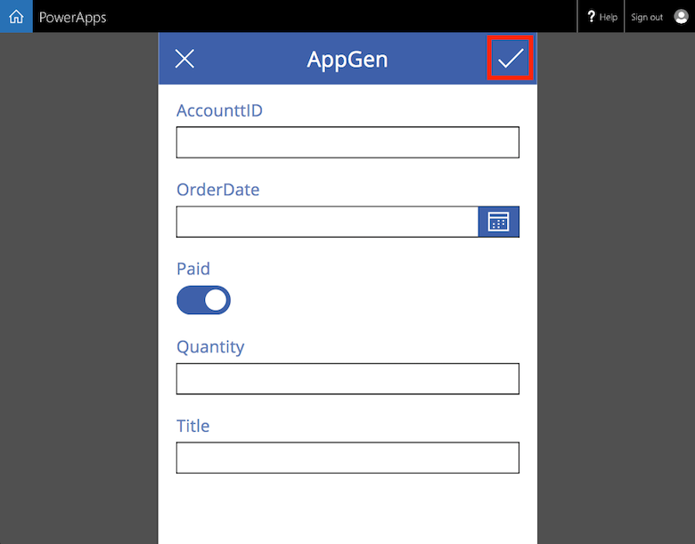
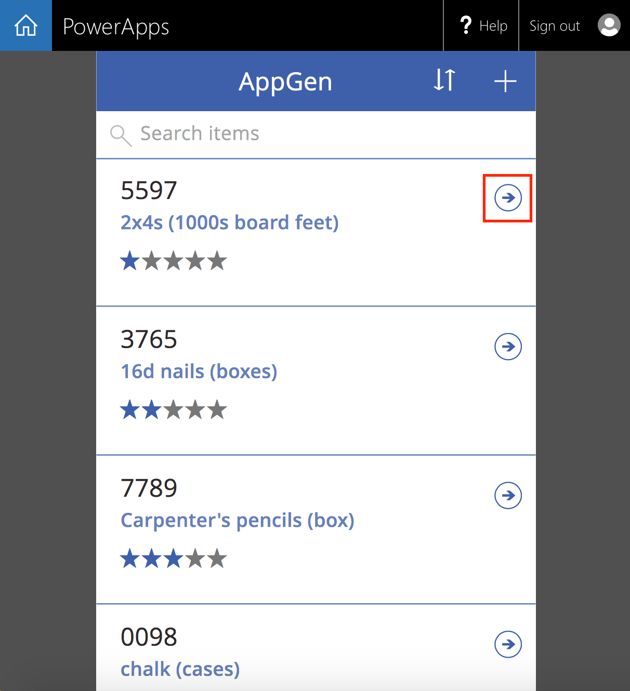
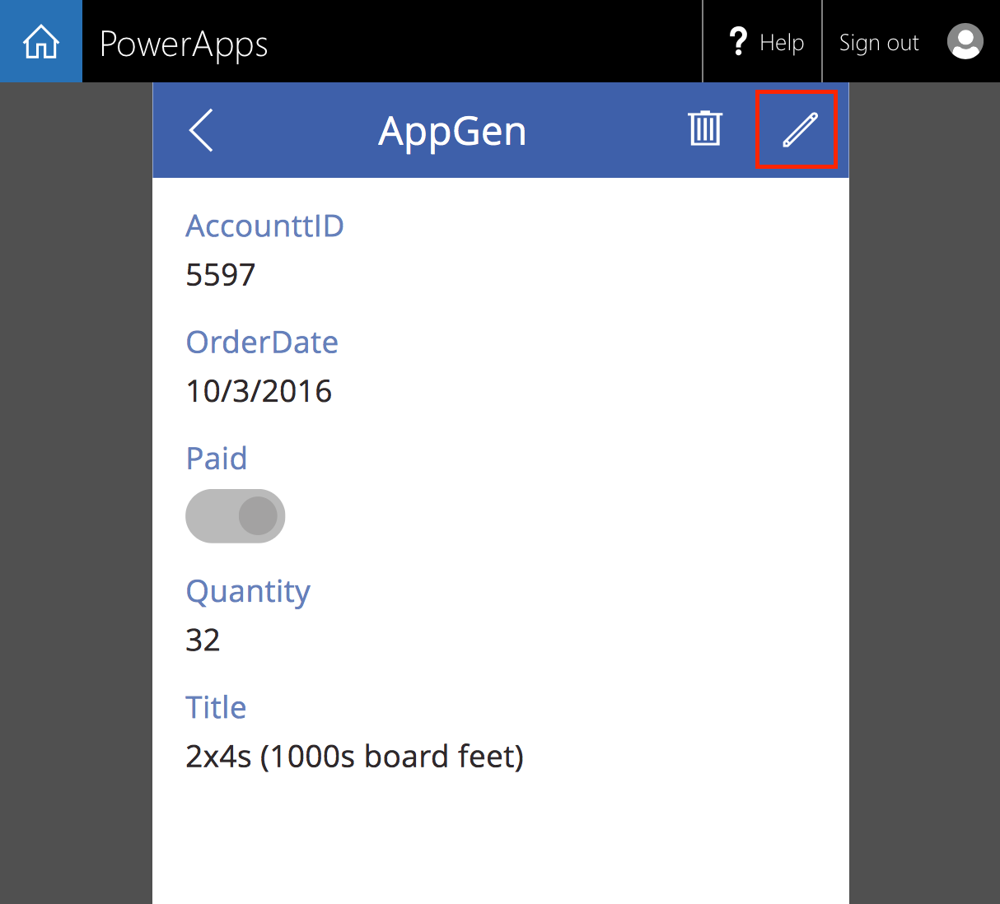
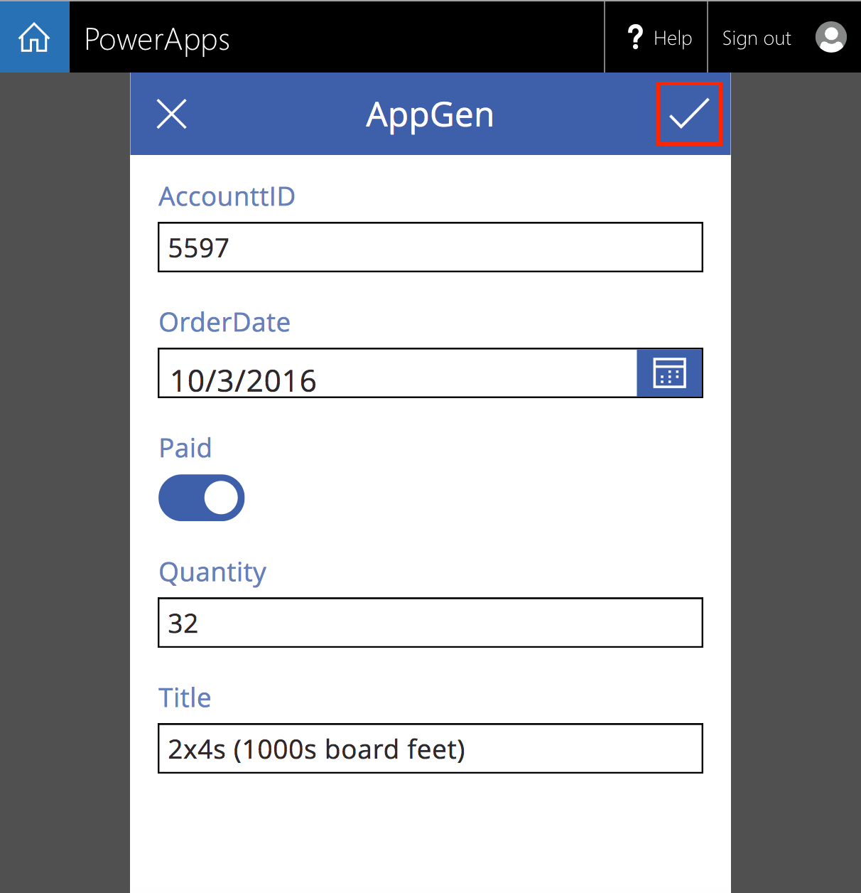
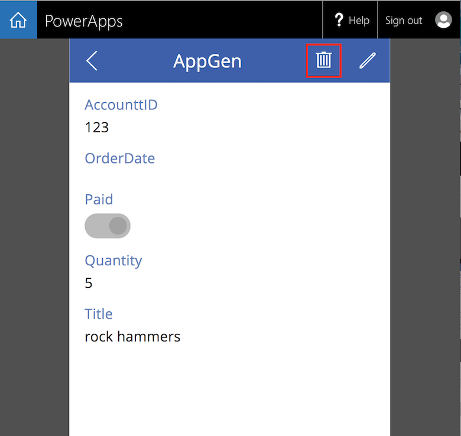

<properties
	pageTitle="Open an app in SharePoint Online | Microsoft PowerApps"
	description="Open an existing app in SharePoint Online to manage a list."
	services=""
	suite="powerapps"
	documentationCenter="na"
	authors="ricksal"
	manager="anneta"
	editor=""
	tags=""/>

<tags
   ms.service="powerapps"
   ms.devlang="na"
   ms.topic="article"
   ms.tgt_pltfrm="na"
   ms.workload="na"
   ms.date="10/11/2016"
   ms.author="ricksal"/>

# Open app from a SharePoint Online list
In a SharePoint Online list, open an existing app that manages the list.

## Open the app ##

You can **Open** an existing app inside SharePoint Online and manage a list.

As of this writing, PowerApps supports custom lists but not libraries. In addition, you can show data in some types of columns, such as **Choice** and **Picture**, but you can't update that data. For more information, see [Known issues](connection-sharepoint-online.md#known-issues)

## Open the app

1. **Open** your SharePoint Online list and select an app from the list.

  

2. Click or tap **Open**.

	

3. The app now appears in a separate browser tab.

	

## Manage list using the app

1. To add an item to the list, click or press the "+" sign.

	

2. A form appears where you can enter values in the fields of the list. When done, click or tap the check mark.

	

3. To view details for an item, press the arrow.

	

4. To edit the item, on the form that appears, press the "pencil".

	

5. Make your changes, then press the check mark.

	

6. To delete an item, from the detail view screen, press the trash.

	
