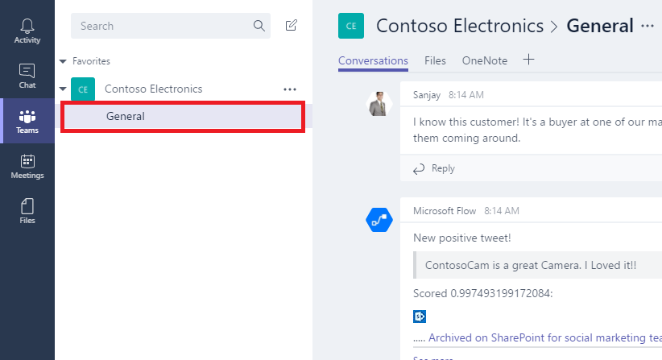
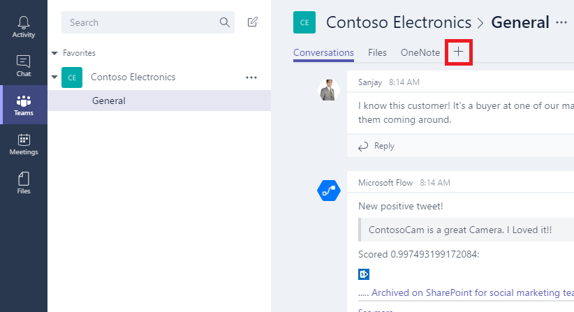
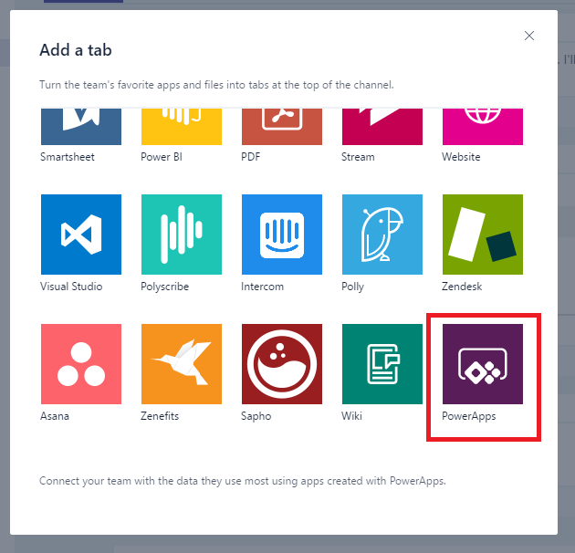
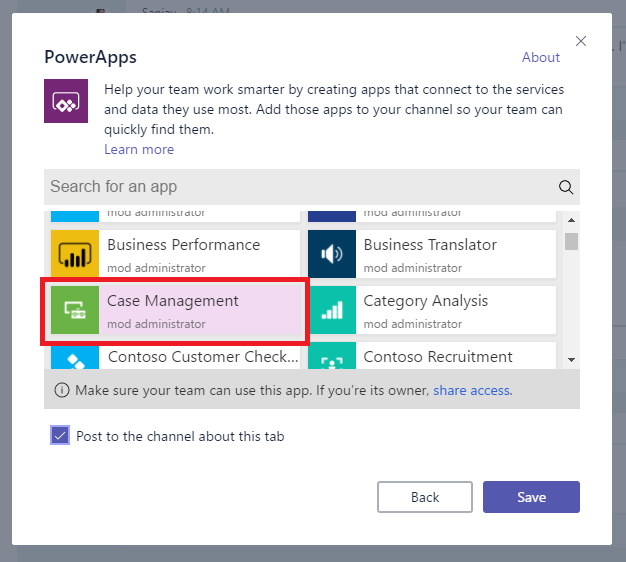
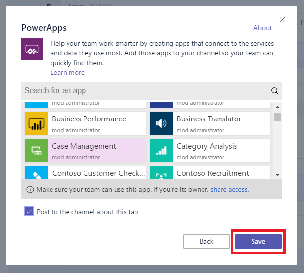
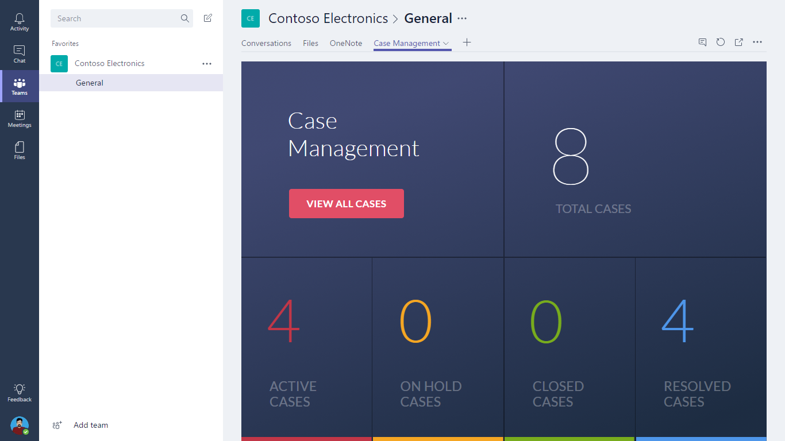
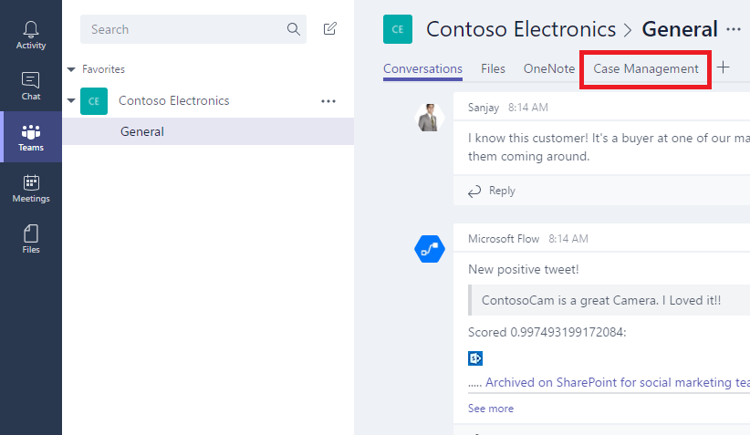

<properties
	pageTitle="Add and open an app in Microsoft Teams | Microsoft PowerApps"
	description="Add and open an app in Microsoft Teams."
	services=""
	suite="powerapps"
	documentationCenter="na"
	authors="sarafankit"
	manager="anneta"
	editor=""
	tags=""/>

<tags
   ms.service="powerapps"
   ms.devlang="na"
   ms.topic="article"
   ms.tgt_pltfrm="na"
   ms.workload="na"
   ms.date="05/20/2017"
   ms.author="ankitsar"/>

# Add and open an app in Microsoft Teams
Add an app to a Microsoft Teams channel so that anybody with whom the app was shared can open it from within that channel. You can add any app that you built or for which you have **Can use** or **Can edit** permissions, and you can both add and open the app from a browser or the desktop app for Microsoft Teams.

## Add an app ##
1. [Share the app](share-app.md) with other members of the team.

1. In Microsoft Teams, select a team and a channel for that team.

	

1. Click or tap **+** to add a tab.

	

1. In the **Add a tab** dialog box, click or tap **PowerApps**.

	

1. Click or tap the app that you want to add.

	**Note**: You can search for an app by name, author, or environment.

	

1. Click or tap the **Save** button.

	

	The app is now available to use in the channel.

	

## Open an app ##
1. In Microsoft Teams, select the team and the channel that contains the app.

	

1. Click or tap the tab that's named for the app.

	

	The app opens in the channel.

	

## Known issues ##
In the desktop app for Microsoft Teams:

- Apps must load content such as images and .pdf files over a secure (https) connection.
- Not all sensors, such as **Acceleration**, **Compass**, and **Location**, are supported.
- Only these audio formats are supported: AAC, H264, OGG Vorbis, and WAV.
