<properties
	pageTitle="Opportunity Tracking with Salesforce | Microsoft PowerApps"
	description="Step-by-step instructions for open and run Opportunity Tracking that connects to user's Salesforce account."
	services=""
	suite="powerapps"
	documentationCenter="na"
	authors="linhtranms"
	manager="darshand"
	editor=""
	tags=""/>

<tags
   ms.service="powerapps"
   ms.devlang="na"
   ms.topic="article"
   ms.tgt_pltfrm="na"
   ms.workload="na"
   ms.date="04/11/2016"
   ms.author="litran"/>

# Open and run Opportunity Tracking with Salesforce #

**Opportunity Tracking** is an app that shows the status and detail of all your opportunities in Salesforce as well as lets you add new opportunities to your account. For each opportunity, you can send an email with the opportunity details, log a call, add a note or schedule a task.  

1. From PowerApps web portal, browse for Sample PowerApps section. 

	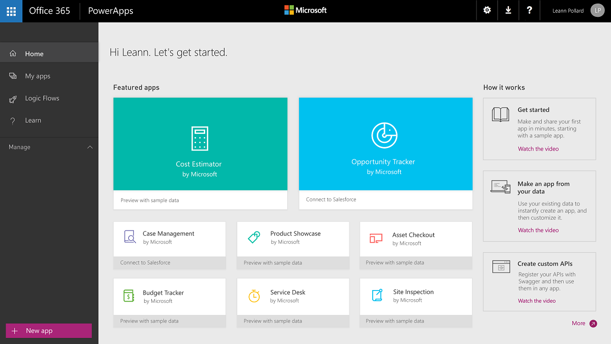 

2. Click on **Opportunity Tracking** app that *Connect to Salesforce*. This opens up a model that gives you a brief description about the app and allow you to select the form factor you want to open the app as, phone or tablet. 

3. In this example, let's select **Phone**. 

4. This will prompt you to enter your credentials to your **Salesforce** account. If you have a Salesforce account, please enter your credentials here. If you don't have a Salesforce account, you can easily create one at [Salesforce.com](http://www.salesforce.com). 

5. Once you enter your credentials, this will open the **Opportunity Tracking** app in the web portal with the data in your Salesforce account. If you select a phone form factor earlier, the app will open as how it would look on a phone. 

6. On the home screen of the app, you will see the count of your opportunities currently in your account along with their status. This includes Open/Prospective, Closed/Won, Closed/Lost ones. You can also click on one among 9 tiles on the home screen that will bring you directly to the list of opportunity with the status listed on the tile. Note, if you just create your account, these will be sample data that Salesforce pre-populated for you. 
	
	
 
7. Select **Opportunities** to see list of all your opportunities.
 
	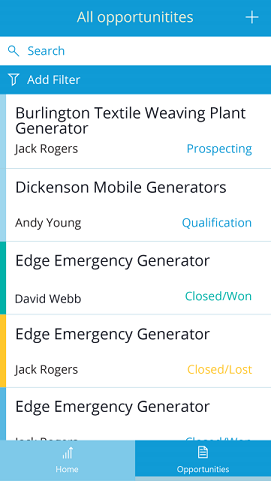

8. Select **Add Filter** and select **Opportunity** filter

	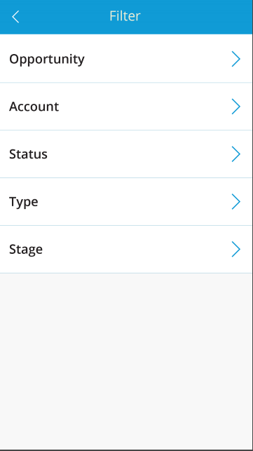

9. Select **Closed/Won**

	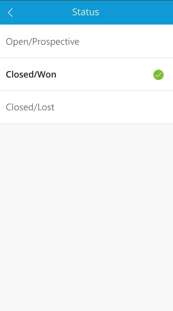

10. This will display a screen with opportunities in a **Closed/Won** status

	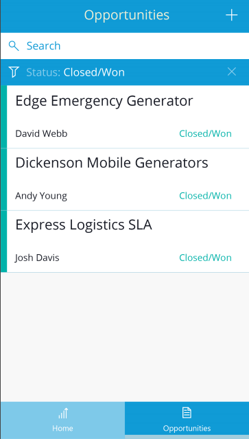

11. Select **Filter** and select **Account**. Then enter an account name that exists in your data. In this example, I enter **Burlington Textiles Corp of America**.

	

12. Select an account to view details. In this example, I select **Burlington Textiles Corp of America**.

	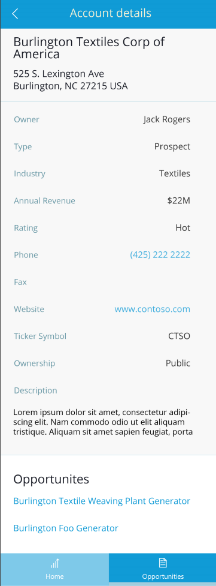

13. Select an opportunity to view details. In this example, I select **Burlington Textile Weaving Plant Generator**.

	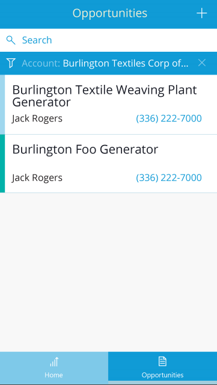

14. This shows you details of an opportunity. You can view notes added for the opportunity, activity history, and all other details.

	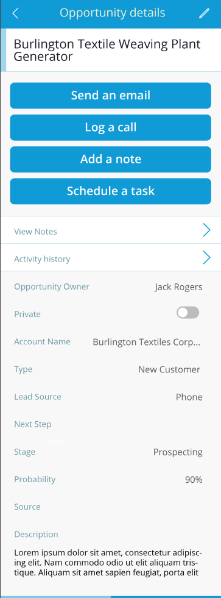

15. To edit an existing opportunity, click on the pencil icon in the opportunity detailed view.
	
	

16. Make the changes you desire and save changes. 
	
17. Select **Send an Email**, select a contact from your list of contact in Salesforce, enter the **Title** and **Body** of the email, take/attach any photo. When you are ready, press the **Send email** button. 
	
	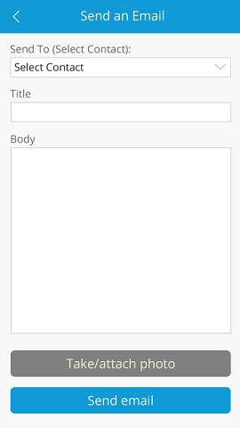

18. To add notes to an opportunity is very simple as well, simply select **Add notes** from the opportunity details. Then click the **+** to enter a new note. Enter the **Title** and **Note** and click **Save note**.
	
	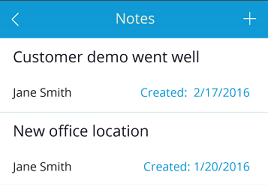
	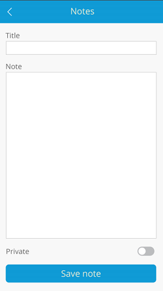

19. To log a call, select **Log a call**. Then select the person from you want to **Assign To** and the **Contact** you wish to call. Enter other details such as **Subject**, **Date**, **Status**, what opportunity this **Related To** and any other **Comments** and click **Save**.

	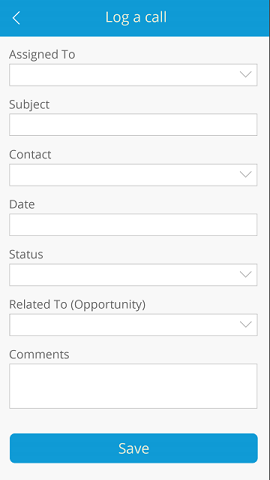

20. To view activity history, simply select **Activity History** the opportunity details. Here you can see all the history related to the opportunity including emails and calls.
	
	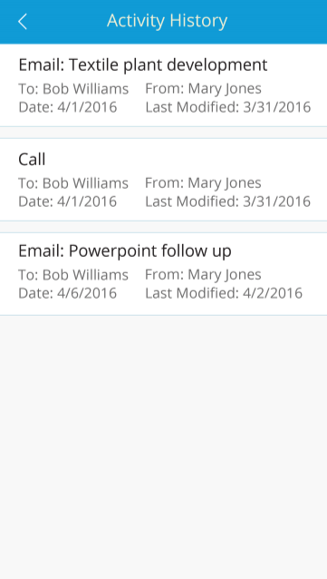

21. To add a new opportunity, click **+** on the home screen. 
	
	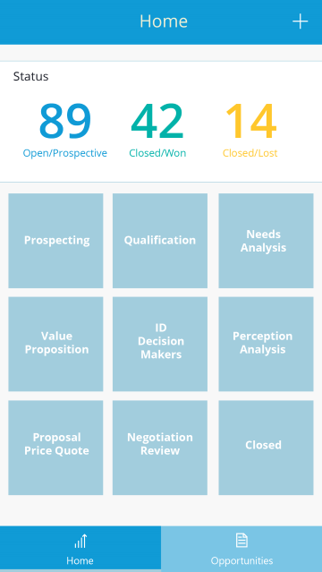

22. Now you have learned about Opportunity Tracking app that connects to your Salesforce account, click on a few other apps that can connect to your data to learn more. 
 

### Other sample apps with sample data ###

[Case Management with Salesforce](case-management-salesforce.md)

