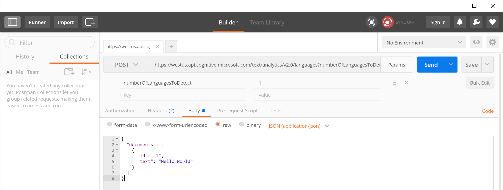
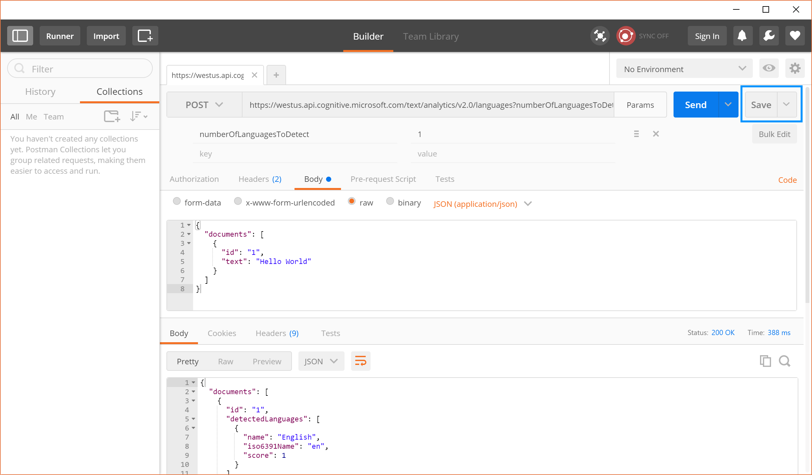
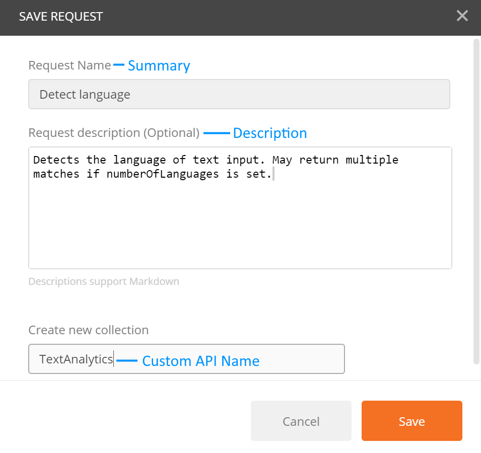
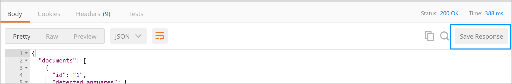
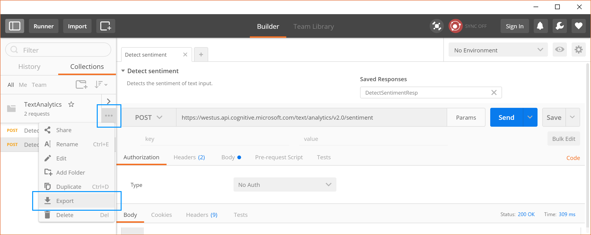
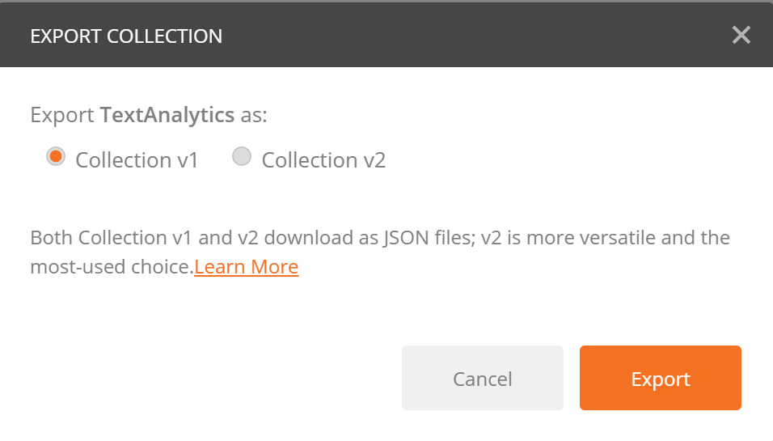

<properties
	pageTitle="Create Postman Collection | Microsoft PowerApps"
	description="Create a Postman collection for registering custom APIs"
	services=""
    suite="powerapps"
	documentationCenter=""
	authors="archnair"
	manager="anneta"
	editor=""/>

<tags
   ms.service="powerapps"
   ms.devlang="na"
   ms.topic="article"
   ms.tgt_pltfrm="na"
   ms.workload="na"
   ms.date="04/28/2017"
   ms.author="archanan"/>

# Create a Postman Collection

[Postman](https://www.getpostman.com/) is a tool for making your API development faster and easier. This tutorial demonstrates how to create a Postman collection, that you can use to easily create [Custom APIs](register-custom-api.md).

## Prerequisites

- Install the [Postman app](https://www.getpostman.com/apps)

## Create a Postman collection

Let's build a postman collection for [Cognitive Services Text Analytics API](https://www.microsoft.com/cognitive-services/en-us/text-analytics-api).

- The first step in creating a Postman collection is to create a request. When creating the request, you can set the HTTP verb, the request URL, query or path parameters, headers and the body. More details on sending request through Postman are available [here](https://www.getpostman.com/docs/requests).

- For the Detect Language API endpoint, the values would be set as follows:

	

Details of parameters and values used:

| Parameter     | Value                                                                                |
|---------------|--------------------------------------------------------------------------------------|
| Verb          |  POST                                                                                |
| Request URL   | https://westus.api.cognitive.microsoft.com/text/analytics/v2.0/languages             |
| Params        | numberOfLanguagesToDetect                                                            |
| Authorization | “No Auth”                                                                            |
| Headers       |  Ocp-Apim-Subscription-Key = <your subscription key>  Content-Type = application/json |
| Body          |	<code>{ &nbsp;&nbsp;&nbsp;"documents": [ &nbsp;&nbsp;&nbsp;&nbsp;&nbsp;{ &nbsp;&nbsp;&nbsp;&nbsp;&nbsp;&nbsp;&nbsp;&nbsp;"id": "1", &nbsp;&nbsp;&nbsp;&nbsp;&nbsp;&nbsp;&nbsp;&nbsp;"text": "Hello World" &nbsp;&nbsp;&nbsp;&nbsp;&nbsp;} &nbsp;&nbsp;] }<code>|

- Click **Send** to make the request and get the response back.
- Save the Request into a Postman collection by clicking on **Save**.

- Provide a Request Name and Description in the Save Request dialog. The same values will be used for Operation Name and Description for your custom API as well.

- You can also save the Response of the request. Custom APIs currently only support a single response per request. If you save multiple responses per request, only the first one will be used.

- Continue building your Postman collection by creating and saving other requests and responses.

- Once you have completed building the Postman collection for all your requests and responses, you can export the collection.

- Choose Collection v1 as the format to export your collection.

You can now use this Postman collection for creating a [Custom API](register-custom-api.md) in PowerApps.
