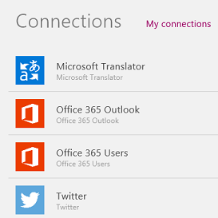
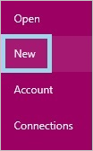
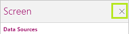

<properties
   pageTitle="Connect to Office 365, Twitter, and Microsoft Translator | Microsoft PowerApps"
   description="Show data from Outlook 365 Users, Office 365 Outlook, Twitter, and Microsoft Translator in an app"
   services=""
   suite="powerapps"
   documentationCenter="na"
   authors="aftowen"
   manager="dwrede"
   editor=""
   tags=""/>

<tags
   ms.service="powerapps"
   ms.devlang="na"
   ms.topic="article"
   ms.tgt_pltfrm="na"
   ms.workload="na"
   ms.date="01/15/2016"
   ms.author="anneta"/>

# Connect to Office 365, Twitter, and Microsoft Translator #

Show data from Outlook 365 Users, Office 365 Outlook, Twitter, and Microsoft Translator in an app. For any of these data sources, create a connection, add it to an app, and then configure controls in the app to perform functions such as:
- translate text into written or spoken form
- send an email message
- display information about a user
- show a Twitter timeline or a list of followers

**Prerequisites**
- Install [PowerApps](http://aka.ms/powerappsinstall).
- Learn how to [configure a control](get-started-test-drive.md#configure-a-control) in PowerApps.

## Create a connection ##
1.  Open PowerApps, and then select **Connections** on the **File** menu (near the left edge).

	

1.  Select **Add connection**.

	
1.  In the list of connection types, select any or all of these options, and then select **Connect**:

	- **Office 365 Users**
	- **Office 365 Outlook**
	- **Twitter**
	- **Microsoft Translator**

1. Provide your credentials for the connection that you selected.

	The connection that you created appears under **My connections**.

	

## Add a connection to an app ##

1. On the **File** menu, select **New**.

	

1. Under **Start from scratch**, select **Get started.**

	

1. In the lower-right corner, select **Options**.

	

1. In the **Screen** pane, select **Insert your data**, select the connection you want, and then select **Add Data Source**.

	Your selection appears under **Data Sources**.

1. Close the **Screen** tab by selecting the **X** in its upper-right corner.

	

## Show data from Microsoft Translator ##

### Translate text ###
1. Follow the steps in the first two procedures in this topic, selecting **Microsoft Translator** as the connection and the data source.

1. On the **Insert** tab, select **Text**, and then select **Input text**.

1. Name the input-text control **Source**.

1. On the **Insert** tab, select **Controls**, select **Drop-down**, and then move the drop-down list below the input-text control.

1. In the formula bar, set the **Items** property of the drop-down list to this formula: 
**microsofttranslator.Languages()**

1. Rename the drop-down list **TargetLang**.

1. On the **Insert** tab, select **Text box**, move it below the drop-down list, and set its **Text** property to this formula:
 **microsofttranslator.Translate(Source.Text, TargetLang.Selected.Value)**

1. Press F5, type text into **Source**, and select a language in **TargetLang**.

	The text box shows the text that you specified translated into the language that you specified.

1. Press Esc to return to the default workspace.

### Speak translated text ###
1. Follow the steps in the first three procedures in this topic, selecting **Microsoft Translator** as the connection and the data source.

1. Set the **Items** property of the **TargetLang** drop-down list to this formula: 
**microsofttranslator.SpeechLanguages()**

1. Rename the text box (not the input-text control) to **Target**.

1. On the **Insert** tab, select **Media**, and then select **Audio**.

1. Set the **Media** property of the audio control to this formula: 
**microsofttranslator.TextToSpeech(Target.Text, TargetLang.Selected.Value)**

1. Press F5, type text into **Source**, select an option in **TargetLang**, and then select the play button in the audio control.

	The app plays an audio version of the text that you specified in the language that you specified.

1. Press Esc to return to the default workspace.

### Detect the source language ###
1. Follow the steps in the first two procedures in this topic, selecting **Microsoft Translator** as the connection and the data source.

1. On the **Insert** tab, select **Text**, select **Input Text**, and name the input-text control **Source**.

1. On the **Insert** tab, select **Text box**, and move the text box under **Source**.

1. Set the **Text** property of the text box to this formula:
 **microsofttranslator.Detect(Source.Text)**

1. Press F5, and then type text into **Source**.

	The text box indicates the language of the text that you typed. For example, the text box shows **fr** (for French) if you type **bonjour** or **it** (for Italian) if you type **ciao**.

1. Press Esc to return to the default workspace.

## Office 365 Outlook ##

### Send email ###
For this function, you must specify the first three arguments, but all other arguments are optional:

**SendEmail(Subject, Body, To[, Attachments, From, CC, BCC, Importance, IsHtml])**

1. Follow the steps in the first two procedures in this topic, selecting **Office 365 Outlook** as the connection and the data source.

1. On the **Insert** tab, select **Text**, select **Input text**, and then repeat that process twice to add three input-text controls to the screen.

1. Arrange the controls in a column, and give them these names:

	- **inputTo**
	- **inputSubject**
	- **inputBody**

1. On the **Insert** tab, select **Button**, and set the button's **OnSelect** property to this formula:
**office365.SendEmail(inputSubject.text, inputBody.text, inputTo.text)**

1. Move the button so that it appears under all the other controls, and set its **Text** property to **Send email**.

1. Press F5, type a valid email address in **inputTo**, and type whatever you want in the other two input-text controls.

1. Select **Send email** to send the message, and then press Esc to return to the default workspace.

## Office 365 Users ##
### Show information about the current user ###
1. Follow the steps in the first two procedures in this topic, selecting **Office 365 Users** as the connection and the data source.

1. On the **Insert** tab, select **Text box**, and then set the **Text** property of the text box to this value (including the period at the end):

	**office365users.MyProfile().**

1. Finish the formula by appending any of these values to it:

	- **Department**
	- **DisplayName**
	- **GivenName**
	- **Id**
	- **JobTitle**
	- **Mail**
	- **MailNickname**
	- **Surname**
	- **TelephoneNumber**
	- **UserPrincipalName**
	- **AccountEnabled**

The text box shows the information that you specified about the current user.

### Show information about another user ###
1. Follow the steps in the first two procedures in this topic, selecting **Office 365 Users** as the connection and the data source.

1. On the **Insert** tab, select **Text**, and then select **Input text**.

1. Rename the text-input control **InfoAbout**.

1. On the **Insert** tab, select **Text box**, and then set the **Text** property of the text box to either of these values, including the period at the end:

	- To show information about another user: 
	**office365users.UserProfile(InfoAbout.Text).**

	- To show information about a user's manager: 
	**office365users.Manager(InfoAbout.Text).**

1. Finish the formula by appending any of these values to it:

	- **Department**
	- **DisplayName**
	- **GivenName**
	- **Id**
	- **JobTitle**
	- **Mail**
	- **MailNickname**
	- **Surname**
	- **TelephoneNumber**
	- **UserPrincipalName**
	- **AccountEnabled**

1. Press F5, and then, in **InfoAbout**, type the email address of someone in your organization.

	The text box shows the information that you specified about the user that you specified or that user's manager.

1. Press Esc to return to the default workspace.

### Show another user's direct reports ###
1. Follow the steps in the first two procedures in this topic, selecting **Office 365 Users** as the connection and the data source.

1. On the **Insert** tab, select **Text**, and then select **Input text**.

1. Rename the text-input control **InfoAbout**.

1. On the **Insert** tab, select **Gallery**, and then select the text gallery in portrait orientation.

1. Set the gallery's **Items** property to this formula:

	**office365users.DirectReports(InfoAbout.Text)**

1. Press F5, and then, in **InfoAbout**, type the email address of someone in your organization.

	The gallery shows information about the direct reports of the user that you specified.

1. Press Esc to return to the default workspace.

1. (optional) In the lower-right corner, select **Options**, and then select **Mail** in the **Body1** list, **DisplayName** in the **Heading1** list, and **JobTitle** in the **Subtitle1** list.

### Search for users ###
1. Follow the steps in the first two procedures in this topic, selecting **Office 365 Users** as the connection and the data source.

1. On the **Insert** tab, select **Text**, and then select **Input text**.

1. Rename the text-input control **SearchTerm**.

1. On the **Insert** tab, select **Gallery**, and then select the text gallery in portrait orientation.

1. Set the gallery's **Items** property to this formula:

	**office365users.SearchUser({searchTerm: SearchTerm.Text})**

1. Press F5, and then type a term in **SearchTerm**.

	The gallery shows users whose information contains the term that you specified.

1. Press Esc to return to the default workspace.

1. (optional) In the lower-right corner, select **Options**, and then select **Mail** in the **Body1** list, **DisplayName** in the **Heading1** list, and **JobTitle** in the **Subtitle1** list.

## Twitter ##
Connect to Twitter, and then perform these tasks:

- Show a [timeline](powerapps-api-functions.md#show-a-timeline)
- Show [followers](powerapps-api-functions.md#show-followers)
- Show [followed users](powerapps-api-functions.md#show-followed-users)
- Show [information](powerapps-api-functions.md#show-information-about-a-user) about a user, such as full name, bio, and location
- [Search tweets](powerapps-api-functions.md#search-tweets)
- [Send a tweet](powerapps-api-functions.md#send-a-tweet)

### Show a timeline ###
1. Follow the steps in the first two procedures in this topic, selecting **Twitter** as the connection and the data source.

1. On the **Insert** tab, select **Gallery**, and then select the text gallery in **Portrait** orientation.

1. Do one of the following:

	- To show the current user's timeline, set the **Items** property of the gallery to this formula: **twitter.HomeTimeline()**

	- To show another user's timeline, set the **Items** property of the gallery to this formula: 
	**twitter.UserTimeline(** *UserID* **)**

	Specify a *UserID* by including a Twitter handle enclosed in double quotation marks or an equivalent value. For example, specify **"satyan"** directly in the formula, or add an input-text control named **Tweep**, specify **Tweep.Text** in the formula, and then type a Twitter handle without quotation marks, such as **satyan**, in **Tweep**.

	**Tip:** Show only the most recent tweets in a timeline (for example, the last five tweets) by specifying the maxResults argument, as these formulas show: 
	**twitter.HomeTimeline({maxResults:5})** 
	**twitter.UserTimeline(Tweep.Text, {maxResults:5})**

1. If the **Screen** tab isn't showing, select **Options** near the lower-right corner.

1. In the **Screen** pane, select **TweetText** in the **Body1** list, **TweetedBy** in the **Heading1** list, and **CreatedAt** in the **Subtitle1** list.

### Show followers ###
1. Follow the steps in the first two procedures in this topic, selecting **Twitter** as the connection and the data source.

1. On the **Insert** tab, select **Gallery**, and then select the text gallery in **Portrait** orientation.

1. Do one of the following:

	- To show the current user's followers, set the **Items** property of the gallery to this formula: **twitter.MyFollowers()**

	- To show the another user's followers, set the **Items** property of the gallery to this formula: 
	**twitter.Followers(** *UserID* **)**

	Specify a *UserID* by including a Twitter handle enclosed in double quotation marks or an equivalent value. For example, specify **"satyan"** directly in the formula, or add an input-text control named **Tweep**, specify **Tweep.Text** in the formula, and then type a Twitter handle without quotation marks, such as **satyan**, in **Tweep**.

	**Tip:** Show only, for example, five followers by specifying the maxResults argument, as these formulas show: 
	**twitter.MyFollowers({maxResults:5})** 
	**twitter.Followers(Tweep.Text, {maxResults:5})**

1. If the **Screen** tab isn't showing, select **Options** near the lower-right corner.

1. In the **Screen** pane, select **Description** in the **Body1** list, **UserName** in the **Heading1** list, and **FullName** in the **Subtitle1** list.

### Show followed users ###

1. Follow the steps in the first two procedures in this topic, selecting **Twitter** as the connection and the data source.

1. On the **Insert** tab, select **Gallery**, and then select the text gallery in **Portrait** orientation.

1. Do one of the following:

	- To show which users the current user is following, set the **Items** property of the gallery to this formula: **twitter.MyFollowing()**

	- To show which users another user is following, set the **Items** property of the gallery to this formula: 
	**twitter.Following(** *UserID* **)**

	Specify a *UserID* by including a Twitter handle enclosed in double quotation marks or an equivalent value. For example, specify **"satyan"** directly in the formula, or add an input-text control named **Tweep**, specify **Tweep.Text** in the formula, and then type a Twitter handle without quotation marks, such as **satyan**, in **Tweep**.

	**Tip:** Show only, for example, five followed users by specifying the maxResults argument, as these formulas show: 
	**twitter.MyFollowing({maxResults:5})** 
	**twitter.Following(Tweep.Text, {maxResults:5})**

1. If the **Screen** tab isn't showing, select **Options** near the lower-right corner.

1. In the **Screen** pane, select **Description** in the **Body1** list, **UserName** in the **Heading1** list, and **FullName** in the **Subtitle1** list.

### Show information about a user ###
1. Follow the steps in the first two procedures in this topic, selecting **Twitter** as the connection and the data source.

1. On the **Insert** tab, select **Text box**, and then set its **Text** property to one of these formulas:
	- **twitter.User(** *UserID* **)!Description**
	- **twitter.User(** *UserID* **)!FullName**
	- **twitter.User(** *UserID* **)!Location**
	- **twitter.User(** *UserID* **)!UserName**
	- **twitter.User(** *UserID* **)!FollowersCount**
	- **twitter.User(** *UserID* **)!FriendsCount**
	- **twitter.User(** *UserID* **)!Id**
	- **twitter.User(** *UserID* **)!StatusesCount**

	Specify a *UserID* by including a Twitter handle enclosed in double quotation marks or an equivalent value. For example, specify **"satyan"** directly in the formula, or add an input-text control named **Tweep**, specify **Tweep.Text** in the formula, and then type a Twitter handle without quotation marks, such as **satyan**, in **Tweep**.

### Search tweets ###
1. Follow the steps in the first two procedures in this topic, selecting **Twitter** as the connection and the data source.

1. On the **Insert** tab, select **Gallery**, and then select the text gallery in **Portrait** orientation.

1. Set the **Items** property of the gallery to this formula: 
**twitter.SearchTweet(** *SearchTerm* **)**

	Specify a *SearchTerm* by enclosing a term in double quotation marks or by referring to an equivalent value. For example, specify **"PowerApps"** directly in the formula, or add an input-text control named **SearchTerm**, specify **SearchTerm.Text** in the formula, and then type a term in **SearchTerm**.

	**Tip:** Show only, for example, the first five results by specifying the maxResults argument, as this formula shows: 
	**twitter.SearchTweet(SearchTerm.Text, {maxResults:5})**

1. If the **Screen** tab isn't showing, select **Options** near the lower-right corner.

1. In the **Screen** pane, select **TweetText** in the **Body1** list, **TweetedBy** in the **Heading1** list, and **CreatedAt** in the **Subtitle1** list.

### Send a tweet ###
1. Follow the steps in the first two procedures in this topic, selecting **Twitter** as the connection and the data source.

1. On the **Insert** tab, select **Text**, select **Input text**, and then rename the new control **MyTweet**.

1. On the **Insert** tab, select **Button**, and then set the **OnSelect** property of the button to this formula: 
**twitter.Tweet({tweetText: MyTweet.Text})**

1. Press F5, type some text into **MyTweet**, and then select the button to tweet the text that you specified.

1. Press Esc to return to the default workspace.
