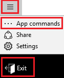
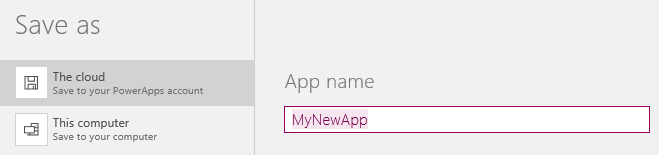
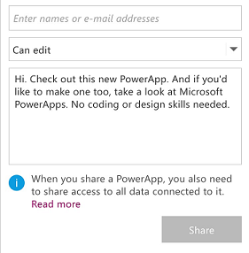

<properties
	pageTitle="Take a quick tour | Microsoft PowerApps"
	description="Step-by-step instructions for running, creating, and sharing an app"
	services=""
	suite="powerapps"
	documentationCenter="na"
	authors="AFTOwen"
	manager="dwrede"
	editor=""
	tags=""/>

<tags
   ms.service="powerapps"
   ms.devlang="na"
   ms.topic="hero-article"
   ms.tgt_pltfrm="na"
   ms.workload="na"
   ms.date="01/21/2015"
   ms.author="anneta"/>

# Take a quick tour of PowerApps #

Run an app that you or someone else created, or create an app with a default interface and sample data in less than a minute. To create an app, specify a cloud-storage account to which PowerApps can upload data, and then choose any of several types of apps that PowerApps can create for you. Try out your new app by adding, updating, and removing data, and share the app with others in your organization.

**Prerequisites**

1. Get an account in Dropbox, OneDrive, or GoogleDrive if you don't already have one.
1. [Install PowerApps](http://aka.ms/powerappsinstall), and then open it.
1. Sign in for the first time by swiping left (or selecting the arrow in the lower-right corner) to advance through the welcome screens and then providing your credentials.

## Run an app ##
1. Open PowerApps, and then select the app in the list that appears on the default screen.

	If another user created an app and shared it with you, you can also open it by selecting **Open in PowerApps** in the notification mail that you received.

1. If prompted, select **Add** next to one or more data sources, provide your credentials, and then select **Launch**.

1. To close the app, select the icon in the upper-left corner, select **App commands**, and then select **Exit**.

	

## Create an app ##

1. In PowerApps, select **Connections** on the **File** menu (near the left edge), and then select **Add a connection**.

1. In the list of connection types, select **Dropbox**, **Google Drive**, or **OneDrive**, select **Connect**, and then provide your credentials.

	

1. On the **File** menu, select **New**, and then select **Get started** under **Start from a template**.

	

1. Select a template category (such as **Events & Calendar**), select a template (such as **Event Signup**), and then select **Use** in the lower-right corner.

	

	The sample data is uploaded to your cloud account, and the app is created and ready to use.

1. Press F5, explore the default behavior and appearance of the app, and then press Esc to return to the default workspace.

## Save and share an app ##
**Note:** Before anyone else can run or customize your app, you must [share its data](share-app-data.md) with them in the cloud.

1. Create an app by following the steps in the previous procedure (or create your own app), and then select **Save** on the **File** menu.

1. Leave the default setting to save your app to the cloud, type a name for your app, and then select **Save** in the lower-right corner.

	

1. Open the **File** menu, and then select the **Share** icon for your app.

	

1. Type the name or email address of one or more people with whom you want to share the app.

	

1. In the list of permissions, select either of these options:

	- **Can view** to allow users to run the app but not customize it.
	- **Can edit** to allow users to customize and share the app.

1. Edit the default notification message, and then select **Share**.

1. Select **Close** to dismiss the success notification.

	The people with whom you shared your app will receive an email message that contains a link to install PowerApps and run your app.

## Next steps #
- Create an app automatically from data in sources such as [Excel](get-started-create-from-data.md), SharePoint, Dynamics CRM Online, and Salesforce.
- Customize the app that you just created (or make your own from scratch) by:

	- adding and configuring controls
	- adding data from Office 365, Twitter, or Microsoft Translator
	- [adding one or more screens](add-screen-context-variables.md)
	- [building formulas](formula-reference.md)
	- [change the settings](change-app-settings.md) for your app
