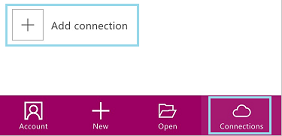
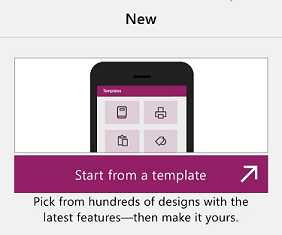
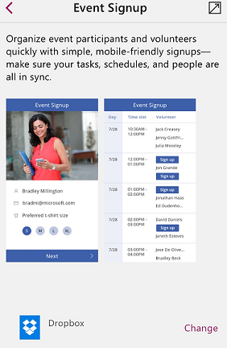
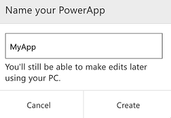
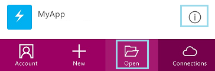

<properties
	pageTitle="Take a quick tour on a phone | Microsoft PowerApps"
	description="Step-by-step instructions for running, creating, and sharing an app on a phone"
	services=""
	suite="powerapps"
	documentationCenter="na"
	authors="AFTOwen"
	manager="dwrede"
	editor=""
	tags=""/>

<tags
   ms.service="powerapps"
   ms.devlang="na"
   ms.topic="hero-article"
   ms.tgt_pltfrm="na"
   ms.workload="na"
   ms.date="01/21/2015"
   ms.author="anneta"/>

# Take a quick tour of PowerApps on a phone #

Run an app that you or someone else created, or create an app with a default interface and sample data in less than a minute. To create an app, specify a cloud-storage account to which PowerApps can upload data, and then choose any of several types of apps that PowerApps can create for you. Try out your new app by adding, updating, and removing data, and share the app with others in your organization.

**Prerequisites**

1. Get a Dropbox, OneDrive, or GoogleDrive account if you don't already have one.

1. [Install PowerApps](http://aka.ms/powerappsinstall), and then open it.

1. Sign in for the first time by swiping left to advance through the welcome screens and then providing your credentials.

## Run an app ##
1. Open PowerApps, and then select the app in the list that appears on the default screen.

	If another user created an app and shared it with you, you can also open it by selecting **Open in PowerApps** in the notification mail that you received.

1. If prompted, select **Add** next to one or more data sources, provide your credentials, and then select **Launch**.

1. To close the app, swipe right.

1. To pin the app to your home screen:

	1. Select the details icon next to app that you want to pin.

	

	1. Select the **Pin** icon, and then follow the prompts.

	

## Create an app ##

1. In PowerApps, select **Connections** near the bottom of the screen, and then select **Add a connection**.

	

1. In the list of connection types, select **Dropbox**, **Google Drive**, or **OneDrive**, select **Connect**, and then provide your credentials.

1. Near the bottom of the screen, select **New**, and then select **Start from a template**.

	

1. Scroll through the list of templates, select a template (such as **Event Signup**), and then select the arrow in the upper-right corner.

	

1. Type a name for your app, and then select **Create**.

	

	The sample data is uploaded to your cloud account, and the app is created and ready to use.

1. Explore the default behavior and appearance of the app, and then swipe right to close it.

## Share an app ##
**Note:** Before anyone else can run or customize your app, you must [share the sample data](share-app-data.md) with them.

1. Create an app by following the steps in the previous procedure.

1. Near the bottom of the screen, select **Open** to display a list of apps that you can share, and then select the details icon to the right of the app you want to share.

	

1. Select the **Share** icon, and then type the name or email address of one or more people with whom you want to share the app.

	

1. In the list of permissions, select one of these options:

	- **Can view** to allow users to run the app but not customize it.
	- **Can edit** to allow users to customize and share the app.

1. Edit the default notification message, and then select **Share**.

1. Select **Close** to dismiss the success notification.

	The people with whom you shared your app will receive an email message that contains a link to install PowerApps and run your app.

## Next steps #
On a tablet, a laptop, or desktop computer that's running PowerApps:

- Create an app automatically from data in sources such as [Excel](get-started-create-from-data.md), SharePoint, Dynamics CRM Online, and Salesforce.
- Customize the app that you just created (or make your own from scratch) by adding and configuring controls, [adding one or more screens](add-screen-context-variables.md), and [building formulas](formula-reference.md).
