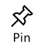

<properties
	pageTitle="Take a quick tour on a phone | Microsoft PowerApps"
	description="Step-by-step instructions for running and sharing an app on a phone"
	services=""
	suite="powerapps"
	documentationCenter="na"
	authors="AFTOwen"
	manager="erikre"
	editor=""
	tags=""/>

<tags
   ms.service="powerapps"
   ms.devlang="na"
   ms.topic="hero-article"
   ms.tgt_pltfrm="na"
   ms.workload="na"
   ms.date="02/10/2016"
   ms.author="anneta"/>

# Take a quick tour of PowerApps on a phone #

Run an app that you or someone else created, or share an app with other users in your organization.

**Prerequisites**

1. [Install PowerApps](http://aka.ms/powerappsinstall), and then open it.

1. Sign in for the first time by swiping left to advance through the welcome screens and then providing your credentials.

## Run an app ##
1. Open PowerApps, and then select the app in the list that appears on the default screen.

	If another user created an app and shared it with you, you can also open it by selecting **Open in PowerApps** in the notification mail that you received.

1. If prompted, select **Add** next to one or more data sources, provide your credentials, and then select **Launch**.

1. To close the app, swipe right.

1. To pin the app to your home screen:

	1. Select the details icon next to the app that you want to pin.

		

	1. Select the **Pin** icon, and then follow the prompts.

		

## Share an app ##
**Note:** Before anyone can run an app, the sample data must be [shared](share-app-data.md) with them.

1. Near the bottom of the screen, select **Open** to display a list of apps that you can share, and then select the details icon to the right of the app you want to share.

	

1. Select the **Share** icon, and then type the name or email address of one or more people with whom you want to share the app.

	

1. In the list of permissions, select one of these options:

	- **Can view** to allow users to run the app but not customize it.
	- **Can edit** to allow users to customize and share the app.

1. Edit the default notification message, and then select **Share**.

1. Select **Close** to dismiss the success notification.

	The people with whom you shared the app will receive an email message that contains a link to install PowerApps and run your app.

## Next steps #
- Create an app automatically from data in sources such as [Excel](get-started-create-from-data.md), [SharePoint](app-from-sharepoint.md), [Dynamics CRM Online](app-from-dynamics.md), and [Salesforce](app-from-salesforce.md).
- Customize the app that you just created (or make your own from scratch) by:

	- [adding and configuring controls](add-configure-controls.md)
	- adding data from [Office 365](show-office-data.md), [Twitter](show-twitter-data.md), or [Microsoft Translator](show-translator-data.md)
	- [adding one or more screens](add-screen-context-variables.md)
	- [building formulas](formula-reference.md)
	- [change the settings](change-app-settings.md) for an app
