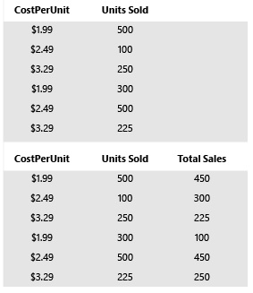

<properties
   pageTitle="Build a formula"
   description="In KratosApps, you can use the operators and functions that this topic describes."
   services="na"
   documentationCenter="na"
   authors="AFTOwen"
   manager=""
   editor=""
   tags=""/>
<tags
   ms.service="kratosapps"
   ms.devlang="na"
   ms.topic="article"
   ms.tgt_pltfrm="na"
   ms.workload="na"
   ms.date="10/06/2015"
   ms.author="anneta"/>

# Build a formula #

As you develop an app, specify its appearance and behavior by building [formulas](formula-reference.md) that include the functions and operators in this topic.

**Note** All references to data in the following examples are hypothetical. No data samples accompany this reference.

## Functions by category
**Boolean** -- [And](#and), [If](#if), [IsBlank](#isblank), [IsEmpty](#isempty), [Not](#not), [Or](#or)

**Collections** -- [Clear](#clear), [Collect](#collect), [LoadData](#loaddata), [Remove](#remove), [RemoveIf](#removeif), [SaveData](#savedata)

**Date and Time** -- [Date](#date), [DateAdd](#dateadd), [DateDiff](#datediff), [DateTimeValue](#datetimevalue), [DateValue](#datevalue), [Day](#day), [Hour](#hour), [Minute](#minute), [Month](#month), [Now](#now), [Second](#second), [Time](#time), [TimeValue](#timevalue), [Today](#today), [Year](#year)

[More examples](show-text-dates-times.md) of how to manage dates and times.

**Math** -- [Abs](#abs), [Average](#average), [Max](#max), [Min](#min), [Rand](#rand), [Round](#round), [RoundDown](#rounddown), [RoundUp](#roundup), [Sqrt](#sqrt), [StdevP](#stdevp), [Sum](#sum), [VarP](#varp)

**Other** -- [ColorFade](#colorfade), [ColorValue](#colorvalue), [Disable](#disable), [Enable](#enable), [Launch](#launch), [Language](#language), [Navigate](#navigate), [Refresh](#refresh), [RGBA](#rgba), [UpdateContext](#updatecontext)

**Strings** -- [Char](#char), [Concat](#concat), [Concatenate](#concatenate), [EncodeUrl](#encodeurl), [Find](#find), [HashTags](#hashtags), [Len](#len), [Left](#left), [Lower](#lower), [PlainText](#plaintext), [Proper](#proper), [Right](#right), [Substitute](#substitute), [Text](#text), [Trim](#trim), [Upper](#upper), [Value](#value)

**Table** -- [AddColumns](#addcolumns), [Count](#count), [CountA](#counta), [CountIf](#countif), [CountRows](#countrows), [Distinct](#distinct), [DropColumns](#dropcolumns), [Filter](#filter), [First](#first), [FirstN](#firstn), [Last](#last),[LastN](#lastn), [LookUp](#lookup), [RenameColumns](#renamecolumns), [Replace](#replace), [Sort](#sort), [Shuffle](#shuffle), [ShowColumns](#showcolumns), [Table](#table), [Update](#update), [UpdateIf](#updateif)

**Note** In the syntax sections of this topic, italics indicate generic text that you replace with values that are specific for your app, and square brackets enclose optional arguments. If a comma appears before an optional argument, you must include the comma if you want to use the argument that follows it.

### Abs
|&nbsp;|&nbsp;|
|---|---|
|Syntax|**Abs**(*Number*) **Abs**(*ColumnExpression*)|
|Description|Returns the absolute value of a number—that is, the number without its sign.<ul><li>**Abs**(*Number*) returns the absolute value of a number.</li><li>**Abs**(*ColumnExpression*), given a one-column table of numeric values, returns a one-column table of their corresponding absolute values.</li></ul>|
|Examples|**Example 1:**<ol><li>Add an input-text control, and name it **Source.**</li> <li>Add a label, and set its **Text** property to this expression: **Abs(Value(Source!Text))**</li> <li>Press F5, and then type a number in the **Source** box. The label shows the absolute value of the number that you specified.</li></ol>**Example 2:**<ol><li>[Create a collection](create-update-collection.md) that contains a column, named **Trend**, that includes a mix of positive and negative numbers.</li> <li>[Show that collection in a gallery](show-images-text-gallery-sort-filter.md).</li> <li>Add a label to the gallery, and set the **Text** property of that label to this expression: **Abs(Trend)**  The label in each row shows the absolute value of the number in the **Trend** column.</li>|

### AddColumns
|&nbsp;|&nbsp;|
|---|---|
|Syntax|**AddColumns**(*TableName*, *ColumnName1*, *Subexpression1*[, *ColumnName2*, *Subexpression2*, ...])|
|Description|Returns a table that has one or more added columns that contain results of the specified expressions evaluated over the rows in the original input table.|
|Example|<ol><li>[Create a collection](create-update-collection.md), named **Sales**, that contains a **CostPerUnit** column and a **UnitsSold** column.</li> <li>[Show that collection in a gallery](show-images-text-gallery-sort-filter.md).</li> <li>Add a second gallery, and set its **Items** property to this expression: **AddColumns(Sales, "TotalSales", CostPerUnit \* UnitsSold)**   The second gallery shows a new column, named **TotalSales**, that contains the results of multiplying the values in each row of the **CostPerUnit** and **UnitsSold** columns.  **Note:** This function doesn't modify the original data.|

### And
|&nbsp;|&nbsp;|
|---|---|
|**Syntax**|**And**(*Subexpression1*[, *Subexpression2*, ...])|
|**Description**|Determines whether one or more Boolean values or sub-expressions are all true. (Accomplishes the same outcome as the inline &amp;&amp; operator.)|
|**Examples**|**Example 1:**<ol><li>Add a slider, and name it **Source**.</li> <li>Add a label, and set its **Text** property to this expression: **If(And(Source!Value > 25, Source!Value < 75), "Looks great!", "Please change.")**</li> <li>Press F5, and adjust the slider to a value that's less than **25** or greater than **75**. The label shows **Please change.**</li> <li>Adjust the slider to a value that's between **25** and **75**. The label shows **Looks great!**</li></ol>**Example 2:**<ol><li>[Create a collection](create-update-collection.md) that contains a **Dept** column and a **Salary** column.</li> <li>[Show that collection in a gallery](show-images-text-gallery-sort-filter.md).</li> <li>Add a label to the gallery, and set the **Text** property of the label to this expression: **And(Dept = "HR", Salary &gt; 200000)**    Only the label in the last row of this example shows **true** because only that item shows a salary greater than **$200,000** in the **HR** department.  **Notes:**<ul><li>In **Example 1**, you would get the same result if you replaced the expression with one that followed this syntax: **If(Source!Value > 25 &amp;&amp; Source!Value < 75), "Looks great!", "Please change.")**</li> <li>In **Example 2**, you would get the same result if you replaced the expression with one that followed this syntax: **Dept = "HR" &amp;&amp; Salary &gt; 200000**|

### Average
|&nbsp;|&nbsp;|
|---|---|
|**Syntax**|**Average**(*Table*, *Subexpression*) **Average**(*Subexpression1*[, *Subexpression2*, …])|
|**Description**|Returns the average (arithmetic mean) of its arguments. You can use this function in these contexts:<ul><li>In a table, this function returns the average of the numbers that the specified subexpression evaluates to.</li><li>When provided scalar numeric inputs—or subexpressions that evaluate to scalar numeric values—this function returns their average.</li></ul>|
|**Example**|<ol><li>Add three sliders, and name them **Source1**, **Source2**, and **Source3**.</li> <li>Add a label, and set its **Text** property to this expression: **Average(Source1!Value, Source2!Value, Source3!Value)**</li> <li>Press F5, and adjust the sliders to whatever values you want. The label shows the average of the values that you specify.</li></ol>|

### Char
|&nbsp;|&nbsp;|
|---|---|
|Syntax|**Char**(*Number*)|
|Description|Returns the appropriate ASCII character for your platform, based on the value that you supply.|
|Example|**Char(65)** returns: A **Char(105)** returns: i **Char(35)** returns: #|

### Clear
|&nbsp;|&nbsp;|
|---|---|
|Syntax|**Clear**(*Collection*)|
|Description|Clears all of the items from a [collection](create-update-collection.md) and returns an empty collection. **Important** This function modifies the underlying collection.|
|Example|<ol><li>Create or import a collection named **Inventory**, as [Show data in a gallery](show-images-text-gallery-sort-filter.md) describes.</li> <li>Add a button, and then set its **OnSelect** property to this function: **Clear(Inventory)**</li> <li>Press F5, click the **Clear** button, and then press Esc to return to the design screen.</li></ol>To confirm that your collection is empty, click **Collections** on the **Content** tab.|

### Collect
|&nbsp;|&nbsp;|
|---|---|
|Syntax|**Collect**(*CollectionName*, *Item1*[, *Item2*,...])|
|Description|Adds a table, a column within a table, or at least one item to a collection. If the specified collection doesn't exist, this function creates it and adds the item. **Important** This function modifies the underlying collection.|
|Examples|<ol><li>Add a button, and set its **OnSelect** property to this function: **Collect(Products, &quot;Europa&quot;, &quot;Ganymede&quot;, &quot;Callisto&quot;)**  This function creates a collection that's named **Products** and that contains a row for each of three product names.</li> <li>Press F5, click the button, and then press Esc to return to the design workspace.</li> <li>(optional) To display a preview of the collection that you created, click **Collections**  on the **Content** tab.</li></ol>[Create and update a collection](create-update-collection.md) for more examples.|

### ColorFade
|&nbsp;|&nbsp;|
|---|---|
|Syntax|**ColorFade**(*Color*, *FadeDelta*)|
|Description|Returns a faded or darker version of a color based on a value between -1 and 1, inclusive.|
|Examples|<ol><li>Add a shape, and set its **Fill** property to **Blue** or **Color!Blue** The shape is a medium blue.</li> <li>Set the same property to **ColorFade(Color!Blue, .5)** or **ColorFade(Color!Blue, -.5)**. The shape is a lighter or darker (respectively) version of the same color.</li></ol>|

### ColorValue
|&nbsp;|&nbsp;|
|---|---|
|Syntax|**ColorValue**(*ColorText*)|
|Description|Returns the color value that corresponds to a CSS (cascading style sheet) color string.|
|Examples|**ColorValue(&quot;Blue&quot;)**  **ColorValue(&quot;Fuschia&quot;)**|

### Concat
|&nbsp;|&nbsp;|
|---|---|
|Syntax|**Concat**(*CollectionName*, *Expression*)|
|Description|Concatenates all strings in a column that you specify in a data source that you specify. You can concatenate data in a collection or imported from, for example, Excel or a SharePoint list.|
|Examples|<ol><li>Add a button, and set its **OnSelect** property to this function: **Collect(Products, {String:"Violin", Wind:"Trombone", Percussion:"Bongos"}, {String:"Cello", Wind:"Trumpet", Percussion:"Tambourine"})**</li> <li>Press F5, click the button, and then press Esc to return to the design workspace.</li> <li>Add a label, and set its **Text** property to this function: **Concat(Products, String &amp; "" )** The label shows **Violin Cello**.</li></ol>|

### Concatenate
|&nbsp;|&nbsp;|
|---|---|
|Syntax|**Concatenate**(*Text1*[, *Text2*, ...]) **Concatenate**(*ColumnExpression1*[, *ColumnExpression2*, ...])|
|Description|Joins several text strings into one string, or concatenates the output of several expressions that return text but appear in different columns in a table, and returns the concatenated text in its own column.|
|Examples|If you created an input-text control named **AuthorName**, the following function would prepend **By** to text that the user typed in that control: **Concatenate("By ", AuthorName!Text)**  If you had an **Employees** table that contained a **FirstName** column and a **LastName** column, the following function would concatenate the data in each row of those columns. **Concatenate(Employees!FirstName, " " Employees!LastName)**  

### Count
|&nbsp;|&nbsp;|
|---|---|
|Syntax|**Count**(*Column*)|
|Description|Counts the cells in a table column that contains only numbers.|
|Example|<ol><li>Import or create a collection named **Inventory**, as [Show data in a gallery](show-images-text-gallery-sort-filter.md) describes.</li> <li>Add a label, and set its **Text** property to this function: **Count(Inventory!UnitsInStock)** The label shows **5**, the number of cells that are in the **UnitsInStock** column and that contain numbers.</li></ol>|

### CountA
|&nbsp;|&nbsp;|
|---|---|
|Syntax|**CountA**(*Column*)|
|Description|Counts the cells that aren't empty in a table column. This function includes error values and empty text (&quot;&quot;) in the count.|
|Example|<ol><li>Import or create a collection named **Inventory**, as [Show data in a gallery](show-images-text-gallery-sort-filter.md) describes.</li> <li>Add a label, and set its **Text** property to this function: **CountA(Inventory!UnitsInStock)** The label shows **5**, the number of non-empty cells in the **UnitsInStock** column.</li></ol>|

### CountIf
|&nbsp;|&nbsp;|
|---|---|
|Syntax|**CountIf**(*Table, Expression*)|
|Description|Counts the rows in a table that satisfy the given condition.|
|Example|<ol><li>Import or create a collection named **Inventory**, as [Show data in a gallery](show-images-text-gallery-sort-filter.md) describes.</li> <li>Add a label, and set its **Text** property to this function: **CountIf(Inventory, UnitsInStock&lt;30)** The label shows **2** because two products (Ganymede and Callisto) have fewer than 30 units in stock.</li></ol>|

### CountRows
|&nbsp;|&nbsp;|
|---|---|
|Syntax|**CountRows**(*Table*)|
|Description|Counts the rows in a table.|
|Example|<ol><li>Import or create a collection named **Inventory**, as [Show data in a gallery](show-images-text-gallery-sort-filter.md) describes.</li> <li>Add a label, and set its **Text** property to this function: **CountRows(Inventory)** The label shows **5** because the collection contains five rows.</li></ol>|

### Date
|&nbsp;|&nbsp;|
|---|---|
|Syntax|**Date**(*Year*, *Month*, *Day*)|
|Description|Returns the sequential serial number that represents the specified date. You can use the DateValue function to customize the date display.<ul><li>*Year*<ul><li>If *Year* is between 0 and 1899 (inclusive), the function adds that value to 1900 to calculate the year.</li><li>If *Year* is between 1900 and 9999 (inclusive), the function uses that value as the year.</li><li>If *Year* is less than 0 or is 10000 or greater, the function returns an error value.</li></ul></li><li>*Month*<ul><li>If *Month* is greater than 12, the function adds that number of months to the first month of the specified year.</li><li>If *Month* is less than 1, the function subtracts that many months, plus 1, from the first month of the specified year.</li></ul></li><li>*Day*<ul><li>If *Day* is greater than the number of days in the specified month, the function adds that many days to the first day of the month and returns the corresponding date from a subsequent month.</li><li>If *Day* is less than 1, the function subtracts that many days, plus 1, from the first day of the specified month.</li></ul></li></ul>|
|Example|1. Add three input-text controls, and name them **HireMonth**, **HireDay**, and **HireYear**.  2. Add a label, and set its **Text** property to this expression: **Text(Date(Value(HireYear!Text), Value(HireMonth!Text), Value(HireDay!Text)), "mmmm dd, yyyy")**  3. Press F5, and then type **3** in **HireMonth**, **17** in **HireDay**, and **1979** in **HireYear**. The label shows **March 17, 1979**.  [More examples](show-text-dates-times.md) of how to manage dates and times.|

### DateAdd
|&nbsp;|&nbsp;|
|---|---|
|Syntax|**DateAdd**(*Date*, *NumberOfUnits*[, *Units*])|
|Description|Returns a date that's a specified number of days before or after a specified date. The first argument specifies the original date, and the second argument specifies the number of days to add or subtract. As an alternative, you can use a third optional argument to add or subtract **Months**, **Quarters**, or **Years**.|
|Examples|If today were Oct. 1, 2015, and you set the **Text** property of a label to this expresion:<ul><li>**Text(DateAdd(Today(), 3), "mmm. dd, yyyy")** The label would show **Oct. 04, 2015**.</li> <li>**Text(DateAdd(Today(), -3), "mmm. dd, yyyy")** The label would show **Sep. 28, 2015**.</li> <li>**Text(DateAdd(Today(), 3, Months), "mmm. dd, yyyy")** The label would show **Jan. 01, 2016**.</li></ul>[More examples](show-text-dates-times.md) of how to manage dates and times.  

### DateDiff
|&nbsp;|&nbsp;|
|---|---|
|Syntax|**DateDiff**(*StartDate*, *EndDate*[, *Units*])|
|Description|Returns the difference between two dates. By default, this function returns the result in **Days**, but you can specify a third argument to return the results in **Years**, **Quarters**, or **Months**.|
|Examples|If today were July 15, 2015,  and you set the **Text** property of a label to this expression: <ul><li>**DateDiff(Today(), DateValue("1/1/2016"))** The label would show **170** as the number of days between today and the first day of the next year.</li> <li>**DateDiff(Today(), DateValue("1/1/2016"), Months)** The label would show **6** because the number of months between the dates is more than five and less than seven.  [More examples](show-text-dates-times.md) of how to manage dates and times.|

### DateTimeValue
|&nbsp;|&nbsp;|
|---|---|
|Syntax|**DateTimeValue**(*DateTimeText*)  **DateTimeValue**(*DateTimeText*, &quot;*LanguageCode*&quot;)||
|Description|Converts a text representation of a date and a time to a value on which you can perform a mathematical or Boolean operation, such as comparing two dates. You can also specify a language code to ensure that a date structured with slashes is interpreted appropriately as MM/DD/YYYY or DD/MM/YYYY.|
|Examples|If you typed 10/11/2014 1:50:24.765 PM into an input-text control named **Start** and then set the **Text** property of a label to this expression:<ul><li>**Text(DateTimeValue(Start!Text), DateTimeFormat!LongDateTime)** The label would show Saturday, October 11, 2014 1:50:24 PM if your computer were set to the &quot;en&quot; locale. **Note:** You can use several options, other than **LongDateTime**, with the **DateTimeFormat** parameter. To display a list of those options, type the parameter, followed immediately by an exclamation point, in the Function Bar.  </li><li>**Text(DateTimeValue(Start!Text, &quot;fr&quot;), DateTimeFormat!LongDateTime)** The label would show Monday, November 10, 2014 1:50:24 PM.  </li><li>**Text(DateTimeValue(Start!Text), &quot;dddd, mmmm dd, yyyy hh:mm:ss.fff AM/PM&quot;)** The label would show Saturday, October 11, 2014 01:50:24:765 PM if your computer were set to the &quot;en&quot; locale. **Note:** You can specify **hh:mm:ss.f** or **hh:mm:ss.ff** to round the time to the nearest tenth or hundredth of a second.</li></ul>[More examples](show-text-dates-times.md) of how to manage dates and times.|

### DateValue
|&nbsp;|&nbsp;|
|---|---|
|Syntax|**DateValue**(*DateText*) **DateValue**(*DateText*, &quot;*LanguageCode*&quot;)|
|Description|Converts a text representation of a date to a value on which you can perform a mathematical or Boolean operation, such as comparing two dates. The source data must follow one of these patterns:<ul><li>**MM/DD/YYYY**</li><li>**DD/MM/YYYY**</li><li>**DD Mon YYYY**</li><li>**Month DD, YYYY**</li></ul>You can also specify a language code to ensure that a date structured with slashes is interpreted appropriately as MM/DD/YYYY or DD/MM/YYYY.|
|Examples|If you typed 10/11/2014 into an input-text control named **Startdate** and then set the **Text** property of a label to this expression:<ul><li>**Text(DateValue(Startdate!Text), DateTimeFormat!LongDate)** The label would show Saturday, October 11, 2014, if your computer were set to the &quot;en&quot; locale. **Note:** You can use several options, other than **LongDateTime**, with the **DateTimeFormat** parameter. To display a list of those options, type the parameter, followed immediately by an exclamation point, in the Function Bar.  </li><li>**Text(DateValue(Startdate!Text, &quot;fr&quot;), DateTimeFormat!LongDate)** The label would show Monday, November 10, 2014.</li></ul>If you did the same thing on October 20, 2014:<ul><li>**DateDiff(DateValue(Startdate!Text), Today())** If your computer were set to the **en** language code, the label would show 9, indicating the number of days between October 11 and October 20. [DateDiff](#datediff) can also show the difference in months, quarters, or years.</li></ul>[More examples](show-text-dates-times.md) of how to manage dates and times.|

### Day
|&nbsp;|&nbsp;|
|---|---|
|Syntax|**Day**(*DateTime*)|
|Description|Returns the day from a DateValue function. The returned value can range from 1 to 31.|
|Example|<ol><li>Add an input-text control, and name it **EventDate**.</li> <li>Add a label, and set its **Text** property to this expression: **Day(DateValue(EventDate!Text))**</li> <li>Type any of these dates into the **EventDate** box:<ul><li>07/15/2013</li><li>15 July 2013</li><li>July 15, 2013</li></ul></ol>The label shows **15**.  [More examples](show-text-dates-times.md) of how to manage dates and times.|

### Disable
|&nbsp;|&nbsp;|
|---|---|
|Syntax|**Disable**(*Signal*)|
|Description|Disables a signal data source so that an app can't pull signals (data) from it. Location is the only signal data source that this release supports.|
|Example|**Disable(Location)**|

### Distinct
|&nbsp;|&nbsp;|
|---|---|
|Syntax|**Distinct**(*Table*, *Expression*)|
|Description|Evaluates an expression over one or more columns of a table and returns a one-column table that contains distinct values for the evaluated expression.|
|Example|If you had an **Employees** table that contained a **Department** column, this expression would list each unique department name in that column, no matter how many times each name appeared in that column: **Distinct(Employees, Department)**|

### DropColumns
|&nbsp;|&nbsp;|
|---|---|
|Syntax|**DropColumns**(*Table*, *Column1*[, *Column2*, …])|
|Description|Returns a table that is based on the specified table but doesn't contain the specified columns.|
|Example|If you had an **Employees** table that contained a **FirstName** column, a **LastName** column, an **Address** column, and several other columns, this expression would return the same table except without those columns: **DropColumns(Employees, &quot;FirstName&quot;, &quot;LastName&quot;, &quot;Address&quot;)**|

### Enable
|&nbsp;|&nbsp;|
|---|---|
|Syntax|**Enable**(*Signal*)|
|Description|Enables a signal data source so that an app can pull data (signals) from it. Location is the only signal data source that this release supports.|
|Example|**Enable(Location)**|

### EncodeUrl
|&nbsp;|&nbsp;|
|---|---|
|Syntax|**EncodeUrl**(*Text*)|
|Description|Encodes all instances of non-alphanumeric characters in a string that represents a URL. For example, you can use this function to help create a mail link by merging strings that contain From:, To:, Subject: and Body: fields.|
|Example|If you set the **Text** property of a label to this expression: **EncodeUrl**("http://example/page/url.aspx")  The label would show this result:  **%27http%3A%2F%2Fexample%2Fpage%2Furl.aspx**|

### Filter
|&nbsp;|&nbsp;|
|---|---|
|Syntax|**Filter**(*Table*, *Condition1*[, *Condition2*, ...])|
|Description|Returns the rows in the specified table that satisfy the given conditions. By default, if you specify more than one condition, And (that is, &amp;&amp;) joins are used.|
|Example|If you had an **Employees** table that contained a **Salary** column, this function would identify the employees whose salaries were greater than 100,000: **Filter(Employees, Salary &gt; 100000)**  For another example, see "Sort and filter items in the gallery" in [Show images and text in a gallery](show-images-text-gallery-sort-filter.md#).

### Find
|&nbsp;|&nbsp;|
|---|---|
|Syntax|**Find**(*FindText*, *WithinText*[, *StartNum*])|
|Description|Indicates where one string appears in another string for the first time. The first argument specifies the string that you want to search for in another string. The second argument specifies the string in which you want to search. You can also include a third optional argument to ignore any instances before a certain location in the string in which you're searching. This function is case-sensitive and returns nothing if the string that you're looking for doesn't appear in the string that you're searching.|
|Example|<ol><li>Add two input-text controls, and name them **SearchFor** and **SearchIn**.</li> <li>Add a label, and set its **Text** property to this expression: **Find(SearchFor!Text, SearchIn!Text)**</li> <li>Press F5, type **cab** in the **SearchFor** box, and type or paste **Honorificabilitudinitatibus** in the **SearchIn** box. The label shows **9** because "cab" appears in the search text starting with the ninth character.</li> <li>Set the **Text** property of the label to this expression: **Find(SearchFor!Text, SearchIn!Text, 10)**. The label doesn't show anything because "cab" doesn't appear in the search text after the 10th character.</li>|

### First
|&nbsp;|&nbsp;|
|---|---|
|Syntax|**First**(*Table*)|
|Description|Returns the first row from the specified table.|
|Example|If you had an **Employees** table, this expression would return the first row from that table: **First(Employees)**|

### FirstN
|&nbsp;|&nbsp;|
|---|---|
|Syntax|**FirstN**(*Table*[, *NumRows*])|
|Description|Returns the specified number of rows from the beginning of the specified table. The NumRows argument is optional; if it isn't specified, only the first row is returned.|
|Example|If you had an **Employees** table, this expression would return the first 10 rows from that table: **FirstN(Employees, 10)**|

### HashTags
|&nbsp;|&nbsp;|
|---|---|
|Syntax|**HashTags**(*Text*)|
|Description|Creates a list of hashtags that start with a pound sign (\#) and contain any combination of these kinds of characters:<ul><li>upper and lowercase letters</li><li>numerals</li><li>underscores (_)</li><li>currency symbols (such as $)</li></ul>Listed hashtags can't contain any other special characters.|
|Example|<ol><li>Add an input-text control, name it **Tweet**, and type or paste this sentence into it: **This #app is #AMAZING and can #coUnt123 or #123abc but not #1-23 or #$*(#@&quot;)**</li> <li>Add a vertical custom gallery, and set its **Items** property to this function: **HashTags(Tweet!Text)**</li> <li>Add a label to the gallery template. The label shows these hashtags.<ul><li>**#app**</li><li>**#AMAZING**</li><li>**#coUnt123**</li><li>**#123abc**</li><li>**#1**</li></ul></li></ol>|

### Hour
|&nbsp;|&nbsp;|
|---|---|
|Syntax|**Hour**(*DateTime*)|
|Description|Returns the hour of a given TimeValue as a number between 0 (12:00:00 A.M.) and 23 (11:00:00 P.M.), inclusive.|
|Example|<ol><li>Add an input-text control, and name it **EventTime**.</li> <li>Add a label, and set its **Text** property to this expression: **Hour(TimeValue(EventTime!Text))**</li> <li>Press F5, and then type or paste **10:20:30 PM** into the **EventTime** box. The label shows **22**.</li></ol>[More examples](show-text-dates-times.md) of how to manage dates and times.|

### If
|&nbsp;|&nbsp;|
|---|---|
|Syntax|**If**(*Condition1*, *Result1*[, *Condition2*, *Result2*, *ConditionN*, *ResultN*, *DefaultResult*])|
|Description|Returns the result that corresponds to the first condition matched. If none of the conditions match, the Default result is returned. If you specify a string as a result, you must surround it with quotation marks.|
|Example|<ol><li>Import or create a collection named **Inventory**, and show it in a gallery as [Show data in a gallery](show-images-text-gallery-sort-filter.md) describes.</li> <li>Set the **Text** property of the lower label in the gallery to this function: **If(UnitsInStock&lt;30, &quot;Order more!&quot;, UnitsInStock)**  If the number of units in stock is fewer than 30, the label shows the message between the quotation marks. Otherwise, the label shows the number of units in stock.</li></ol>|

### IsBlank
|&nbsp;|&nbsp;|
|---|---|
|Syntax|**IsBlank**(*Expression*)|
|Description|Returns true if an expression evaluates to blank (no value); otherwise, returns false. For example, you could combine this function with the If function to notify users when they leave a required field blank.|
|Example|<ol><li>Add an input-text control, and name it **Quantity** (for example, in an order form).</li> <li>Add a label, and set its **Text** property to this expression: **If(IsBlank(Quantity!Text), &quot;Please specify a quantity.&quot;)**</li> <li>Press F5, and then type a value in the **Quantity** box.</li>The label stops reminding you to specify a quantity.</ol>|

### IsEmpty
|&nbsp;|&nbsp;|
|---|---|
|Syntax|**IsEmpty**(*Source*)|
|Description|Identifies whether a table or a collection contains any data.|
|Example|If a table named Employees contains data, **IsEmpty(Employees)** returns false; otherwise, the function returns true.  For another example, see [SaveData](reference-functions.md#savedata).|

### Language
|&nbsp;|&nbsp;|
|---|---|
|Syntax|**Language()**|
|Description|Returns the currently active language from the language preferences for an app that hasn't yet been published. If you change the language preference while KratosApps is open, you must restart KratosApps for the function to reflect the change.  For a published app, this function returns the language with which the app was branded just before it was published.|
|Example|**Language()** could return **en-US** based on your configuration.|

### Last
|&nbsp;|&nbsp;|
|---|---|
|Syntax|**Last**(*Table*)|
|Description|Returns the last row from the specified table.|
|Example|If you had a table named **Employees**, this function would return the last row from that table: **Last(Employees)**|

### LastN
|&nbsp;|&nbsp;|
|---|---|
|Syntax|**LastN**(*Table*[, *NumRows*])|
|Description|Returns the specified number of rows from the end of the table. The *NumRows* argument is optional; if it isn't specified, this function returns only the last row.|
|Example|If you had a table named **Employees**, this function would return the last 15 rows from that table: **LastN(Employees, 15)**|

### Launch
|&nbsp;|&nbsp;|
|---|---|
|Syntax|**Launch**(*Hyperlink*)|
|Description|Runs the app that's associated with the specified hyperlink and opens the hyperlink itself.|
|Example|<ol><li>Set the **OnSelect** property of a button to this function: **Launch("http://www.bing.com")**</li> <li>Press F5, and then click the button. The Bing homepage opens.</li></ol>|

### Left
|&nbsp;|&nbsp;|
|---|---|
|Syntax|**Left**(*Text*, *NumChars*)  **Left**(*ColumnExpression*, *NumericExpression*)|
|Description|Returns the specified number of characters from the beginning of the given string.|
|Example|<ol><li>Import or create a collection named **Inventory**, and show it in a gallery as [Show data in a gallery](show-images-text-gallery-sort-filter.md) describes.</li> <li>Set the **Text** property of the lower label in the gallery to this function: **Left(ThisItem!ProductName, 3)** The label shows the first three characters in each product name.</li></ol>|

### Len
|&nbsp;|&nbsp;|
|---|---|
|Syntax|**Len**(*Text*) **Len**(*ColumnExpression*)|
|Description|<ul><li>**Len**(**Text**) Returns the number of characters in a string.</li><li>**Len**(**ColumnExpression**) Given a one-column table of strings, returns a one-column table that contains the corresponding string lengths.</li></ul>|
|Example|<ol><li>Add an input-text control, and name it **Password**.</li> <li>Add a label, and set its **Text** property to this expression: **Len(Password!Text)**</li> <li>Press F5, and then type or paste **f@V0ritebandname** into the **Password** box. The label shows **16**.|

### LoadData
|&nbsp;|&nbsp;|
|---|---|
|Syntax|**LoadData**(*Collection*, *Filename*)|
|Description|Decrypts the data in the specified file and inserts it into the specified collection. Use this function together with the SaveData function to save and load application data to and from app local storage.  LoadData is an asynchronous function and can't be used in predicates. We recommend that the result of LoadData be piped into a collection whose schema is known, because LoadData itself doesn't provide a schema.|
|Example|Follow the steps in the example for [SaveData](#savedata).|

### LookUp
|&nbsp;|&nbsp;|
|---|---|
|Syntax|**LookUp**(*Table*, *Condition*, *Expression*)|
|Description|This function takes three arguments: a table, a condition that evaluates to true or false for each row in the table, and an expression. For the first row for which the condition evaluates to true, the expression is evaluated, and the result is returned.|
|Example|<ol><li>Import or create a collection named **Inventory** as the first step in the first procedure of [Show data in a gallery](show-images-text-gallery-sort-filter.md) describes.</li> <li>Add a label, and set its **Text** property to this expression: **LookUp(Inventory, "Callisto" in ProductName, UnitsInStock)** The label shows the number of units in stock for the product you specified.</li>|

### Lower
|&nbsp;|&nbsp;|
|---|---|
|Syntax|**Lower**(*Text*) **Lower**(*ColumnExpression*)|
|Description|<ul><li>**Lower**(**Text**) Converts the letters in the specified text string to lowercase.</li><li>**Lower**(**ColumnExpression**) Given a one-column table of string values, returns a one-column table of the corresponding lowercase values.</li></ul>|
|Example|<ol><li>Import or create a collection named **Inventory**, and show it in a gallery as [Show data in a gallery](show-images-text-gallery-sort-filter.md) describes.</li> <li>Set the **Text** property of the lower label in the gallery to this function: **Lower(ThisItem!ProductName)** The label shows the name of each product in all lowercase letters.</li></ol>|

### Max
|&nbsp;|&nbsp;|
|---|---|
|Syntax|**Max**(*Table*, *Expression*) **Max**(*Expression1*[, *Expression2*, ...])|
|Description|Returns the largest value among its arguments.|
|Example|<ol><li>Import or create a collection named **Inventory** as the first step in the first procedure of [Show data in a gallery](show-images-text-gallery-sort-filter.md) describes.</li> <li>Add a label, and set its **Text** property to this function: **Max(Inventory, UnitsInStock)** The label shows the highest value in the **UnitsInStock** column of the **Inventory** collection.</li></ol>|

### Mid
|&nbsp;|&nbsp;|
|---|---|
|Syntax|**Mid**(*Text*, *StartPosition*, *NumChars*)  **Mid**(*TextColumn*, *StartPositions*, *NumChars*)|
|Description|Returns the characters from a string, given the position of the starting character and the number of characters to extract. You can run this function on a table of strings.|
|Example|<ol><li>Import or create a collection named **Inventory**, and show it in a gallery as [Show data in a gallery](show-images-text-gallery-sort-filter.md) describes.</li> <li>Set the **Text** property of the lower label in the gallery to this function: **Mid(ThisItem!ProductName, 2, 3)** The label shows second, third, and fourth letters in the name of each product.</li></ol>|

### Min
|&nbsp;|&nbsp;|
|---|---|
|Syntax|**Min**(*Table*, *Expression*) **Min**(*Expression1*[, *Expression2*, …])|
|Description|Returns the smallest value among its arguments.|
|Example|<ol><li>Import or create a collection named **Inventory** as the first step in the first procedure of [Show data in a gallery](show-images-text-gallery-sort-filter.md) describes.</li> <li>Add a label, and set its **Text** property to this function: **Min(Inventory, UnitsInStock)** The label shows the lowest value in the **UnitsInStock** column of the **Inventory** collection.</li></ol>|

### Minute
|&nbsp;|&nbsp;|
|---|---|
|Syntax|**Minute**(*DateTime*)|
|Description|Returns the minute from a given TimeValue as a number between 0 and 59 (inclusive).|
|Example|<ol><li>Add an input-text control, and name it **EventTime**.</li> <li>Add a label, and set its **Text** property to this expression: **Minute(TimeValue(EventTime!Text))**</li> <li>Press F5, and then type **10:20:30 PM** into the **EventTime** box. The label shows **20**.  [More examples](show-text-dates-times.md) of how to manage dates and times.|

### Month
|&nbsp;|&nbsp;|
|---|---|
|Syntax|**Month**(*DateTime*)|
|Description|Returns the month from a given DateValue as a number between 1 and 12 (inclusive).|
|Example|<ol><li>Add an input-text control, and name it **EventDate**.</li> <li>Add a label, and set its **Text** property to this expression: **Month(DateValue(EventDate!Text))**</li> <li>Type any of these dates into the **EventDate** box:<ul><li>07/15/2013</li><li>15 July 2013</li><li>July 15, 2013</li></ol>The label shows **7**.  [More examples](show-text-dates-times.md) of how to manage dates and times.|

### Navigate
|&nbsp;|&nbsp;|
|---|---|
|Syntax|**Navigate**(*TargetScreen*, *Transition*[, *ContextVariable*])|
|Description|Opens the screen you specify with one of these transitions:<ul><li>ScreenTransition!Cover</li><li> ScreenTransition!UnCover</li><li>ScreenTransition!Fade.</li></ul> By specifying a *ContextVariable* argument, you can pass information to the target screen that changes what appears on that screen or how it functions. The target screen has unqualified access to the fields in the context record. **Important:** If you pass a *ContextVariable* to a target screen, its own context may be modified.|
|Example|<ol><li>Name the default screen **DefaultScreen**, add a label to it, and set the **Text** property of that label so that it shows **Default**.</li> <li>Add a screen, and name it **AddlScreen**.</li> <li>Add a label to **AddlScreen**, and set the **Text** property of the label so that it shows **Addl**.</li> <li>Add a button to **AddlScreen**, and set its **OnSelect** property to this function: **Navigate(DefaultScreen, ScreenTransition!Fade)**</li> <li>From the **AddlScreen**, press F5, and then click the button. **DefaultScreen** appears.</li></ol><br [Another example](add-screen-context-variable.md)|

### Not
|&nbsp;|&nbsp;|
|---|---|
|Syntax|**Not**(*BooleanExpression*)|
|Description|Computes the logical negation of a Boolean expression.|
|Example|This expression makes sure a radio button isn't selected: **Not(RadioButton1!Selected)**|

### Now
|&nbsp;|&nbsp;|
|---|---|
|Syntax|**Now()**||
|Description|Returns the current date and time in the device's locale-specific format. To format it, use the [Text](#text) function.|
|Example|If today were October 11, 2014, at exactly 3:25 PM and you set the text property of a label to **Text(Now(), &quot;mm/dd/yyyy hh:mm:ss.fff&quot;)**, the label would show **10/11/2014 3:25:00:000 PM** if your computer were set to the **en** language code. The label would show **11/10/2014 3:25:00:000 PM** if your computer were set to the **fr** language code.  As an alternative, you can specify **hh:mm:ss.f** or **hh:mm:ss.ff** to round the time to the nearest tenth or hundredth of a second.  If fractions of seconds don't matter in your app, you can use the DateTimeFormat parameter to specify the date, time, or both in any of several built-in formats. For example, you can replace the function in this example with **Text(Now(), DateTimeFormat!ShortDateTime)** to get the same results but without the milliseconds. To display a list of options for this parameter, type it, immediately followed by an exclamation mark, in the Function Bar.  [More examples](show-text-dates-times.md) of how to manage dates and times.|

### Or
|&nbsp;|&nbsp;|
|---|---|
|Syntax|**Or**(*LogicalExpression1*[, *LogicalExpression2*, ...])|
|Description|Returns true if any specified expression is true; otherwise, returns false. In contrast, the And function returns true only if all specified expressions are true.  The Or function accomplishes the same outcome as using the inline **&#124;&#124;** operator.|
|Example|You can use this function to determine whether a slider's value falls outside the 50 to 100 range: **Or(Slider1!Value &lt; 50, Slider1!Value&gt; 100)**  If a table contained a Dept column and a Salary column, you could use this function in a Result column to show true in all rows in which the value in the Dept column was HR or the value in the Salary column was larger than 200000: **Or(Dept = HR, Salary &gt;= 200000)**  As an alternative, you can use the **&#124;&#124;** operator to get the same results as what the previous functions return: **Slider1!Value &lt; 50 &#124;&#124; Slider1!Value&gt; 100** **Dept = &quot;HR&quot; &#124;&#124; Salary &gt; 200000**|

### PlainText
|&nbsp;|&nbsp;|
|---|---|
|Syntax|**PlainText(*TextWithTags*)**|
|Description|Strips HTML and XML tags from text or converts them to an appropriate symbol.|
|Example|If you show an RSS feed in a gallery and set the **Text** property of a label in that gallery to **ThisItem!description**, the label might show raw HTML or XML code as in this example: **&lt;p&gt;We have done an unusually&amp;nbsp;&amp;quot;deep&amp;quot; globalization and localization.&lt;p&gt;**  If you set the **Text** property of the same label to **PlainText(ThisItem!description)**, the text appears as in this example: **We have done an unusually &quot;deep&quot; globalization and localization.**|

### Proper
|&nbsp;|&nbsp;|
|---|---|
|Syntax|**Proper**(*Text*) **Proper**(*ColumnExpression*)|
|Description|Converts words in a text string to proper case; that is, the first letter in every word is uppercase, and the other letters are lowercase.<ul><li>**Proper**(*Text*) Converts a string to proper case.</li> <li>**Proper**(**Expression**) Given a one-column table of string values, returns a one-column table that contains the corresponding proper-case values.  </li></ul>|
|Example|<ol><li>Add an input-text control, and name it **Source**.</li> <li>Add a label, and set its **Text** property to this function: **Proper(Source!Text)**</li> <li>Press F5, and then type **WE ARE THE BEST!** into the **Source** box. The label shows **We Are The Best!**</li></ol>|

### Rand
|&nbsp;|&nbsp;|
|---|---|
|Syntax|**Rand()**|
|Description|Returns a pseudo-random number that's greater than or equal to 0 but less than 1.|
|Example|If you set the **Text** property of a label to **Rand()**, the label could show:<ul><li>0.85116235</li><li>0.76728732</li><li>0.27591115</li><li>any other number greater than or equal to 0 but less than 1</li></ul>|

### Refresh
|&nbsp;|&nbsp;|
|---|---|
|Syntax|**Refresh**(*ServiceDataSource*)|
|Description|Refreshes the data from the specified data source so that the app has the most recent state. **Important:** You can't use this function to refresh data from a local Excel table.|
|Example|<ol><li>Add an RSS feed named **rss_1**.</li> <li>Add a button, and set its **OnSelect** property to **Refresh(rss_1)**.</li> <li>Press F5, and then click the button. </li>Your app has the most recent data from that feed.</ol>|

### Remove
|&nbsp;|&nbsp;|
|---|---|
|Syntax|**Remove**(*Collection*, *Record1*[, *Record2*, ..., **All**]) **Remove**(*Collection*, *Table*[, **All**])|
|Description|Removes one or more items (rows) from a collection. Because a collection can have duplicate items, this function also accepts an optional argument **All**, which removes duplicates. **Important:** This function modifies the underlying collection.|
|Example|<ol><li>Import or create a collection named **Inventory**, and show it in a gallery as [Show data in a gallery](show-images-text-gallery-sort-filter.md) describes.</li> <li>In the gallery, set the **OnSelect** property of the image to this expression: **Remove(Inventory, ThisItem)**</li> <li>Press F5, and then click an image in the gallery. The item is removed from the gallery and the collection.</li></ol>|

### RemoveIf
|&nbsp;|&nbsp;|
|---|---|
|Syntax|**RemoveIf**(*Collection*, *Condition1*[, *Condition2* ...])|
|Description|Removes from a collection all items that satisfy the specified conditions and returns the modified collection.|
|Example|If a collection named **Products** contained a field named **Vendor**, you could add a button and set its **OnSelect** property to this expression: **RemoveIf(Products, "Contoso" in Vendor)** If you pressed F5 and then clicked the button, you would remove all items for which Contoso is listed as the vendor.|

### RenameColumns
|&nbsp;|&nbsp;|
|---|---|
|Syntax|**RenameColumns**(*CollectionName*, "*OldName*", "*NewName*")|
|Description|Creates a temporary table that contains the same data as a data source except that one column has a different name. You can rename columns in a collection or in data imported from, for example, Excel or a SharePoint list.|
|Example|<ol><li>Import or create a collection named **Inventory** as the first step in the first procedure of [Show data in a gallery](show-images-text-gallery-sort-filter.md) describes.</li> <li>Add an image gallery with text, name it **TableHolder**, and set its **Items** property to this expression: **RenameColumns(Inventory, "ProductName", "JacketID")**</li> <li>Add a button, and set its **OnSelect** property to this function: **Collect(Inventory2, TableHolder!AllItems)**</li> <li>Press F5, click the button you just created, and then press Esc to return to the design workspace.</li> <li>Click **Collections**  on the **Content** tab.</li> <li>Confirm that you've duplicated the **Inventory** collection, except that the new collection, named **Inventory2**, contains the same information in a column named **JacketID** as the original collection did in a column named **ProductName**.</li></ol>|

### Replace
|&nbsp;|&nbsp;|
|---|---|
|Syntax|**Replace**(*Text*, *StartIndex*, *Count*, *NewText*) **Replace**(*Column*, *StartIndex*, *Count*, *NewText*)|
|Description|Replaces part of a text string with a different text string, given the position of the starting character and the number of characters to replace. You can run this function on a table of strings.|
|Example|<ol><li>Import or create a collection named **Inventory** as the first step in the first procedure in [Show data in a gallery](show-images-text-gallery-sort-filter.md) describes.</li> <li>Add an image gallery with text, and set its **Items** property to this function: **Replace(Inventory!ProductName, 3, 2, &quot;zz&quot;)** In each product name, &quot;zz&quot; replaces the third and fourth letters.</li></ol>|

### RGBA
|&nbsp;|&nbsp;|
|---|---|
|Syntax|**RGBA**(*Red*, *Green*, *Blue*, *Alpha*)|
|Description|Returns a color value that has the red, green, blue, and alpha components that you specify.|
|Example|Add a label, and set its **Color** property to this function: **RGBA(112, 48, 160, 1)** The text of the label becomes purple.|

### Right
|&nbsp;|&nbsp;|
|---|---|
|Syntax|**Right**(*Text*, *NumChars*) **Right**(*ColumnExpression*, *NumericExpression*)|
|Description|Returns the specified number of characters from the end of the given string.|
|Example|<ol><li>Import or create a collection named **Inventory**, and show it in a gallery as [Show data in a gallery](show-images-text-gallery-sort-filter.md) describes.</li> <li>Set the **Text** property of the lower label in the gallery to this function: **Right(ThisItem!ProductName, 3)** The label shows the last three characters in each product name.</li></ol>|

### Round
|&nbsp;|&nbsp;|
|---|---|
|Syntax|**Round**(*Number*, *DecimalPlaces*) **Round**(*Column*, *DecimalPlaces*)|
|Description|Rounds the given number to the specified number of decimal places. You can run this function on a table of numbers.|
|Examples|<ol><li>Add an input-text control, and name it **Decimal**.</li> <li>Add a label, and set its **Text** property to this function: **Round(Value(Decimal!Text), 2)** </li> <li>In the **Decimal** box, type a decimal value (for example, **.634** or **.635**). The label shows the appropriate value (for example, **.63** or **.64**).</li></ol>|

### RoundDown
|&nbsp;|&nbsp;|
|---|---|
|Syntax|**RoundDown**(*Number*, *DecimalPlaces*) **RoundDown**(*Column*, *DecimalPlaces*)|
|Description|Rounds down the given number to the specified number of decimal places.|
|Example|<ol><li>Add an input-text control, and name it **Decimal**.</li> <li>Add a label, and set its **Text** property to this function: **RoundDown(Value(Decimal!Text), 2)**</li> <li>In the **Decimal** box, type a decimal value (for example, **.634** or **.635**). The label shows the appropriate value (for example, **.63**).</li></ol>|

### RoundUp
|&nbsp;|&nbsp;|
|---|---|
|Syntax|**RoundUp**(*Number*, *DecimalPlaces*) **RoundUp**(*Column*, *DecimalPlaces*)|
|Description|Rounds up the given number to the specified number of decimal places.|
|Example|<ol><li>Add an input-text control, and name it **Decimal**.</li> <li>Add a label, and set its **Text** property to this function: **RoundUp(Value(Decimal!Text), 2)**</li> <li>In the **Decimal** box, type a decimal value (for example, **.634** or **.635**). The label shows the appropriate value (for example, **.64**).</li></ol>|

### SaveData
|&nbsp;|&nbsp;|
|---|---|
|Syntax|**SaveData**(*Collection*, *FileName*)|
|Description|Encrypts the data in the specified collection and saves it to the specified file. This file is located in the app's own protected space. Use this function together with the **LoadData** function to save and load application data to and from app local storage.  SaveData is an asynchronous function and can't be used in predicates such as predicates of Filter and CountIf.|
|Example|<ol><li>[Create a collection](create-update-collection.md) that has one column.</li> <li>Change the **OnSelect** property of the button to this expression: **Collect(Destinations, Destination!Text);SaveData(Destinations, "destfile")**</li> <li>Click a blank area of the screen to select it, and then set its **OnVisible** property to this expression: **If(IsEmpty(Destinations), LoadData(Destinations, "destfile"))**</li></ol>Step 2 saves the collection whenever a destination is added to it. Step 3 loads the data into the collection but only if it's empty when the screen appears. <ul><li>When you close and reopen an app, all collections are empty by default. In that case, the saved data is loaded into the collection when the screen appears.</li><li>If the app has multiple screens and you navigate to that screen from another screen, the collection might already contain data. If it does, the expression does nothing so that it doesn't create duplicates.|

### Second
|&nbsp;|&nbsp;|
|---|---|
|Syntax|**Second**(*DateTime*)|
|Description|Returns the second from a given time value as a number between 0 and 59 (inclusive).|
|Example|<ol><li>Add an input-text control, and name it **EventTime**.</li> <li>Add a label, and set its **Text** property to this expression: **Second(TimeValue(EventTime!Text))**</li> <li>Press F5, and then type or paste **10:20:30 PM** into the **EventTime** box. The label shows **30**.</li></ol>[More examples](show-text-dates-times.md) of how to manage dates and times.|

### ShowColumns
|&nbsp;|&nbsp;|
|---|---|
|Syntax|**ShowColumns**(*CollectionName*, "*Column1*", "*Column2*"...)|
|Description|Creates a temporary table that contains only the columns that you specify from a data source that you specify. You can specify columns from a collection or data imported from, for example, Excel or a SharePoint list.|
|Examples|<ol><li>Import or create a collection named **Inventory**, as the first step in the first procedure of [Show data in a gallery](show-images-text-gallery-sort-filter.md) describes.</li> <li>Add a text gallery, name it **TableHolder**, and set its **Items** property to this expression: **ShowColumns(Inventory, &quot;ProductName&quot;, &quot;UnitsInStock&quot;)** The gallery shows the name of each product and the number of units in stock but not its product design.</li> <li>Add a button, and set its **OnSelect** property to this function: **Collect(Inventory2, TableHolder!AllItems)**</li> <li>Press F5, click the button you just created, and then press Esc to return to the design workspace.</li> <li>Press Alt-D, and then click **Collections** in the left navigation bar.</li> <li>Confirm that you've created a collection, named **Inventory2**, that contains the **ProductName** and **UnitsInStock** columns (but not the **ProductDesign** column) from the **Inventory** collection.</li></ol>|

### Shuffle
|&nbsp;|&nbsp;|
|---|---|
|Syntax|**Shuffle**(*Collection*)|
|Description|Returns a copy of the given collection, in which rows in the table are randomly reordered.|
|Example|If you stored details about playing cards in a collection named **Deck**, this function would shuffle that collection: **Shuffle(Deck)**|

### Sort
|&nbsp;|&nbsp;|
|---|---|
|Syntax|**Sort**(*Table*, *Expression*[, **Descending**])|
|Description|Returns a copy of a collection, in which the rows in the given table are sorted based on the result of the specified expression evaluated to one of the supported expression types—number and its subtypes, string and its subtypes, and Boolean types. The function doesn't support sorting on aggregate values such as table and rows. The function also accepts an optional argument that indicates that the table should be sorted in descending order.|
|Example|<ol><li>Add a listbox, and set its **Items** property to this expression: **Table({Color:"Yellow"},{Color:"Blue"},{Color:"Red"},{Color:"Green"})** The list shows the colors in the order that you specified.</li> <li>Set the **Items** property to this expression: **Sort(Table({Color:"Yellow"},{Color:"Blue"},{Color:"Red"},{Color:"Green"}), Color)** The list shows the colors alphabetically.</li> <li>Set the **Items** property to this expression: **Sort(Table({Color:"Yellow"},{Color:"Blue"},{Color:"Red"},{Color:"Green"}), Color, Descending)** The list shows the colors in reverse alphabetical order.</li></ol>[Show data in a gallery](show-images-text-gallery-sort-filter.md) for another example.|

### Sqrt
|&nbsp;|&nbsp;|
|---|---|
|Syntax|**Sqrt**(*Number*) **Sqrt**(*ColumnExpression1*)|
|Description|Returns the square root of a positive number. You can run this function on a table of numbers.|
|Examples|<ol><li>Add an input-text control, and name it **Source**.</li> <li>Add a label, and set its **Text** property to this function: **Sqrt(Value(Source!Text))**</li> <li>Type a number into the **Source** box, and confirm that the label shows the square root of the number that you typed.</li></ol>|

### StdevP
|&nbsp;|&nbsp;|
|---|---|
|Syntax|**StdevP**(*Table*,*Expression*) **StdevP**(*Expression1*[,*Expression2*, ...])|
|Description|Returns the standard deviation of its arguments.|
|Examples|If you had a Sales table that not only contained a CostPerUnit column and a UnitsSold column but also listed each region on a different row, this function would compute standard deviation of sales by region: **StdevP(Sales, CostPerUnit * UnitsSold)**  To compute the standard deviation of the values set for sliders 1 through 7: **StdevP(Slider1!Value, Slider2!Value, Slider3!Value, Slider4!Value, Slider5!Value, Slider6!Value, Slider7!Value)**|

### Substitute
|&nbsp;|&nbsp;|
|---|---|
|Syntax|**Substitute**(*Text*, *OldText*, *NewText*[, *InstanceNum*]) **Substitute**(*TextColumn*, *OldTextColumn*, *NewTextColumn*[, *InstanceNumColumn*])|
|Description|Replaces part of a text string with a different text string. If the optional fourth argument is used, it specifies the instance to match and replace, starting with 1, which means the first instance.|
|Example|<ol><li>Add an input-text control, and name it **Source**.</li> <li>Add a label, and set its **Text** property to this expression: **Substitute(Source!Text, "College", "University")**</li> <li>Press F5, and then type or paste **State College** in the **Source** box. The label shows **State University**.|

### Sum
|&nbsp;|&nbsp;|
|---|---|
|Syntax|**Sum**(*Expression1*[, *Expression2*, ...]) **Sum**(*Table*, *Expression*)|
|Description|Returns the sum of the arguments, for the specified range.|
|Examples|<ol><li>Add three sliders, and name them **January**, **February**, and **March**.</li> <li>Add a label, and set its **Text** property to this expression: **Sum(January!Value, February!Value, March!Value)**</li> <li>Press F5, and then adjust the sliders. The label shows the sum of the sliders as you change them.|

### Table
|&nbsp;|&nbsp;|
|---|---|
|Syntax|**Table**({*Column1*:*Row1*, *Column2*:*Row1*...}, {*Column1*:*Row2*, *Column2*:*Row2*...})|
|Description|Creates a temporary table that contains the data that you specify. You don't have to specify data in every column for every row.|
|Examples|<ul><li>Add a listbox, and then set its **Items** property to this function: **Table({Color:&quot;red&quot;}, {Color:&quot;green&quot;}, {Color:&quot;blue&quot;})** The list shows the colors that you specified.</li> <li>Add a text gallery, and set its **Items** property to this function: **Table({Item:&quot;Violin123&quot;, Location:&quot;France&quot;, Owner:&quot;Fabrikam&quot;}, {Item:&quot;Violin456&quot;, Location:&quot;Chile&quot;})** (optional) Set the **Text** property of the **Heading1** label to **ThisItem!Item**, set the **Text** property of the **Subtitle1** label to **ThisItem!Owner**, and set the **Text** property of the **Body1** label to **ThisItem!Location**.</li></ul>|

### Text
|&nbsp;|&nbsp;|
|---|---|
|Syntax|**Text**(*Value*, *Format*)|
|Description|Converts a value to a formatted text output.|
|Examples|<ol><li>Add a text-input control, name it **Source**, and then type **56.75** in it.</li> <li>Add a label, and set its **Text** property to this expression: **Text(Value(Source!Text), &quot;$#.##&quot;)** The label shows **$56.75**.</li> <li>Change the **Text** property of the label to this expression: **Text(Value(Source!Text), &quot;#.##%&quot;)** The label shows **56.75%**.</li></ol><a href="https://technet.microsoft.com/library/dn955337(v=vs.111).aspx">Format dates and times</a>.|

### Time
|&nbsp;|&nbsp;|
|---|---|
|Syntax|**Time**(*Hour*, *Minute*, *Second*)|
|Description|Converts the specified hours, minutes, and seconds into a decimal.|
|Example|<ol><li>Add three input-text controls, and name them **BirthHour**, **BirthMinute**, and **BirthSecond**.</li> <li>Add a label, and set its **Text** property to this expression: **Text(Time(Value(BirthHour!Text), Value(BirthMinute!Text), Value(BirthSecond!Text)), "hh:mm:ss a/p")**</li> <li>Press F5, and then type **14** in **BirthHour**, **50** in **BirthMinute**, and **24** in **BirthSecond**. The label shows **02:50:24 p**.  [More examples](show-text-dates-times.md) of how to manage dates and times.|

### TimeValue
|&nbsp;|&nbsp;|
|---|---|
|Syntax|**TimeValue**(*TimeText*) **TimeValue**(*TimeText*, &quot;*LanguageCode*&quot;)|
|Description|Converts a time value stored as text to a value on which you can perform a mathematical or Boolean operation, such as comparing two times. You can also specify a language code to ensure that a time value is interpreted and formatted appropriately.|
|Example|<ol><li>Add an input-text control, and name it **FinishTime**.</li> <li>Add a label, and set its **Text** property to this expression: **If(TimeValue(FinishTime!Text)&lt;TimeValue("5:00:00.000 PM"), "You made it!", "Too late!")**</li> <li>Type **4:59:59.999 PM** in the **FinishTime** box. The label shows **"You made it!"**</li> <li>Type **5:00:00.000 PM** in the **FinishTime** box. The label shows **"Too late!"**</li> [More examples](show-text-dates-times.md) of how to manage dates and times.|

### Today
|&nbsp;|&nbsp;|
|---|---|
|Syntax|**Today()**|
|Description|Returns the current date, in the device's locale-specific format.|
|Example|If today were October 11, 2014, and you set the **Text** property of a label to this function:<ul><li>**Today()** The label would show **10/11/2014** if your computer were set to the **en** language code or **11/10/2014** if your computer were set to the **fr** language code.</li> <li>**Text(Today(), &quot;mm/dd/yyyy&quot;)** The label would show **10/11/2014** regardless of the language code to which your computer was set.</li> <li>**Text(Today(), DateTimeFormat!ShortDate)** The label would show **10/11/2014** regardless of the language code to which your computer was set. **Note:** You can use several options, other than **ShortDate**, with the **DateTimeFormat** parameter. To display a list of those options, type the parameter, followed immediately by an exclamation point, in the Function Bar.</li></ul>[More examples](show-text-dates-times.md) of how to manage dates and times.|

### Trim
|&nbsp;|&nbsp;|
|---|---|
|Syntax|**Trim**(*Text*) **Trim**(*ColumnExpression*)|
|Description|Removes all spaces from a text string except for single spaces between words.|
|Examples|<ol><li>Add an input text control, and name it **Source**.</li> <li>Add a label, and set its **Text** property to this expression: **Trim(Source!Text)**</li> <li>Press F5, and then type or paste **We are&nbsp;&nbsp;&nbsp;&nbsp;&nbsp;&nbsp;the best!** in the **Source** box. The label shows **We are the best!**|

### Update
|&nbsp;|&nbsp;|
|---|---|
|Syntax|**Update**(*Collection*, *Record1*, *Record2*[, **"All"**])|
|Description|In a specified collection, replaces the matching record with the specified record and returns the resulting collection. To update all matches, specify the optional argument **"All"**. **Important:** This function modifies the underlying collection.|
|Example|<ol><li>Import or create a collection named **Inventory**, and show it in a gallery as [Show data in a gallery](show-images-text-gallery-sort-filter.md) describes.</li> <li>Name the gallery **ProductGallery**.</li> <li>Add a slider named **UnitsSold**, and set its **Max** property to this expression: **ProductGallery!Selected!UnitsInStock**</li> <li>Add a button, and set its **OnSelect** property to this expression: **Update(Inventory, {ProductDesign:ProductGallery!Selected!ProductDesign, ProductName:ProductGallery!Selected!ProductName, UnitsInStock:ProductGallery!Selected!UnitsInStock}, {ProductDesign:ProductGallery!Selected!ProductDesign, ProductName:ProductGallery!Selected!ProductName, UnitsInStock:ProductGallery!Selected!UnitsInStock-UnitsSold!Value})**</li> <li>Press F5, click a product in the gallery, specify a value with the slider, and then click the button. The number of units in stock for the product that you specified decreases by the amount that you specified.</li></ol>|

### UpdateContext
|&nbsp;|&nbsp;|
|---|---|
|Syntax|**UpdateContext**({*Name1*: *Expression1*[, *Name2*: *Expression2*, …]})|
|Description|Updates the context of the current screen and binds the specified variables to the results from the evaluation of the specified expressions. **Important:** This function modifies the underlying screen context.|
|Example|<ol><li>Name the default screen **Source**, add another screen, and name it **Target**.</li> <li>On the **Source** screen, add two buttons, and set their **Text** properties so that one says **English** and the other says **Spanish**.</li> <li>Set the **OnSelect** property of the **English** button to this expression: 	**Navigate(Target, ScreenTransition!Fade, {Language:"English"})**</li> <li>Set the **OnSelect** property of the **Spanish** button to this expression: **Navigate(Target, ScreenTransition!Fade, {Language:"Spanish"})**</li> <li>On the **Target** screen, add a label, and set its **Text** property to this expression: **If(Language="English", "Hello!", "Hola!")**</li> <li>On the **Target** screen, click **Shapes** on the **Insert** tab, and then click the Back arrow.</li> <li>Set the Back arrow's **OnSelect** property to this formula: **Navigate(Source, ScreenTransition!Fade)**</li> <li>From the **Source** screen, press F5, and then click the button for either language. On the **Target** screen, the label appears in the language that corresponds to the button that you clicked.</li> <li>Click the Back arrow to return to the **Source** screen, and then click the button for the other language. On the **Target** screen, the label appears in the language that corresponds to the button that you clicked.</li> <li>Press Esc to return to the default workspace.</li></ol>[Another example](add-screen-context-variable.md)|

### UpdateIf
|&nbsp;|&nbsp;|
|---|---|
|Syntax|**UpdateIf**(*Collection*, *Condition1*, {*Column1*: *Expression1*, …}[, *Condition2*, {*Column1*: *Expression2*, …} …])|
|Description|Updates the specified columns by using the results of the corresponding expressions for the rows that satisfy the specified conditions, and returns the modified collection. **Important:** This function modifies the underlying collection.|
|Example|<ol><li>Import or create a collection named **Inventory**, and show it in a gallery as [Show data in a gallery](show-images-text-gallery-sort-filter.md) describes.</li> <li>Name the gallery **ProductGallery**.</li> <li>Add a slider named **UnitsSold**, and set its **Max** property to this expression: **ProductGallery!Selected!UnitsInStock**</li> <li>Add a button, and set its **OnSelect** property to this expression: **UpdateIf(Inventory, ProductName = ProductGallery!Selected!ProductName, {UnitsInStock:UnitsInStock-UnitsSold!Value})**</li> <li>Press F5, click a product in the gallery, specify a value with the slider, and then click the button. The number of units in stock for the product you specified decreases by the amount that you specified.</li></ol>|

### Upper
|&nbsp;|&nbsp;|
|---|---|
|Syntax|**Upper**(*Text*) **Upper**(*ColumnExpression*)|
|Description|<ul><li>**Upper**(*Text*) Converts the letters in the specified text string to uppercase.</li><li>**Upper** (*ColumnExpression*) Given a one-column table of string values, returns a one-column table of the corresponding uppercase values.</li></ul>|
|Examples|**Example 1:**<ol><li>Add an input-text control, and name it **Source**.</li> <li>Add a label, and set its **Text** property to this function: **Upper(Source!Text)**</li> <li>Press F5, and then type **We are the best!** into the **Source** box. The label shows **WE ARE THE BEST!**</li></ol>**Example 2:**<ol><li>Import or create a collection named **Inventory**, and show it in a gallery as [Show data in a gallery](show-images-text-gallery-sort-filter.md) describes.</li> <li>Set the **Text** property of the lower label in the gallery to this function: **Upper(ThisItem!ProductName)** The label shows the name of each product in all capital letters.</li></ol>|

### Value
|&nbsp;|&nbsp;|
|---|---|
|Syntax|**Value**(*Text*)|
|Description|Converts a text string that represents a value to an actual value.|
|Example|<ol><li>Add an input-text control, and name it **Source**.</li> <li>Add a label, and set its **Text** property to this expression: **Text(Value(Source!Text), "$#,#")**</li> <li>Press F5, and then type or paste **5000** in the **Source** box. The label shows **$5,000**.</li></ol>|

### VarP
|&nbsp;|&nbsp;|
|---|---|
|Syntax|**VarP**(*Table*, *Expression*) **VarP**(*Expression1*[, *Expression2*, ...])|
|Description|Returns the variance of its arguments.|
|Examples|If you had a **Sales** table that not only contained a **CostPerUnit** column and a **UnitsSold** column but also listed each region in a different row, this expression would compute variance of sales by region: **VarP(Sales, CostPerUnit * UnitsSold)**  To compute the standard deviation of the values set for sliders 1 through 7: **VarP(Slider1!Value, Slider2!Value, Slider3!Value, Slider4!Value, Slider5!Value, Slider6!Value, Slider7!Value)**|

### Year
|&nbsp;|&nbsp;|
|---|---|
|Syntax|**Year**(*DateTime*)|
|Description|Returns the year of a given date as a number between 1900 and 9999 (inclusive).|
|Example|<ol><li>Add an input-text control, and name it **EventDate**.</li> <li>Add a label, and set its **Text** property to this expression: **Year(DateValue(EventDate!Text))**</li> <li>Press F5, and then type any of these dates into the **EventDate** box:<ul><li>07/15/2013</li><li>15 July 2013</li><li>July 15, 2013 </li></ol>The label shows **2013**.  [More examples](show-text-dates-times.md) of how to manage dates and times.|

## ThisItem
When you [show data in a gallery](show-images-text-gallery-sort-filter.md), you use the **ThisItem** operator to specify which type of data each control in the gallery shows. For example, you can use that operator to specify that an image control shows the design of a product in a catalog, a label shows the name of the same product, and another label shows its price.

For nested galleries, **ThisItem** refers to the innermost gallery's items. Assuming the row fields in the inner and outer galleries don't conflict, you can also use the unqualified field (column) names directly. This approach enables rules in an inner gallery to refer to an outer gallery's items.

## in and exactin
You can use the **in** and **exactin** operators to find a string in a data source, such as a collection or an imported table. The **in** operator identifies matches regardless of case, and the **exactin** operator identifies matches only if they're capitalized the same way. Here's an example:

1.  [Show data in a gallery](show-images-text-gallery-sort-filter.md).

2.  Set the **Items** property of the gallery to this function:

    **Filter(Inventory, "E" in ProductName)**

    The gallery shows all products except Callisto because the name of that product is the only one that doesn't contain the letter you specified.

3.  Change the **Items** property of the gallery to this function:

    **Filter(Inventory, "E" exactin ProductName)**

    The gallery shows only Europa because only its name contains the letter you specified in the case that you specified.

## Other operators

|Symbol|Operator type|Syntax|Description|
|---|---|---|---|
|( )|Parentheses|Filter(T, A &lt; 10)  (1 + 2) * 3|Precedence-order enforcement, and grouping of sub-expressions in a larger expression|
|+|Arithmetic operators|1 + 2|Addition|
|-||2 - 1|Subtraction and sign|
|\*||2 * 3|Multiplication|
|/||2 / 3|Division|
|^||2 ^ 3|Exponentiation|
|%||20%|Percentage (equivalent to &quot;* 1/100&quot;)|
|=|Comparison operators|Price = 100|Equal to|
|&gt; ||Price &gt; 100|Greater than|
|&gt;=||Price &gt;= 100|Greater than or equal to|
|&lt; ||Price &lt; 100|Less than|
|&lt;=||Price &lt;= 100|Less than or equal to|
|&lt;&gt; ||Price &lt;&gt; 100|Not equal to|
|&amp;|String concatenation operator|&quot;hello&quot; &amp; &quot; &quot; &amp; &quot;world&quot;|Makes multiple strings appear continuous|
|&amp;&amp;|Logical operators|Price &lt; 100 &amp;&amp; slider!value = 20|Logical conjunction|
|&#124;&#124;||Price &lt; 100 &#124;&#124; slider!value = 20|Logical disjunction|
|!||!(Price &lt; 100)|Logical negation|
|exactin|Membership operators|gallery!Selected exactin SavedItems|Belonging to a collection or table|
|exactin||&quot;Windows&quot; exactin “To display windows in the Windows operating system...”|Substring test (case-sensitive)|
|in||gallery!Selected in SavedItems|Belonging to a collection or table  |
|in||&quot;The&quot; in &quot;The keyboard and the monitor...&quot;|Substring test (case-insensitive)|
|@|Disambiguation operator|MyTable[@fieldname]|Field disambiguation|
|||[@MyTable]|Global disambiguation|
|;|Expression chaining|Collect(T, A); Navigate(S1, &quot;&quot;)|Separate invocations of functions in behavior properties|
